## Redis基础笔记

注：该笔记主要为Redis数据类型与相关命令介绍

### 1、简介

1.1 Redis有ANSI C编写，其是一个key-value存储系统，

	支持string（字符串）、list（链表）、set（集合）、zset(有序集合)、Hash(哈希值)。
	
	其数据支持push/pop/add/remove等操作。数据会周期性的缓存于内存或者虚拟内存。虚拟高，但是有一定程度的数据丢失。支持主从同步（将数据同步到多台从库上）。
	
	作用：用于解决海量数据下数据库的性能瓶颈问题，其有很高的扩展性。

常见大数据两种解决方式：

1）大规模的互联网应用，使用垂直和水平的方式对RDBMS数据库进行切割分类部署到一个集群上。

优点：关系型数据库为熟悉技术。缺点：只能针对特定应用，或者说数据量要相对可控，数据有一定的调整性。

2）云存储，客户的用户数据不断增加，运营商无法对客户的数据库进行切割。此时必须使用key-value数据库存储。

有点：分布式易于扩充，支持数量很多的并发查询，高度容错。

1.2 Redis的应用

案例：新浪微博（200多台物理机，400多端口）

1）应用直接访问Redis.

2)应用直接访问Redis，访问Redis失败才访问mysql。

1.3 快速入门

Redis下载地址：http//redis.io/download

步骤省略，默认端口6379

参数配置：（参考《redis实战》）

简单操作

	1）启动程序：运行redis-server.exe  redis.windows.conf（可省略）
	
	2）不关闭redis-server.exe的同时，运行redis-cli.exe，下面开始进行演示代码。
	
	插入数据：set key value
	
	查询数据：get key
	
	删除数据：del key
	
	包含数据：exists key (返回1包含，返回0不包含)
	
	如下图：
	
	

### 2、Redis数据类型及命令

2.1 String类型

String类型是二进制安全的，可以包含任何数据，如图片或者序列化对象。在Redis中String可以看做一个Byte数组，
其上限为1G字节。结构如下：

	struct sdshdr{
		long len;//buf数组长度
		long free;//剩余字节数
		char buf[];//用于存储字符串内容，char为一个字节
	}

方法：（key对应键名称，value对应值）

1）set方法（创建）

用法：set key value

注意：当key相同时，value将被覆盖为最新值。

2）setnx方法（判断，创建）

用法：setnx key value

注意：当key已存在时，将不能创建，返回0；

3）setex方法（创建一个有有效期的键值对）

用法：setex key 10 value

注意：如上，创建一个有效时间10秒的键值对，生效后查询返回nil。

4）setrange（替换）

用法:setrange key 4  126.com,
	如上从第四位（不包含），将字符串第四位以后替换为126.com

例：见下图：

5）mset（一次性设置多个键值对）

用法：mset key1 value1 key2 value2

注：成功返回OK，失败返回0，key有同名存在，会覆盖。

例：如图

6）msetnx（一次性设置多个键值对）

用法：msetnx key1 value1 key2 value2

注：成功返回OK，失败返回0。不会覆盖已存在的key

例：如图

7）get （取值）

用法：get key

注：存在对应的key，返回对应的value，否则返回nil

例：如图

8)getset(赋值，并返回key对应旧值)

用法：getset key value(新值)

例：如图

9）getrange（获取子字符串）

用法：getrange key start end

注：从左开始截取，0开始。从右开始截取，最后一位为-1。

例：如图

10）mget(一次性获取多个值)

用法：mget key1 key2 key3

注：key不存在，返回nil

例：如图

11)incr(做加加)

用法：incr key （integer）10；对应key的值加10

注：值必须是int，key不存在，默认key原值为1

12）incrby(加加)

用法：incrby key （integer）10；对应key的值加10

注：值必须是int，key不存在，默认key原值为0

13）decr(减减)

用法：decr key （integer）10；对应key的值加10

注：值必须是int，key不存在，默认key原值为-1；

14）decrby(加加)

用法：decrby key （integer）10；对应key的值加10

注：值必须是int，key不存在，默认key原值为-1

15）append(追加字符串)

用法：append key value（追加部分）

例：如图

16）stelen(字符串长度)

用法：append key

例：如图

2.2 hashes类型

(key为键名称，field为字段名称，value为值)
Redis hash是一个string类型的field和value的映射表。它的添加、删除操作都是0（1）（平均）。其适合存储对象。相较与每个字段存成string类型。对象存储在hash类型会占更少的空间。且存取整个对象更为方便。其省内存是因为hash对象开始是使用zipmap(small hash)存储，也可以拍照将zipmap修改为hash。

Redis 中每个 hash 可以存储 232 - 1 键值对（40多亿）。

方法介绍：

1）hset（赋值）

用法：hset key field value

注：key与field存在，会覆盖值。

例：如图

2）hsetnx(赋值，判断key是否存在)

用法：hsetnx key field value

注：key与field存在，将不会创建。返回0；成功返回1；
   （同时使用hsetnx赋值时存在bug，提示未成功，但是值被覆盖）

例：如图

3）hmset(赋值，会覆盖已存在的值)

用法：hmset key field1 value1 field2 value2 ...

注：key与field1存在时值被覆盖

例：如图

4）hget(取值)

用法：hmset key field

注：不存在返回nil

例：如图

5）hmget(取多个值)

用法：hmget key field1 field2....

注：值不存在返回nil

例：如图

6）hincrby(给hash filed加值)

用法：hmget key field value（值必须为整形）

例：如图

7）hexists(判断field是否存在)

用法：hexists key filed

注：存在返回1，不存在返回0

例：如图

8）hlen(判断指定hash field数量)

用法：hexists key,统计key下的field

例：如图

9）hdel(判断指定field数量)

用法：hdel key field，统计field下的数量

例：如图

10）hkeys(获取对应的所有field)

用法：hkeys key 

例：如图

11）hvals(获取对应的所有value)

用法：hvals key 

例：如图

12）hgetall(获取对应的所有key 、value)

用法：hgetall key 

例：如图

2.3 lists类型

list 是一个链表结果，主要有push、pop、获取范围内的所有值等，操作中的key是链表名字。

Redis中的list其实是一个每个元素都是string类型的双向链表。链表的最大长度（2的32次方）。因为可以从头或尾添加删除元素，list可以用作栈或者队列。

list的pop操作有阻塞版本，可以避免轮询。

方法介绍：

1）lpush（key对应的list头部添加字符串元素）

用法：lpush key value

例：如图

2）rpush（key对应的list尾部添加字符串元素）

用法：rpush key value

例：如图

3）linsert（指定位置（之前或者之后）插入）

用法：linsert key after/before "选择的位置（string）" value

例：如图

4）lset（指定位置插入）

用法：lset key 下标 value

注：下标右侧0开始，从左侧则-1开始

例：如图

5）lrem（移除）

用法：lrem key count value

注：count>0时，总左侧开始，移除count个与value相同的元素；

   count<0时，总右侧侧开始，移除count个与value相同的元素；

   ****count=0时，移除所有与value相同的元素；

例：如图

6）ltrim（保留指定位置内的元素）

用法：ltrim key start end

注：下标0开始

例：如图

7）lpop（从头部删除一个元素）

用法：lpop key 

注：从头部删除一个元素，并返回该元素。

例：如图

8）rpop（从尾部删除一个元素）

用法：rpop key 

注：从头部删除一个元素，并返回该元素。

例：如图

9）rpoplpush（从第一个list的尾部移除一个元素的第二个list的头部）

用法：rpoplpush list1 list2

注：从第一个list的尾部移除一个元素的第二个list的头部，第一个list为空时，操作不成功。

例：如图

10）lindex（取指定下标的元素）

用法：lindex key 下标

注：取指定下标的元素，左侧0下标开始

例：如图

11）llen（取指定key对应的list元素个数）

用法：llen key 

例：如图

2.4 sets类型

set集合有添加删除，还可以求交并差。操作中key为集合名称。

set是通过hash table实现的，应用于sns中的好友推荐和blog的tag功能。

方法介绍：

1）sadd(添加元素)

用法：sadd key value

例：如图

2）srem(删除指定元素)

用法：sadd key value，删除对应集合中值与value相同的元素。

例：如图

3）spop(随机删除一个元素)

用法：spop key 

注：随机删除对应key中的一个元素，并返回该元素。

例：如图

4）sdiff(差集)

用法：sdiff key1 key2

注：key1中较key2多出的元素。

例：如图

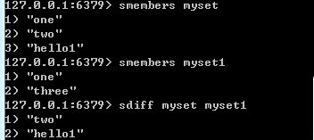

5）sdiffstore(差集赋予set)

用法：sdiffstore key3 key1 key2

注：key1中较key2多出的元素赋予key3。

例：如图

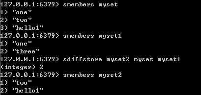

5）sdiffstore(差集赋予set)

用法：sdiffstore key3 key1 key2

注：key1中较key2多出的元素赋予key3。

例：如图

6）sinter(交集)

用法：sinter key1 key2 

例：如图

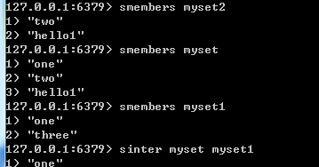

7）sinterstore(交集赋予set)

用法：sinterstore key3 key1 key2 

例：如图

8）sunion(并集)

用法：sunion key1 key2 

例：如图

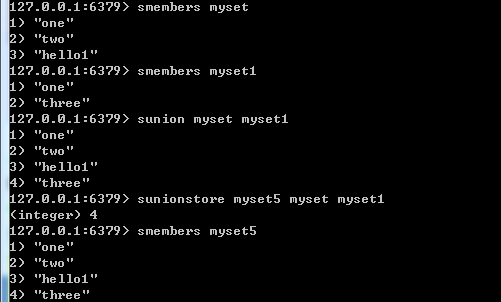

9）sunionstore(并集赋予set)

用法：sunionstore key3 key1 key2 

例：如图

10）smove(移除第一个set对应元素到第二个set中)

用法：smove  key1 key2 value1

例：如图

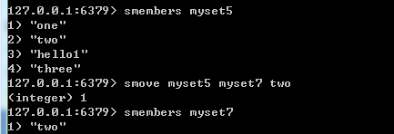

11）scard(统计对应key中元素数量)

用法：scard  key

例：如图

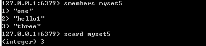

12）sismember(查询对应key中是否存在对应value)

用法：sismember  key value

注：存在返回1，不存在返回0

例：如图

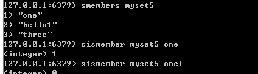

13）srandmember(随机抽取，但不会移除元素)

用法：srandmember  key 

例：如图

2.5 sorted set（zset）类型

sorted set是set的一个升级版，其增加了一个顺序属性。可以理解为两列的mysql,一列值，一列是顺序。操作中key为zset.

zset也是string类型元素集合，但是每个元素会关联一个double类型的score。zset是实现skip list（是双向链表）和hash table的混合体。

一般做索引，排序字段做score存储，对象id当元素存储。

方法介绍：

1）zadd(添加)

用法：zadd key score value

注：score为顺序，当value输入重复时，顺序为后一次排序。value不同，score可重复。（score可重复，value不可重复）

例：如图

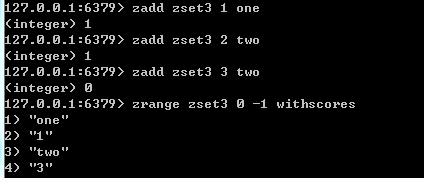

2）zrem(移除对应的value)

用法：zrem key value

例：如图

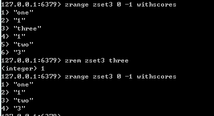

3）zincrby(对指定的value，将序号加入一定值)

用法：zincrby key score（原序号基础上序号加score） value

例：如图

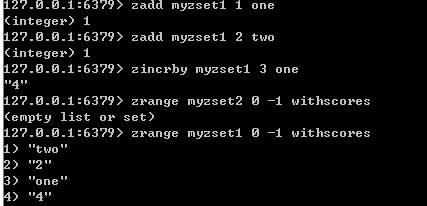

4）zrank(取对应的value的下标（序号升序后）)

用法：zrank key value

注：此处不是序号，是下标，从0开始。

例：如图

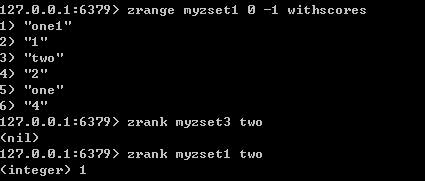

5）zrevrank(取对应的value的下标（序号降序后）)

用法：zrevrank key value

注：此处不是序号，是下标，从0开始。

例：如图

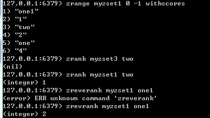

6）zrevrange(按序号降序输出所有元素)

用法：zrevrange key 0 -1 withscores

例：如图

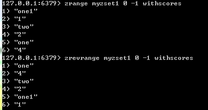

7）zrangebyscore(返回特定序号区间的值)

用法：zrangebyscore key min max withscores

注：不是序号

例：如图

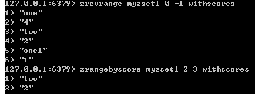

8）zcount(返回特定序号区间内元素数量)

用法：zcount key min max
 
注：不是序号

例：如图

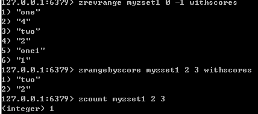

9）zcard(返回集合元素数量)

用法：zcard key 

例：如图

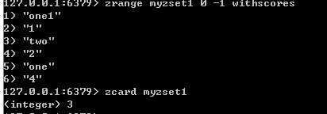

10）zscore(返回特定值对应的序号)

用法：zscore key value

例：如图

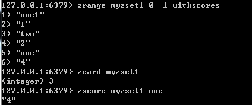

11）zremrangebyrank(删除特定区间的元素)

用法：zremrangebyrank key start end

注：不是序号

例：如图

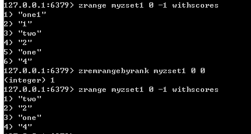

12）zremrangebyscore(删除特定序号之间的元素)

用法：zremrangebyscore key start end

例：如图

### 3 Redis常用命令

3.1 键值相关命令

1）keys

满足给定pattern的所有key,*表示所有。也可以key*

用法：keys * 

例：如图

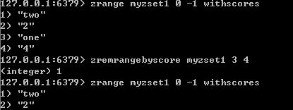

2）exists(确认key是否存在)

用法：exists key,存在返回1，不存在返回0

3）del(删除key)

用法：del key,成功返回1

4）expire(设置key的过效时间，单位秒)

用法：expire addr 时间

5）move(当前数据库中的key转移到其他数据库中)

用法：move key db(数据库)

例：如图

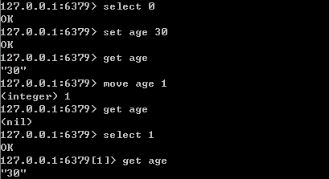

6）persist(移除key的过期时间)

用法：persist key,（用ttl key查看效果，有效返回-1）

7）randomkey(随机返回一个key)

用法：randomkey

8）rename(重命名key)

用法：rename key key_new

9）type(返回值的类型)

用法：type key

3.2 服务器相关命令

1）ping(测试连接是否存活)

用法：ping

注：正常返回PONG

2)echo(命令行输出)

用法：echo "内容"

3)select(数据库选择)

用法：select 编号（redis提供0-15）

4）quit(退出连接)

用法：quit

5)dbsize(当前数据库中key的数目)

用法：dbsize

6)info(获取服务器的信息和统计)

用法：info

7)monitor(实时转储收到的请求)

用法：monitor

8）config get(获取服务器配置信息)

用法：例config get dir

9)flushdb(删除当前选择数据库中的所有key)

用法：flushdb,(用dbsize查看效果)

10）flushall(删除所有数据库的所有key)

用法：flushall