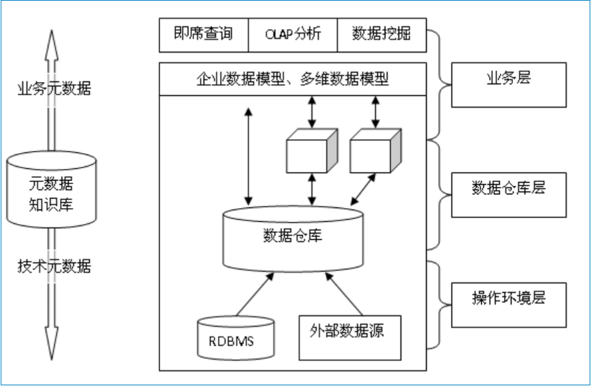

## 数据仓库与元数据

### 1、数据仓库

数据仓库用于研究和解决从数据库获取信息的问题。其是单个数据存储，出于分析和决策支持而建，为企业提供业务流程改进、监视是哪、成本、质量以及控制。

与其说数据仓库是软件开发项目，还不如说是系统集成项目，因为它的主要工作是把所需的数据仓库工具集成在一起，完成数据的抽取、转换和加载，OLAP分析和数据挖掘

 
数据仓库是面向主题的、集成的、相对稳定的、反映历史变化的数据集合，用于支持管理决策。

特点：

	1.面向主题，主题是用户使用时间刺客所关心的重点方面。一个主题通常与多个操作型信息系统相关。
	
	2.集成的，数据来自于分散的操作型数据（不同的数据源），需要进行抽取、加工，综合统一后才能进入数据仓库。（数据仓库中通常数据做的是大量查询，修改与删除很少）
	
	3.不可更新的，主要是为决策分析提供数据，涉及到的操作主要是查询。
	
	4.随时间变化。
	
	5.汇总的，操作性数据映射成决策可用格式。
	
	6.大容量。
	
	7.非规范化的，会有大量冗余数据。
	
	8.元数据。将描述数据保存。
	
	9.数据源，数据来自内部或者外部的非集成操作系统。

数据仓库，是在数据库已大量存在的情况下，为进一步挖掘数据资源、为了决策需要而产生。（并不是数据库），其需要具有以下特点：效率要高、数据质量、扩展性、面向主题。

主要使用技术：

	1.并行
	
	2.分区
	
	3.数据压缩

### 2、元数据

元数据：中介数据，是描述数据的数据，或者说是用于提供某种资源的有关信息的结构。数据仓库与数据源之间存在相互对应的关系转换，以达到数据集成。

在数据仓库中：元数据按用途分为技术元数据和业务元数据。
技术元数据主要辅助开发，业务元数据主要辅助用户。

元数据主要有以下功能：

	1.描述哪些数据在数据仓库中；
	
	2.定义要进入数据仓库中的数据和从数据仓库中产生的数据；
	
	3.记录根据业务事件发生而随之进行的数据抽取工作时间安排；
	
	4.记录并检测系统数据一致性的要求和执行情况；
	
	5.衡量数据质量。

收集信息主要有：

	1.数据的表结构Schema信息
	
	2.数据的空间存储，读写记录，权限归属和其它各类统计信息
	
	2.数据的血缘关系信息
	
	4.数据的业务属性信息

### 3、数据仓库解决方案

### 4、元数据API的设计以及优化

疑问：数据源分散（关联不强），怎么整合到数据仓库。