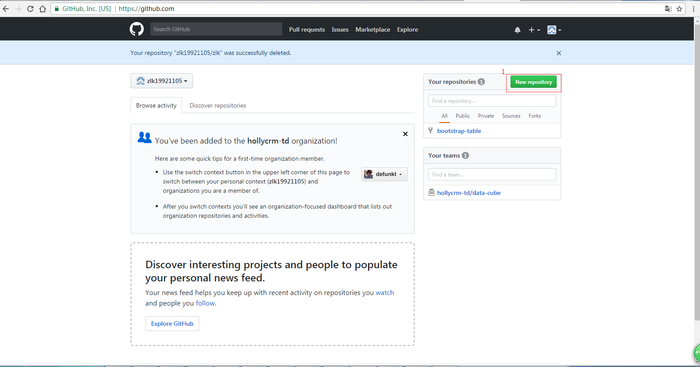
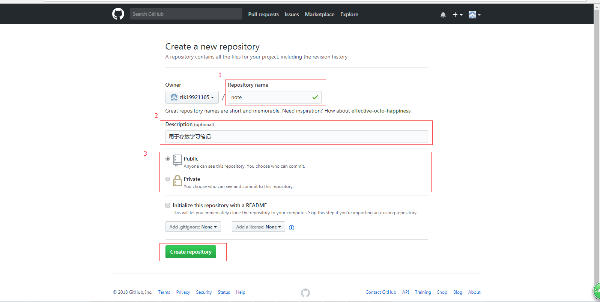
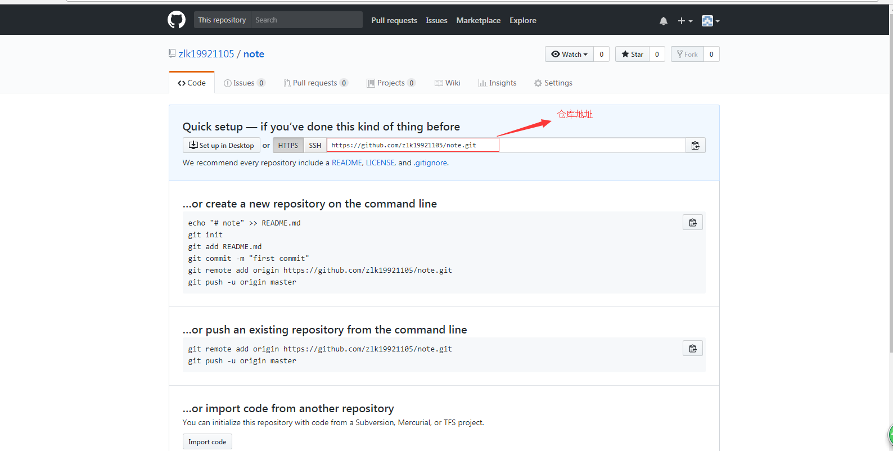
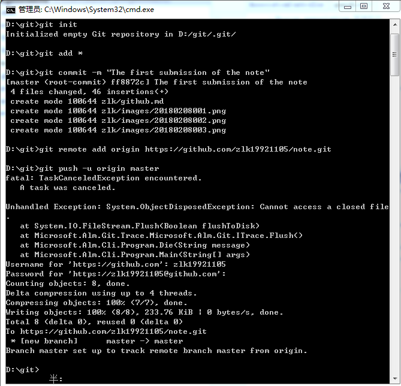
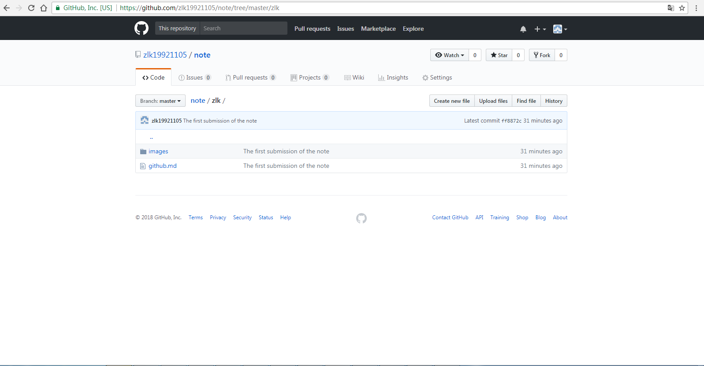
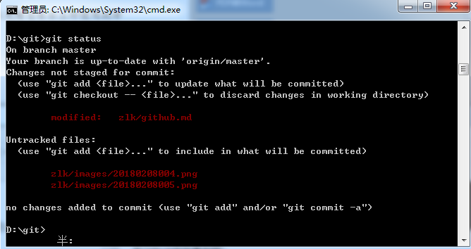
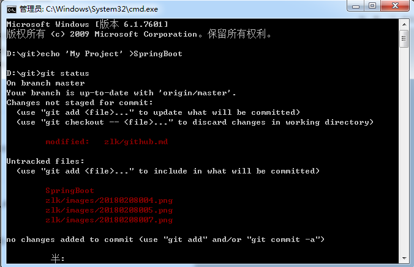

##   GitHub

注：使用cmd进行操作，省略$
### 1 Windows环境下GitHub安装与配置

1.1 下载GitHub并进行安装

  > 下载地址：https://git-scm.com/download/win，进入后将自动下载git安装包后进行安装。
  > 更新git命令：$ git clone git://git.kernel.org/pub/scm/git/git.git

1.2 设置用户名称与邮箱地址
 >设置用户名：$ git config --global user.email 2773407299@qq.com
 >
 > 设置邮箱：$ git config --global user.name "zlk19921105"
 

1.3 检查配置信息
 >检查配置列表：$ git config --list
 >
 >检查特定配置：$ git config <key>
 >
 >例如检查用户名：$ git config user.name

1.4 获取帮助
  >$ git help <verb> 
  >
  >例如获取config的命令手册：$ git help config
  
### 2 Git基础
2.1 获取Git仓库
获取Git项目仓库的两种方式：

第一种方式：在现有项目或目录下导入所有文件到Git中；（用于提交新项目）

第一步：在gitHub上建立一个本地仓库，本记录该本地仓库地址，如图所示：

1).点击New repository

2).填写仓库信息，并创建

3).记录仓库地址

第二步：将本地文件提交到GitHub远程仓库（以下提交到https://github.com/zlk19921105/note.git）

>命令：（括号内，一般是出错时的处理）
>
>1 将项目添加到git管理：$ git init
>
>2 实现指定文件跟踪：$ git add *
>
>3 进行提交，-m后为提交的说明：$ git commit -m "The first submissiom of the not"
>
>4将本地的仓库关联到github上:$ git remote add origin https://自己的仓库url地址（上面有说到https://github.com/zlk19921105/note.git）; 此处会提示输入GitHub账号的用户名与密码
>
>5 提交到GitHub master分支:$ git push -u origin master

例：在d:\git 提交到https://github.com/zlk19921105/note.git，
在当前文件（d:\git）中打开cmd,进行上面1到5的操作，如图所示（**注：使用cmd不需要$**）：

在Github中效果如图：

第二种方式：从一个服务器克隆一个现有的Git仓库。(用于克隆已存在项目)
>第二种方式十分简单，将远程仓库克隆即可。
>命令：$ git clone url <新仓库名，用于放在本地，可省略>
例：$ git clone https://github.com/zlk19921105/note.git

2.2记录更新到仓库

1）检查当前文件状态命令：$ git status

出现类似下图输出：
分支为master,

在项目中的新建文件夹SpringBoot,输入命令：
>$ echo 'MY project' >SpringBoot;
>
>$ git status

效果如下图，其中untracked files文件为未提交(该类文件commit前需要先暂存add)，changes对应已提交但是有修改。

2）忽略文件（略）

3）提交更新
  查看文件修改：$ git diff（$ git status）

在文件提交(项目已提交GitHub)：
>$ git status (在文件夹所示上级目录打开)
>
>$ git pull --all（更新）
>
>$ git add <fileName> 
>
>$ git commit -m "提示"  或 $ git commit -a -m "提示"（用-a可以跳过add,跳过暂存区域）
>
>$ git push origin 分支（master）
  
4）移除文件： $ git rm <fileName>

5) 移动文件： $ git mv file_from file_to

6)查看提交历史： $ git log

7)撤销操作： $ git commit --amend(撤销操作，尝试重新提交)

8）取消暂存：$ git reset HEAD <file>

9)撤销修改 ： $ git checkout --<fileName>

10)查看远程仓库：$ git remote <-v origin gitHub地址（<>内为可选）>

11）版本回退：
 > 1.查看版本：$ git log 或$ git log --pretty=oneline
 > $ git log 使用q退出
 > 
 >2接下来是回退版本，HEAD表示当前版本，HEAD^表示上一个版本，HEAD^^表示上上版本，当版本较大时，比如100，直接写成HEAD~100.执行：
 >
 >例：$ git reset --hard efa5971 ，其中efa5971为版本号。

### 3 Git分支
1）创建分支

>创建分支：$ git branch 分支名
>
>切换分支：$ git checkout 分支名
>
>>或：创建并切换到新分支：git branch + git checkout = git checkout -b 分支名
>
>push操作：$ git push origin 分支（master）

>查看分支：$ git branch -vv

>修改分支：$ git branch -m 原分支名 新分支名

>删除分支：$ git branch -d 分支名

>项目第一次更新时需要，远程分支与本地联系$ git branch --set-upstream-to=origin/分支名称
>合并分支$ git merge 分支名（一般是需要合并到master分支）

2）一般在开发中使用分支提交代码的流程。
>初次建立分支（该分支未提交过代码，或者需要将master分支代码合并到当前分支进行开发时），若该分支未A分支：

>>1、实现指定文件跟踪 git add *（A分支）

>>2、git commit -m"提交代码到当前分支"（A分支）

>>3、切换master分支 git checkout master

>>4、更新master分支代码到本地 git pull --all(master分支)

>>5、切换到A分支 git checkout A

>>6、合并master分支代码到A分支 git merge master（A分支）

>>7、将所有代码push到当前A分支上 git push origin A(A分支)

>分支已经提交到master合并，关闭问题。当前分支出现bug，当前分支未A分支。问题序号为10

>>1、将A分支代码全部提交，（不在赘述）

>>2、切换master分支 git checkout master

>>3、更新master分支 git pull --all (master分支)

>>4、建bug分支，分支名为 问题序号-fixbug,用于关联原来的分支 : 
> git branch 10-fixbug

>>5、重新再github上打开问题。

>>6、将修改后的代码提交的10-fixbug,并向master分支提交合并请求。请求合并成功后，关闭问题。

	删除本地分支
	命令行 : $ git branch -d <BranchName>

	删除远程分支
	命令行 : $ git push origin --delete <BranchName>

	远程仓库删除文件 
	$ git rm 我的文件

	本地仓库删除文件夹 
	$ git rm -r 我的文件夹/

    撤销add
    $ git reset HEAD <文件>
