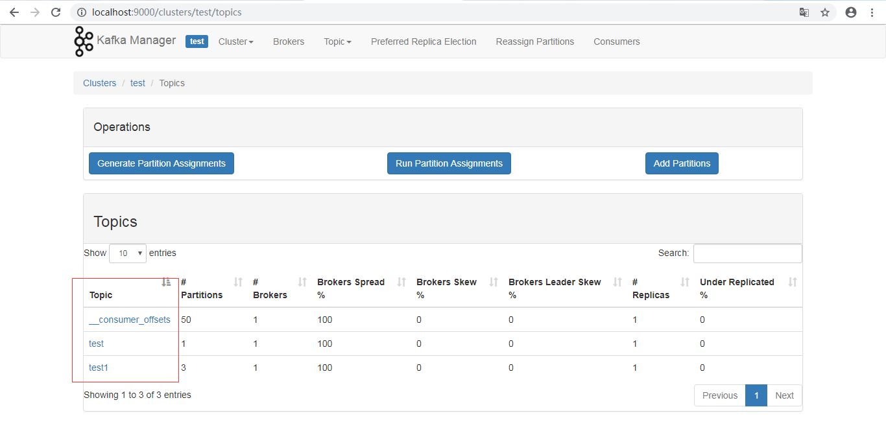

## Windows 安装 Kafka

### 1 准备工作：

	jdk1.8.0_111
	
	zookeeper-3.4.10，教程https://blog.csdn.net/qq_34553637/article/details/86613060(本节未用到，高版本的kafka内置有zookeeper)

### 2 下载Kafka

下载地址:https://www.apache.org/dyn/closer.cgi?path=/kafka/2.1.0/kafka_2.11-2.1.0.tgz

### 3 解压并配置Kafka

将kafka_2.11-2.1.0.tgz解压到D:\kafka_2.11-2.1.0文件夹。(**注：文件夹不能带空格，否则zookeeper启动报错**)

	bin目录：启动,停止等命令。 
	config目录： 配置文件 
	libs目录： 类库

### 4 启动和停止kafka

4.1 配置

**注：在本实验中我将所有的localhost更换为127.0.0.1**

4.1.1 zookeeper.properties
     
    #dataDir与dataLogDir需要指定一个目录（需要创建D:/zookeeper/data与D:/zookeeper/log目录），否则启动kafka会报java.nio.file.AccessDeniedException错误。

	dataDir=D:/zookeeper/data
	dataLogDir=D:/zookeeper/log
	clientPort=2181
	maxClientCnxns=0

4.2 启动kafka

进入bin\windows目录下，按先后顺序启动

	启动zookeeper，端口2181
	zookeeper-server-start.bat ../../config/zookeeper.properties
	
	启动kafka,端口9092
	kafka-server-start.bat ../../config/server.properties

	Kafka Connect 启动：（此处不需要，用于连接数据库）
	connect-standalone.bat ../../config/connect-standalone.properties ../../config/mysql.properties

   connect-distributed.bat ../../config/connect-standalone.properties ../../config/mysql.properties

kafka-console-consumer.bat --bootstrap-server localhost:9092 --topic test --from-beginning

kafka-console-consumer.bat --zookeeper localhost:2181 --topic test

zookeeper启动

kafka启动成功

4.3 停止kafka

进入bin\windows目录下，按先后顺序启动

	kafka-server-stop.bat
	zookeeper-server-stop.bat

4.4 topic创建

进入bin\windows目录下

	方法一：自动创建
	kafka-console-producer.bat --broker-list 127.0.0.1:9092 --topic test
	
	方法二： 
	创建一个拥有3个副本,1个分区的topic
	kafka-topics.bat --create --zookeeper 127.0.0.1:2181 --replication-factor 1 -partitions 3 --topic test1

4.5 topic删除

进入bin\windows目录下

	kafka-topics.bat --delete --zookeeper 127.0.0.1:2181 --topic test

4.6 查看topic

进入bin\windows目录下

    #查看topic列表
	kafka-topics.bat --zookeeper 127.0.0.1:2181 --list

    #查看topic名称为test对应的具体信息​
	kafka-topics.bat --describe --zookeeper 127.0.0.1:2181 --topic test

4.7 启动生产者

	kafka-console-producer.bat --broker-list 127.0.0.1:9092 --topic test

4.8 启动消费者

	kafka-console-consumer.bat --bootstrap-server 127.0.0.1:9092 --topic test --from-beginning

kafka-console-consumer.bat --bootstrap-server 127.0.0.1:9092 --topic fullfillment --from-beginning

### 5 可视化工具kafka-manager

下载地址：

	https://github.com/yahoo/kafka-manager/releases  需要编译

    编译后：https://pan.baidu.com/s/1qYifoa4 密码：el4o（来源https://www.cnblogs.com/dadonggg/p/8205302.html）

配置conf/application.conf文件

	manager.zkhosts="127.0.0.1:2181"

启动： **启动前需要启动zookeeper与kafka**

    进入bin目录，默认端口9000
	输入命令：kafka-manager

成功后访问地址：localhost:9000

**创建主题test,关联上面zookeeper 127.0.0.1:2181**

点击active下新建的主题

点击圈中topitcs对应数字。

topitcs列表详情

参考地址：http://kafka.apache.org/documentation/