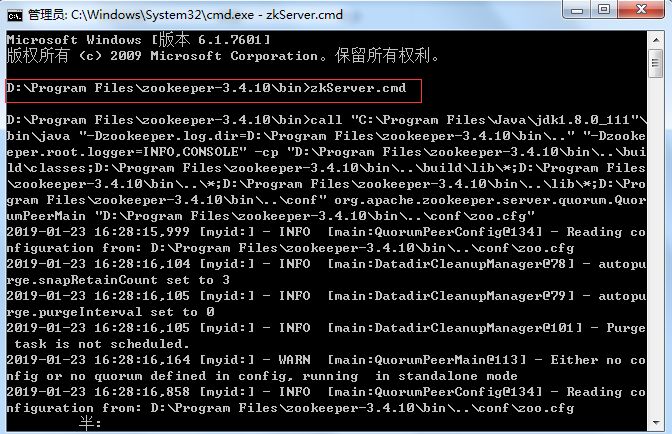
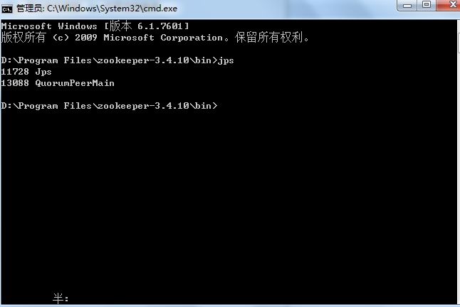

## Windows 安装 ZooKeeper

### 介绍
ZooKeeper是一个分布式的，开放源码的分布式应用程序协调服务，是Google的Chubby一个开源的实现，是Hadoop和Hbase的重要组件。它是一个为分布式应用提供一致性服务的软件，提供的功能包括：配置维护、域名服务、分布式同步、组服务等。
ZooKeeper的目标就是封装好复杂易出错的关键服务，将简单易用的接口和性能高效、功能稳定的系统提供给用户。

ZooKeeper包含一个简单的原语集，提供Java和C的接口。
ZooKeeper代码版本中，提供了分布式独享锁、选举、队列的接口，代码在zookeeper-3.4.10\src

### 1 下载地址

准备工作：安装jdk1.8.0_111

版本3.4.10

下载地址：http://mirrors.hust.edu.cn/apache/zookeeper/zookeeper-3.4.10/

### 2 安装

将zookeeper-3.4.10.tar.gz解压到D:\Program Files\zookeeper-3.4.10。

打开D:\Program Files\zookeeper-3.4.10\conf下zoo.cfg配置如下：

	# The number of milliseconds of each tick
	tickTime=2000
	# The number of ticks that the initial 
	# synchronization phase can take
	initLimit=10
	# The number of ticks that can pass between 
	# sending a request and getting an acknowledgement
	syncLimit=5
	# the directory where the snapshot is stored.
	# do not use /tmp for storage, /tmp here is just 
	# example sakes.
	dataDir=D:\\zookeeper\\data
	dataLogDir=D:\\zookeeper\\log
	# the port at which the clients will connect
	clientPort=2181
	# the maximum number of client connections.
	# increase this if you need to handle more clients
	#maxClientCnxns=60
	#
	# Be sure to read the maintenance section of the 
	# administrator guide before turning on autopurge.
	#
	# http://zookeeper.apache.org/doc/current/zookeeperAdmin.html#sc_maintenance
	#
	# The number of snapshots to retain in dataDir
	#autopurge.snapRetainCount=3
	# Purge task interval in hours
	# Set to "0" to disable auto purge feature
	#autopurge.purgeInterval=1

说明：

	1、tickTime：这个时间是作为 Zookeeper 服务器之间或客户端与服务器之间维持心跳的时间间隔。
	2、dataDir：顾名思义就是 Zookeeper 保存数据的目录，默认情况下，Zookeeper 将写数据的日志文件也保存在这个目录里。
	3、dataLogDir：顾名思义就是 Zookeeper 保存日志文件的目录
	4、clientPort：这个端口就是客户端连接 Zookeeper 服务器的端口，Zookeeper 会监听这个端口，接受客户端的访问请求。

### 3 启动

进入bin目录下输入命令：zkServer.cmd

查看启动情况，进入bin目录下输入命令：jps

启动客户端则进入bin目录下启动：zkServer.cmd 127.0.0.1：2181

### 4 配置环境变量

计算机--》右击鼠标--》属性--》高级系统设置--》环境变量--》系统变量
    
	新建ZOOKEEPER_HOME，对应值D:\Program Files\zookeeper-3.4.10

	path添加$ZOOKEEPER_HOME/bin，前面用分好隔开。

转载地址：https://blog.csdn.net/tlk20071/article/details/52028945

