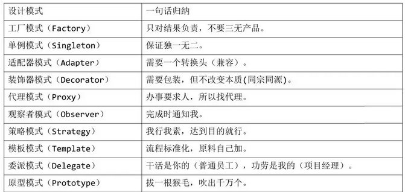

## 面试题整理

### 1 分数转优秀

	create table grade_table(
	       id integer not null , 
	       chinese  number(4,1) not null , --中文成绩
	       english  number(4,1) not null , -- 英语成绩
	       math  number(4,1) not null  , --数学成绩
	       primary key(id)
	)
	
	insert into grade_table(id,chinese,english,math) values(1002,91,70,59);
	insert into grade_table(id,chinese,english,math) values(1001,90,80,60);
	
	select id,
		case  when chinese>=90 then '优秀' when chinese>=80 then '良好' when chinese>=70 then '中等' when chinese>=60 then '及格'  else '不及格' end as 语文,
		case  when english>=90 then '优秀' when english>=80 then '良好' when english>=70 then '中等' when english>=60 then '及格'  else '不及格' end as 英语,
		case  when math>=90 then '优秀' when math>=80 then '良好' when math>=70 then '中等' when math>=60 then '及格'  else '不及格' end as 数学
	from grade_table

结果：

	ID      语文   英语   数学
	1002	优秀	 中等	  不及格
	1001    优秀   良好	  及格

###  2 行变列

**2.1.oracle行变列**
	
	create table grade_table2(
	       id integer not null , 
	       s_id integer not null , -- 学号
	       c_name varchar2(50)  not null, -- 课程名称
	       score  number(4,1) , --成绩
	       primary key(id)
	)
	
	insert into grade_table2(id,s_id,c_name,score) values(1001,20141001,'语文',90);
	insert into grade_table2(id,s_id,c_name,score)  values(1002,20141001,'英语',85);
	insert into grade_table2(id,s_id,c_name,score)  values(1003,20141001,'数学',70);
	
	insert into grade_table2(id,s_id,c_name,score)  values(1004,20141002,'语文',80);
	insert into grade_table2(id,s_id,c_name,score)  values(1005,20141002,'英语',98);
	insert into grade_table2(id,s_id,c_name,score)  values(1006,20141002,'数学',77);

测试数据如下：

        id      s_id        c_name   score
	1	1001	20141001	语文	    90.0
	2	1002	20141001	英语      85.0
	3	1003	20141001	数学	    70.0
	4	1004	20141002	语文	    80.0
	5	1005	20141002	英语	    98.0
	6	1006	20141002	数学	    77.0

	
测试1：将行换列

	select  s_id 学号,
	             MAX(case  when c_name= '语文' then  score ELSE 0 END) 语文,
	             MAX(case  when c_name= '数学' then  score ELSE 0 END) 数学,
	             MAX(case  when c_name= '英语' then  score ELSE 0 END) 英语  
	 from grade_table2  GROUP BY s_id 

结果1
		
		学号        语文 数学 英语    
	1	20141001	90	70	85
	2	20141002	80	77	98

测试2：行换列，并把分数分等级
	 
	 select       s_id 学号,
	              MAX(case  when c_name='语文'  then (case when   score>=90 then '优秀' when score>=80 then '良好' when score>=70 then '中等' when score>=60 then '及格'  else '不及格' end)  else '' end) 语文,
	              MAX(case  when c_name='数学'  then (case when   score>=90 then '优秀' when score>=80 then '良好' when score>=70 then '中等' when score>=60 then '及格'  else '不及格' end)  else '' end) 数学,
	              MAX(case  when c_name='英语' then  (case when   score>=90 then '优秀' when score>=80 then '良好' when score>=70 then '中等' when score>=60 then '及格'  else '不及格' end)  else '' end)  英语  
	 from grade_table2  GROUP BY s_id 

结果2

		学号        语文  数学  英语
	1	20141001	优秀	中等	良好
	2	20141002	良好	中等	优秀

###  3 多级缓存

缓存选择

	接口计算复杂，耗时、耗资源
	数据不是经常改变
	数据量大
	接口数据一致性要求不高

热点数据，次热点数据做多级缓存。热点数据做一级（如热卖产品访问次数多cache（Caffeine）），次热点做二级（非热卖产品访问次数稍少redis集群）。

删除与清空时，需要先删除二级，再删除一级。

###  4 MySQL引擎
	
	MyISAM：默认的MySQL插件式存储引擎（MySQL 5.1前），它是在Web、数据仓储和其他应用环境下最常使用的存储引擎之一。注意，
	通过更改STORAGE_ENGINE配置变量，能够方便地更改MySQL服务器的默认存储引擎。表级锁、不支持事务和全文索引，适合一些CMS
	内容管理系统作为后台数据库使用，但是使用大并发、重负荷生产系统上，表锁结构的特性就显得力不从心；（适合查询）
	
	InnoDB：默认的MySQL插件式存储引擎（MySQL 5.5后）用于事务处理应用程序，具有众多特性，包括ACID事务支持。(提供行级
	锁)，行级锁、事务安全（ACID兼容）、支持外键、不支持FULLTEXT类型的索引(5.6.4以后版本开始支持FULLTEXT类型的索引)。
	InnoDB存储引擎提供了具有提交、回滚和崩溃恢复能力的事务安全存储引擎。InnoDB是为处理巨大量时拥有最大性能而设计的。
	它的CPU效率可能是任何其他基于磁盘的关系数据库引擎所不能匹敌的。InnoDB表的行锁也不是绝对的。（适合更新）
	
	BDB：可替代InnoDB的事务引擎，支持COMMIT、ROLLBACK和其他事务特性。
	
	Memory：将所有数据保存在RAM中，在需要快速查找引用和其他类似数据的环境下，可提供极快的访问。
	
	Merge：允许MySQL DBA或开发人员将一系列等同的MyISAM表以逻辑方式组合在一起，并作为1个对象引用它们。
	对于诸如数据仓储等VLDB环境十分适合。
	
	Archive：为大量很少引用的历史、归档、或安全审计信息的存储和检索提供了完美的解决方案。
	
	Federated：能够将多个分离的MySQL服务器链接起来，从多个物理服务器创建一个逻辑数据库。十分适合于分布式环境或数据集市环境。
	
	Cluster/NDB：MySQL的簇式数据库引擎，尤其适合于具有高性能查找要求的应用程序，这类查找需求还要求具有最高的正常工作时间和可用性。
	
	Other：其他存储引擎包括CSV（引用由逗号隔开的用作数据库表的文件），Blackhole（用于临时禁止对数据库的应用程序输入），
	以及Example引擎（可为快速创建定制的插件式存储引擎提供帮助）。

###  5 MySQL编码utf-8与utf-8mb4

	MySQL在5.5.3之后增加了这个utf8mb4的编码，mb4就是most bytes 4的意思，专门用来兼容四字节的unicode。好在utf8mb4是utf8的超集，
	除了将编码改为utf8mb4外不需要做其他转换。当然，为了节省空间，一般情况下使用utf8也就够了。原来mysql支持的 utf8 编码最大字符长度
	为 3 字节。为了获取更好的兼容性，应该总是使用 utf8mb4 而非 utf8.  对于 CHAR 类型数据，utf8mb4 会多消耗一些空间，
	根据 Mysql 官方建议，使用 VARCHAR  替代 CHAR。

	MySQL 5.0以上的版本：
	一个汉字占多少长度与编码有关：
	UTF－8：一个汉字＝3个字节
	GBK：一个汉字＝2个字节

### 6 nginx配置，使用

https://blog.csdn.net/qq_34553637/article/details/91126671

反向代理的作用：

	1.负载均衡，提高请求处理与响应速度（集群）;
	2.保证内网安全，隐藏服务器信息，防止web攻击。

### 7 spring常用设计模式

https://blog.csdn.net/weixin_41648325/article/details/79922976

我们通常说的 23 中经典设计模式可以通过下表一目了然：

	 创建型 
	工厂方法模式（FactoryMethod）、抽象工厂模式（AbstractFactory）、 建造者模式（Builder）、原型模式（Prototype）、单例模式(Singleton)
	结构型
	适配器模式(Adapter)、桥接模式（Bridge）、组合模式（Composite）、 装饰器模式（Decorator）、门面模式（Facade）、享元模式（Flyweight）、 代理模式（Proxy）
	行为型
	解释器模式（Interpreter）、模板方法模式（TemplateMethod）、 责任链模式（ChainofResponsibility）、命令模式（Command）、
	 迭代器模式（Iterator）、调解者模式（Mediator）、备忘录模式（Memento）、 观察者模式（Observer）、状态模式（State）、策略模式（Strategy）、 访问者模式（Visitor）

**第一种：简单工厂模式（不在23中之中）**

其有一个创建Bean对象的工厂类，当需要创建对象时，通过传入一个id标识来动态的生产电影Bean对象。（id的判断逻辑在工厂内）

spring中的BeanFactory就是简单工厂模式的体现，根据传入一个唯一的标识来获得bean对象，但是否是在传入参数后创建还是传入参数前创建这个要根据具体情况来定。

	<beans>
	    <bean id="singletonBean" class="com.itxxz.HelloItxxz"  singleton="false">
	        <constructor-arg>
	            <value>Hello! 这是singletonBean!value>
	        </constructor-arg>
	</ bean>

穷举：批量化，标准化。

**第二种：工厂方法模式**

通常由应用程序直接使用 new 创建新的对象，为了将对象的创建和使用相分离，采用工厂模 式,即应用程序将对象的创建及初始化职责交给工厂对象。 一般情况下,应用程序有自己的工厂对象来创建 Bean.如果将应用程序自己的工厂对象交给 Spring 管 理,那么 Spring 管理的就不是普通的 Bean,而是工厂 Bean。（id的判断逻辑在客户端）

穷举：流水线生产。

**第三种：单例模式**

保证一个类仅有一个实例，并提供一个访问它的全局访问点。

spring中的单例模式完成了后半句话，即提供了全局的访问点BeanFactory。但没有从构造器级别去控制单例，这是因为spring管理的是是任意的java对象。 
核心提示点：Spring下默认的bean均为singleton，可以通过singleton=“true|false” 或者 scope=“？”来指定

**第四种：适配器模式**

Spring AOP 模块对 BeforeAdvice、AfterAdvice、ThrowsAdvice 三种通知类型的支持实际上是借 助适配器模式来实现的，这样的好处是使得
框架允许用户向框架中加入自己想要支持的任何一种通知类 型，上述三种通知类型是 Spring AOP 模块定义的，它们是 AOP 联盟定义的 Advice 的子类型。拦截器的实现。

**第五种：包装器**

比较常见的是多数据源的切换。

Spring 中用到的包装器模式在类名上有两种表现：一种是类名中含有 Wrapper，另一种是类名中含有 Decorator。基本上都是动态地给一个对象添加一些额外的职责。

**第六种：代理**

为其他对象提供一种代理以控制对这个对象的访问。  从结构上来看和Decorator（包装器）模式类似，但Proxy是控制，更像是一种对功能的限制，而Decorator是增加职责。 
spring的Proxy模式在aop中有体现，比如JdkDynamicAopProxy和Cglib2AopProxy。 

穷举：中介

**第七种：观察者**

定义对象间的一种一对多的依赖关系，当一个对象的状态发生改变时，所有依赖于它的对象都得到通知并被自动更新。
spring中Observer模式常用的地方是listener的实现。如ApplicationListener。 

**第八种：策略**

定义一系列的算法，把它们一个个封装起来，并且使它们可相互替换。本模式使得算法可独立于使用它的客户而变化。 
spring中在实例化对象的时候用到Strategy模式
在SimpleInstantiationStrategy中有如下代码说明了策略模式的使用情况： 
 
**第九种：模板方法**

定义一个操作中的算法的骨架，而将一些步骤延迟到子类中。Template Method使得子类可以不改变一个算法的结构即可重定义该算法的某些特定步骤。
Template Method模式一般是需要继承的。这里想要探讨另一种对Template Method的理解。spring中的JdbcTemplate，在用这个类时并不想去继承这个类，因为这个类的方法太多，但是我们还是想用到JdbcTemplate已有的稳定的、公用的数据库连接，那么我们怎么办呢？我们可以把变化的东西抽出来作为一个参数传入JdbcTemplate的方法中。但是变化的东西是一段代码，而且这段代码会用到JdbcTemplate中的变量。怎么办？那我们就用回调对象吧。在这个回调对象中定义一个操纵JdbcTemplate中变量的方法，我们去实现这个方法，就把变化的东西集中到这里了。然后我们再传入这个回调对象到JdbcTemplate，从而完成了调用。这可能是Template Method不需要继承的另一种实现方式吧。 

以下是一个具体的例子： 
JdbcTemplate中的execute方法 

模式：

### 8 spring常用注解

	一： 组件类注解
	@Component ：标准一个普通的spring Bean类。 @Repository：标注一个DAO组件类。 @Service：标注一个业务逻辑组件类。 @Controller：标注一个控制器组件类。 
	这些都是注解在平时的开发过程中出镜率极高，@Component、@Repository、@Service、@Controller实质上属于同一类注解，用法相同，功能相同，
	区别在于标识组件的类型。@Component可以代替@Repository、@Service、@Controller，因为这三个注解是被@Component标注的。如下代码
	
	二：装配bean时常用的注解@Autowired
	注： @Resource（不是Spring的注解）的作用相当于@Autowired
	
	三：@Component vs @Configuration and @Bean
	
	四：事务注解@Transactional

### 9 solr

### 9 高并发

	1.做负载均衡:集群；
	2.资源动静分离（静态资源由nginx提供，动态资源由tomcat提供:使用nginx或者DNS；
	3.缓存:以空间换时间，提高效率；
	4.限流：流量控制（队列实现）；
	5.降级：在并发量特别高时，可以暂时关掉非核心服务。（如日志等只保留报错，警告日志暂时关掉等）。
	6.非关系型数据库。

###  10 mysql 分区

	RANGE分区：基于属于一个给定连续区间的列值，把多行分配给分区。
	
	LIST分区：类似于按RANGE分区，区别在于LIST分区是基于列值匹配一个离散值集合中的某个值来进行选择。
	
	HASH分区：基于用户定义的表达式的返回值来进行选择的分区，该表达式使用将要插入到表中的这些行的列值进行计算。这个函数可以包含MySQL 中有效的、产生非负整数值的任何表达式。
	
	KEY分区：类似于按HASH分区，区别在于KEY分区只支持计算一列或多列，且MySQL服务器提供其自身的哈希函数。必须有一列或多列包含整数值。

注：支持1024个分区。如果表写入频繁，数据1000w+，可以考虑分区。

### 11 vi2000行

### 12 字符转字节****

	byte[] sb = str.getBytes();

### 13 http与https

https://www.cnblogs.com/wqhwe/p/5407468.html

　HTTPS（http+ssl）和HTTP的区别主要如下：

　　1、https协议需要到ca申请证书，一般免费证书较少，因而需要一定费用。

　　2、http是超文本传输协议，信息是明文传输，https则是具有安全性的ssl加密传输协议。

　　3、http和https使用的是完全不同的连接方式，用的端口也不一样，前者是80，后者是443。

　　4、http的连接很简单，是无状态的；HTTPS协议是由SSL+HTTP协议构建的可进行加密传输、身份认证的网络协议，比http协议安全。

### 14 产生死锁，解决死锁。

 java中导致死锁的原因

	多个线程同时被阻塞，它们中的一个或者全部都在等待某个资源被释放，而该资源又被其他线程锁定，从而导致每一个线程都得等其它线程释放
	其锁定的资源，造成了所有线程都无法正常结束。这是从网上其他文档看到的死锁产生的四个必要条件：

	1、互斥使用，即当资源被一个线程使用(占有)时，别的线程不能使用
	2、不可抢占，资源请求者不能强制从资源占有者手中夺取资源，资源只能由资源占有者主动释放。
	3、请求和保持，即当资源请求者在请求其他的资源的同时保持对原有资源的占有。
	4、循环等待，即存在一个等待队列：P1占有P2的资源，P2占有P3的资源，P3占有P1的资源。这样就形成了一个等待环路。

解决

	加锁顺序
	加锁时限
	死锁检测

	线程在同步某个对象里，再去锁定另外一个对象的话，就和容易发生死锁的情况。最好是线程每次只锁定一个对象并且在锁定该对象的过程中不再去锁定其他的对象

	有的时候业务需要同时去锁定两个对象，可以根据资源的hashcode值大小来判断先后锁定顺序。
 
### 15 创建数据库注意事项

	1字符集：选GBK， 或 utf-8 
	2数据库名区分大小写 
	3表名严格区分大小写，一般以 ‘t_’ 开头，单词之间可以试用 ‘_’ 隔开 
	4字段名不区分大小写，单词之间可以试用 ‘_’ 隔开 
	5主键使用自增模式 
	6数据库引擎使用 ：InnoDB（支持事务） 
	7主键约束，非空约束，索引，字段名，字段类型，字段初始化，字段描述; 
	（注：表之间的关联在代码中实现，不要建表外键约束） 
	8字段设置常用类型（字段名不要与关键字相同）： 
	tinyint(4); 
	int(11); 
	varchar(20); 
	datetime; 
	text; 
	decimal(M,N)
	9 不选用关键字

### 16 mvc

	另外整理

### 17 单点登录的实现

单点登录全称Single Sign On（以下简称SSO），是指在多系统应用群中登录一个系统，便可在其他所有系统中得到授权而无需再次登录，包括单点登录与单点注销两部分。

sso需要一个独立的认证中心，只有认证中心能接受用户的用户名密码等安全信息，其他系统不提供登录入口，只接受认证中心的间接授权。间接授权通过令牌实现，sso认证中心验证用户的用户名密码没问题，创建授权令牌，在接下来的跳转过程中，授权令牌作为参数发送给各个子系统，子系统拿到令牌，即得到了授权，可以借此创建局部会话，局部会话登录方式与单系统的登录方式相同。这个过程，也就是单点登录的原理，用下图说明
	
	cookie：存放id(不能跨域)
	session:验证ID（各个服务有自己的session）
	
	单点的解决思路：各个服务共享session，使得cookie（cookie的路径设置成顶级域名）来的id都能验证通过。

### 18 数据库事务

https://zhuanlan.zhihu.com/p/58866021

**18.1 特性**

	原子性（Atomicity）：事务作为一个整体被执行，包含在其中的对数据库的操作要么全部被执行，要么都不执行。 
	一致性（Consistency）：事务应确保数据库的状态从一个一致状态转变为另一个一致状态。一致状态的含义是数据库中的数据应满足完整性约束。 
	隔离性（Isolation）：多个事务并发执行时，一个事务的执行不应影响其他事务的执行。 
	持久性（Durability）：一个事务一旦提交，他对数据库的修改应该永久保存在数据库中

**18.2 隔离级别**
	
	1读未提交：(Read Uncommitted)
	在该隔离级别，所有事务都可以看到其他未提交事务的执行结果。本隔离级别很少用于实际应用，因为它的性能也不比其他级别好多少。读取未提交的数据，也被称之为脏读(Dirty Read)。
		--对别人修改但是未commit的数据可见。
	
	2读已提交（Read Committed） 大多数数据库默认的隔离级别	
	这是大多数数据库系统的默认隔离级别比如 Sql Server, Oracle 等，但不是 MySQL 默认的。它满足了隔离的简单定义：一个事务只能看见已经提交事务所做的改变。
	这种隔离级别也支持所谓的不可重复读(Nonrepeatable Read)，因为同一事务的其他实例在该实例处理其间可能会有新的 Commit，所以同一查询可能返回不同结果。
		--A修改后未commit，被B 所commit覆盖，导致A在一个事务里查询出两个结果；

	3可重复读（Repeatable-Read) mysql数据库所默认的级别
	当隔离级别设置为 Repeatable Read 时，可以避免不可重复读。不可重复读是指事务 T1 读取数据后，事务 T2 执行更新操作，使 T1 无法再现前一次读取结果。具体地讲，不可重复读包括三种情况：
	
	事务 T1 读取某一数据后，事务 T2 对其做了修改，当事务 T1 再次读该数据时，得到与前一次不同的值。例如，T1 读取 B=100 进行运算，T2 读取同一数据 B，对其进行修改后将 B=200 写回数据库。T1 为了对读取值校对重读 B，B 已为 200，与第一次读取值不一致。

	事务 T1 按一定条件从数据库中读取了某些数据记录后，事务 T2 删除了其中部分记录，当 T1 再次按相同条件读取数据时，发现某些记录神密地消失了。

	事务 T1 按一定条件从数据库中读取某些数据记录后，事务 T2 插入了一些记录，当 T1 再次按相同条件读取数据时，发现多了一些记录，也就是幻读。

	这是 MySQL 的默认事务隔离级别，它确保在一个事务内的相同查询条件的多次查询会看到同样的数据行，都是事务开始时的数据快照。虽然 Repeatable Read 避免了不可重复读，但还有可能出现幻读。简单说，就是当某个事务在读取某个范围内的记录时，另外的一个事务又在该范围内插入新的记录。在之前的事务在读取该范围的记录时，就会产生幻行，InnoDB 通过间隙锁(next-key locking)策略防止幻读的出现。

	4序列化（serializable）
	
	Serializable 是最高的事务隔离级别，它通过强制事务排序，使之不可能相互冲突，从而解决幻读问题。简言之，它是在每个读的数据行上加上共享锁。在这个级别，
	可能导致大量的超时现象和锁竞争。该隔离级别代价也花费最高，性能很低，一般很少使用，在该级别下，事务顺序执行，不仅可以避免脏读、不可重复读，还避免了幻读。

### 19  Forward和Redirect

forward又叫转发，redirect叫做重定向

	forward(转发)：
	1.是服务器内部的重定向，服务器直接访问目标地址的 url网址，把里面的东西读取出来，但是客户端并不知道，因此用forward的话，客户端浏览器的网址是不会发生变化的。 
	2.关于request: 由于在整个定向的过程中用的是同一个request，因此forward会将request的信息带到被重定向的jsp或者servlet中使用。
	
	redirect（重定向）：
	1.是客户端的重定向，是完全的跳转。即服务器返回的一个url给客户端浏览器，然后客户端浏览器会重新发送一次请求，到新的url里面，因此浏览器中显示的url网址会发生变化。 
	2.因为这种方式比forward多了一次网络请求，因此效率会低于forward

	另：
	A.Forward却只是一次request一次response
	       相比之下，Forward性能更高。
	B.Forward能够存储request Scope的Attribute而Redirect却不行。
	C.Forward的同时URL并不会变。
	D.Forward需要在Servlet中需要通过一个Dispatcher来实现。
	E.Redirect能够防止某些情况下客户端Refresh造成的一些未知后果(例如连续删除)

### 20 redis 面试题

https://www.cnblogs.com/jasontec/p/9699242.html

### 21 数据库范式

第一范式(确保每列保持原子性)

--每个字段已经不可再分解。
	
	第一范式是最基本的范式。如果数据库表中的所有字段值都是不可分解的原子值，就说明该数据库表满足了第一范式。
	
	第一范式的合理遵循需要根据系统的实际需求来定。比如某些数据库系统中需要用到“地址”这个属性，本来直接将“地址”属性设计成一个数据库表的字段就行。但是如果系统经常会访问“地址”属性中的“城市”部分，那么就非要将“地址”这个属性重新拆分为省份、城市、详细地址等多个部分进行存储，这样在对地址中某一部分操作的时候将非常方便。这样设计才算满足了数据库的第一范式，

第二范式(确保表中的每列都和主键相关)

--组合主键，数据应该与组合主键直接相关。拆分数据，让数据不冗余。

	第二范式在第一范式的基础之上更进一层。第二范式需要确保数据库表中的每一列都和主键相关，而不能只与主键的某一部分相关（主要针对联合主键而言）。也就是说在一个数据库表中，一个表中只能保存一种数据，不可以把多种数据保存在同一张数据库表中。
	
	比如要设计一个订单信息表，因为订单中可能会有多种商品，所以要将订单编号和商品编号作为数据库表的联合主键

	这样就产生一个问题：这个表中是以订单编号和商品编号作为联合主键。这样在该表中商品名称、单位、商品价格等信息不与该表的主键相关，而仅仅是与商品编号相关。所以在这里违反了第二范式的设计原则。

	而如果把这个订单信息表进行拆分，把商品信息分离到另一个表中，把订单项目表也分离到另一个表中，就非常完美了。

第三范式(确保每列都和主键列直接相关,而不是间接相关)

--外键，主从表，需要直接与主键相关。
	
	第三范式需要确保数据表中的每一列数据都和主键直接相关，而不能间接相关。

	比如在设计一个订单数据表的时候，可以将客户编号作为一个外键和订单表建立相应的关系。而不可以在订单表中添加关于客户其它信息（比如姓名、所属公司等）的字段。如下面这两个表所示的设计就是一个满足第三范式的数据库表。

22 ES

23 消息队列

24 分布式事务

25 mysql类型

26 常见分页

27 mongdb

28 kafka

29 多线程

30 集合（种类，线程安全）

31 mybatis模糊全区别

32 springBoot常用注解

33 java类型

34 aop与

35 jdbc

	public class JdbcUtil {
		
		private static final String driver = getValue("jdbc.driver");
		private static final String url = getValue("jdbc.url");;
		private static final String user = getValue("jdbc.username");;
		private static final String password = getValue("jdbc.password");;

		static{
			// 加载驱动
					try {
						Class.forName(driver);
					} catch (ClassNotFoundException e) {
					System.out.println("加载驱动失败！"+e.getMessage());
					}
		}
		
		/**
		 * 连接数据库对象
		 * @return Connection 连接对象
		 */
		public static Connection getConnection(){
			Connection conn = null;
			try {
				conn = DriverManager.getConnection(url, user, password);
			} catch (SQLException e) {
				System.out.println("数据库连接失败！"+e.getMessage());
			}
			return conn;		
		}
		
		/**获取文件中的数据库连接配置信息
		 * @param key 键
		 * @return 值
		 */
		private static String getValue(String key){
			//方式一：
			//ResourceBundle bundle = ResourceBundle.getBundle("jdbc");
			//return bundle.getString(key);	
			InputStream in = JdbcUtil.class.getResourceAsStream("/jdbc.properties");
			Properties properties = new Properties();
			try {
				properties.load(in);
			} catch (IOException e) {
				// TODO Auto-generated catch block
				e.printStackTrace();
			}
			return properties.getProperty(key);
		}
		
		/**
		 * 关闭连接
		 * @param conn 连接对象
		 * @param stmt 创建sql语句对象
		 * @param rs 执行sql语句对象
		 */
		public static void close(Connection conn ,Statement stmt,ResultSet rs){
			try {
				if(rs!=null){
				rs.close();
				}
				if(stmt!=null){
				stmt.close();
				}
				if(conn!=null){
				conn.close();
				}
			} catch (SQLException e) {
				System.out.println("关闭资源失败！"+e.getMessage());
			}
		}
		
		public static void main(String[] args) {
			System.out.println(getConnection());
		}
			
	}

		/**
		 *更新指定的员工 信息 --预编译
		 * @param emp 员工信息
		 */
		public void update(Employee emp) throws DataAccessExcption{
			Connection conn = JdbcUtil.getConnection();
			StringBuffer sql = new StringBuffer("update myemp set ename=? hiredate=?  where empno=?");
			PreparedStatement ps = null;
			try {
				 ps = conn.prepareStatement(sql.toString());
				 int i = 1;
				 //setObject(i++, 值);
				 ps.setObject(i++, emp.getEname());
				 //加sql
				 ps.setObject(i++, new java.sql.Date(emp.getHiredate().getTime()));
				 ps.setObject(i++, emp.getEmpno());
				 System.out.println(sql.toString());
				 //不要sql
				 int row = ps.executeUpdate();
				 System.out.println("更新成功！");	 
			} catch (SQLException e) {
				throw new DataAccessExcption();
			}finally{
				try {
					ps.close();
				} catch (SQLException e) {
					// TODO Auto-generated catch block
					e.printStackTrace();
				}
				JdbcUtil.close(conn,null, null);
			}		
			}

		
		/**
		 * 员工名做模糊查询--非预编译
		 * @param likeName
		 * @return 	Employee 员工信息
		 */
		public List<Employee> findLike(String likeName){
			Connection conn = JdbcUtil.getConnection();
			Statement stmt = null;
			ResultSet rs ;
			Employee emp = null;
			String sql = "select * from myemp where ename like "+"'%"+likeName+"%'";
			System.out.println(sql);
			List<Employee> list = new ArrayList<Employee>();
			try {
				 stmt = conn.createStatement();
				 rs = stmt.executeQuery(sql);
				 while(rs.next()){
						Integer empno = rs.getInt("empno");
						String ename = rs.getString("ename");
						String job = rs.getString("job");
						Integer mgr = rs.getInt("mgr");
						Date hiredate = rs.getDate("hiredate");
						Double sal = rs.getDouble("sal");
						Double comm = rs.getDouble("comm");
						Integer deptno = rs.getInt("deptno");

						emp = new Employee(empno, ename, job, mgr, hiredate,
								sal, comm, deptno);
						list.add(emp);
				 }
				 
			} catch (SQLException e) {
				System.out.println("没有此员工！");
				return null;	
			}
			return list;	
		}
		
		public static void main(String[] args) {
			Scanner input=new Scanner(System.in);//创建一个键盘扫描类对象
			System.out.print("请您输入内容:");
			int contents=input.nextInt(); //输入整型
			String contents1=input.next(); //输入字符串型
		}

35 字符串

36 final....

37 nginx

### Java编程思想，Java开发指南
