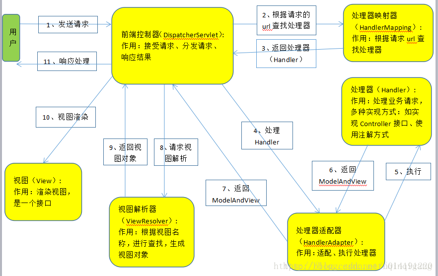

##

### 1 Spring MVC

**1.1 Spring MVC工作流程**

1、用户请求发到**前端控制器**（DispatcherServlet），前端控制器过滤请求（url），加载springmvc.xml配置文件。--（初始加载配置，是否能够访问）

2、前端控制器找到处理映射器（HandlerMapping），通过处理映射器完成url到Controller映射组件。--（url应该去哪）

3、处理映射器有了映射关系，并找到对应的处理器。将处理器（Handler）返回，返回前做拦截处理。

4、**前端控制器**拿到处理器后，去找处理适配器（HandlerAdapter），通过处理适配器访问并执行处理器。

5、执行处理器（**具体开发的方法**）。

6、处理器执行后会返回一个ModelAndView给处理适配器。

7、处理适配器将ModelAndView对象返回给**前端控制器**。

8、前端控制器请求视图解析器（ViewResolver）去进行视图解析，将其解析成真正的试图对象（如：jsp）

9、返回视图对象到到**前端控制器**。

10、视图渲染，将ModelAndView对象中的数据放到request域中，用来让页面加载数据的。

11、通过第8步，通过名称找到了对应的页面，通过第10步，request域中有了所需要的数据，那么就能够进行视图渲染了。最后将其返回即可。

**1.2 springMVC中的几个组件**：

	前端控制器（DispatcherServlet）：接收请求，响应结果，相当于电脑的CPU。
	
	处理器映射器（HandlerMapping）：根据URL去查找处理器
	
	处理器（Handler）：（需要程序员去写代码处理逻辑的）
	
	处理器适配器（HandlerAdapter）：会把处理器包装成适配器，这样就可以支持多种类型的处理器，类比笔记本的适配器（适配器模式的应用）
	
	视图解析器（ViewResovler）：进行视图解析，多返回的字符串，进行处理，可以解析成对应的页面

### 2 Servlet

作用：处理请求，发送响应。（Tomcat 是Web应用服务器,是一个Servlet/JSP容器）

**2.1 Servlet生命周期**
 
	1、加载和实例化：当Servlet容器启动或者客户端发送一个请求时，Servlet容器会去内存中查看是否存在。存在则取该实例响应请求。若不存在就创建一个Servlet实例。
	
	2、初始化：实例化Servlet对象后。Servlet容器将调用Servlet的init()方法进行初始。
	
	3、服务：初始化后的Servlet处于请求就绪状态。当收到请求时，调用service()处理用户请求，service()方法会根据请求去调对应的doPost()或者doGet()方法。
	
	4、销毁：Servlet容器关闭时，Servlet实例也随时销毁。其间，Servlet容器会调用Servlet 的destroy()方法去判断该Servlet是否应当被释放（或回收资源）。

### 3 线程

**3.1 线程生命周期**：新建、就绪、运行、死亡、堵塞

	1、新建状态
	创建一个线程实例（new Thread()）;
	
	2、就绪状态
	调用.start()方法，等待分配CPU分配，若分配到CPU就进入执行，否则在就绪队列中进行等待。
	
	3、运行
	获得CPU，执行run()方法。时除非此线程自动放弃CPU资源或者有优先级更高的线程进入，线程将一直运行到结束。
	
	4、死亡
	当线程执行完成或者线程被杀死，线程进入死亡状态。此时将不能再回到就绪状态。
	自然终止：正常运行run()方法后终止
	异常终止：调用stop()方法让一个线程终止运行

	5、堵塞（blocked）
	由于某种原因导致正在运行的线程让出CPU并暂停自己的执行，即进入堵塞状态。
	正在睡眠：用sleep(long t) 方法可使线程进入睡眠方式。一个睡眠着的线程在指定的时间过去可进入就绪状态。
	正在等待：调用wait()方法。（调用motify()方法回到就绪状态）
	被另一个线程所阻塞：调用suspend()方法。（调用resume()方法恢复）

**3.5 多线程的创建方式**

	1、继承Thread类
	2、实现Runnable接口，重写run()方法。
	3、Callable与FutureTask，和Runnable相似，只是重写的是call()方法。
	4、lambda方式。
	5、匿名内部类实现。
	6、定时器
	
	都需要将实现new Thread().start()

**3.3 sleep与wait区别**

	sleep()属于Thread类，wait()属于Object()；
	
	sleep()方法只是暂停执行时间，不会释放对象锁，当等待时间到后自动进入运行状态。
	wait()方法会放弃对象锁，进入等待锁定池，只有针对此对象调用notify()方法或者Allnotity()后本线程才进入对象锁定池准备获取对象锁进入运行状态。

**3.4 synchronized与volatile**

	1、共享内存 ——— 隐式通信 volatile 
	2、 消息传递 ——— 显示通信 synchronized / lock

    synchronized：通过锁住共享内存空间的方式。线程A先锁住内存空间，修改完值后将值放入内存，释放锁。此时线程B才能获取值。可以用在变量、方法、类、同步代码块等，性能低。能保证可见性、原子性、有序性。

	volatile：也加了锁，JVM进行了优化。会将修改的结果强制刷新到主存中。只能修饰变量。不能保证原子性。

	volatile不会造成线程阻塞。synchronized可能会造成线程阻塞。
    

**3.5 多线程同步的实现方式**

参考：https://www.cnblogs.com/XHJT/p/3897440.html

	1、synchronized 同步方法
	2、synchronized同步代码块
	3、volatile（只可修饰变量）
	4、重入锁实现线程同步
        ReentrantLock() : 创建一个ReentrantLock实例 
        lock() : 获得锁 
        unlock() : 释放锁
    5、局部变量实现线程同步 
		ThreadLocal() : 创建一个线程本地变量 
	    get() : 返回此线程局部变量的当前线程副本中的值 
	    initialValue() : 返回此线程局部变量的当前线程的"初始值" 
	    set(T value) : 将此线程局部变量的当前线程副本中的值设置为value
    6、阻塞队列实现线程同步
		LinkedBlockingQueue 类常用方法 
	    LinkedBlockingQueue() : 创建一个容量为Integer.MAX_VALUE的LinkedBlockingQueue 
	    put(E e) : 在队尾添加一个元素，如果队列满则阻塞 
	    size() : 返回队列中的元素个数 
	    take() : 移除并返回队头元素，如果队列空则阻塞 
	7、原子变量实现线程同步
		AtomicInteger类常用方法：
		AtomicInteger(int initialValue) : 创建具有给定初始值的新的AtomicInteger
		addAddGet(int dalta) : 以原子方式将给定值与当前值相加
		get() : 获取当前值

### 4 线程池

**4.1、常见线程池**

	1、newSingleThreadExecutor
	单个线程的线程池，即线程池中每次只有一个线程工作，单线程串行执行任务

	2、newFixedThreadExecutor(n)
	固定数量的线程池，没提交一个任务就是一个线程，直到达到线程池的最大数量，然后后面进入等待队列直到前面的任务完成才继续执行

	3、newCacheThreadExecutor（推荐使用）
	可缓存线程池，当线程池大小超过了处理任务所需的线程，那么就会回收部分空闲（一般是60秒无执行）的线程，当有任务来时，又智能的添加新线程来执行。

	4、newScheduleThreadExecutor
	大小无限制的线程池，支持定时和周期性的执行线程 

	创建如：ExecutorService pool=Executors.newFixedThreadPool(2);

**4.2ThreadPoolExecutor详解**

	ThreadPoolExecutor的完整构造方法的签名是：ThreadPoolExecutor(int corePoolSize, int maximumPoolSize, long keepAliveTime, TimeUnit unit, BlockingQueue<Runnable> workQueue, ThreadFactory threadFactory, RejectedExecutionHandler handler) .
	
	corePoolSize - 池中所保存的线程数，包括空闲线程。
	
	maximumPoolSize-池中允许的最大线程数。
	
	keepAliveTime - 当线程数大于核心时，此为终止前多余的空闲线程等待新任务的最长时间。
	
	unit - keepAliveTime 参数的时间单位。
	
	workQueue - 执行前用于保持任务的队列。此队列仅保持由 execute方法提交的 Runnable任务。
	
	threadFactory - 执行程序创建新线程时使用的工厂。
	
	handler - 由于超出线程范围和队列容量而使执行被阻塞时所使用的处理程序。
	
	ThreadPoolExecutor是Executors类的底层实现。
  
	如： ThreadPoolExecutor executor = new ThreadPoolExecutor(5, 10, 200, TimeUnit.MILLISECONDS, new ArrayBlockingQueue<Runnable>(5));

**ThreadPoolExecutor创建流程**

	如果当前线程池中的线程数目小于corePoolSize，则每来一个任务，就会创建一个线程去执行这个任务；
	
	如果当前线程池中的线程数目>=corePoolSize，则每来一个任务，会尝试将其添加到任务缓存队列当中，若添加成功，则该任务会等待空闲线程将其取出去执行；若添加失败（一般来说是任务缓存队列已满），则会尝试创建新的线程去执行这个任务；
	
	如果当前线程池中的线程数目达到maximumPoolSize，则会采取任务拒绝策略进行处理；
	
	如果线程池中的线程数量大于 corePoolSize时，如果某线程空闲时间超过keepAliveTime，线程将被终止，直至线程池中的线程数目不大于corePoolSize；如果允许为核心池中的线程设置存活时间，那么核心池中的线程空闲时间超过keepAliveTime，线程也会被终止。

### 5 集合

参考：https://blog.csdn.net/zhangqunshuai/article/details/80660974#commentBox；https://blog.csdn.net/feiyanaffection/article/details/81394745#commentBox

**5.1 概述**

	List , Set, Map都是接口，前两个继承至collection接口，Map为独立接口
	Set下有HashSet，LinkedHashSet，TreeSet
	List下有ArrayList，Vector，LinkedList
	Map下有Hashtable，LinkedHashMap，HashMap，TreeMap
	collection接口下还有个Queue接口，有PriorityQueue类

结构：

	Collection 接口的接口 对象的集合（单列集合） 
	├——-List 接口：元素按进入先后有序保存，可重复 
	│—————-├ LinkedList 接口实现类， 链表， 插入删除， 没有同步， 线程不安全 
	│—————-├ ArrayList 接口实现类， 数组， 随机访问， 没有同步， 线程不安全 
	│—————-└ Vector 接口实现类 数组， 同步， 线程安全 
	│ ———————-└ Stack 是Vector类的实现类 
	└——-Set 接口： 仅接收一次，不可重复，并做内部排序 
	├—————-└HashSet 使用hash表（数组）存储元素 
	│————————└ LinkedHashSet 链表维护元素的插入次序 
	└ —————-TreeSet 底层实现为二叉树，元素排好序
	
	Map 接口 键值对的集合 （双列集合） 
	├———Hashtable 接口实现类， 同步， 线程安全 
	├———HashMap 接口实现类 ，没有同步， 线程不安全- 
	│—————–├ LinkedHashMap 双向链表和哈希表实现 
	│—————–└ WeakHashMap 
	├ ——–TreeMap 红黑树对所有的key进行排序 
	└———IdentifyHashMap

**5.2 connection接口**(注意首字母小写):

	— List 有序,可重复
	
	ArrayList
	优点: 底层数据结构是数组，查询快，增删慢。
	缺点: 线程不安全，效率高
	Vector
	优点: 底层数据结构是数组，查询快，增删慢。
	缺点: 线程安全，效率低
	LinkedList
	优点: 底层数据结构是链表，查询慢，增删快。
	缺点: 线程不安全，效率高

	—Set 无序,唯一
	
	HashSet
	底层数据结构是哈希表。(无序,唯一)
	如何来保证元素唯一性?
	1.依赖两个方法：hashCode()和equals()
	
	LinkedHashSet
	底层数据结构是链表和哈希表。(FIFO插入有序,唯一)
	1.由链表保证元素有序
	2.由哈希表保证元素唯一
	
	TreeSet
	底层数据结构是红黑树。(唯一，有序)
	1. 如何保证元素排序的呢?
	自然排序
	比较器排序
	2.如何保证元素唯一性的呢?
	根据比较的返回值是否是0来决定

**5.3 Map接口**

有三个比较重要的实现类，分别是HashMap、TreeMap和HashTable。

	TreeMap是有序的，HashMap和HashTable是无序的。
	Hashtable的方法是同步的，HashMap的方法不是同步的。这是两者最主要的区别。

	这就意味着:
	Hashtable是线程安全的，HashMap不是线程安全的。
	HashMap效率较高，Hashtable效率较低。
	如果对同步性或与遗留代码的兼容性没有任何要求，建议使用HashMap。 查看Hashtable的源代码就可以发现，除构造函数外，Hashtable的所有 public 方法声明中都有 synchronized关键字，而HashMap的源码中则没有。
	Hashtable不允许null值，HashMap允许null值（key和value都允许）

	父类不同：Hashtable的父类是Dictionary，HashMap的父类是AbstractMap

### 6 JVM

### 7 hibernate三状态与二级缓存

hibernate对象的三种状态：（session即一级缓存,一级缓存请求内存，没有的话在请求数据库；）  

	1、 瞬时（临时）状态：对象被创建时的状态，数据库里面没有与之对应的记录！    
	
	2、持久状态： 处于session的管理中，并且数据库里面存在与之对应的记录！
	
	3、游离状态： 对象不处于session的管理中，但是数据库里面存在与之对应的记录，但是此时发生修改与数据库无关。

hibernate二级缓存

	二级缓存请求内存，没有在请求二级缓存区，没有在请求数据库；(很少修改的数据放二级缓存，类似于Redis缓存)

### 8 Redis

类型：String、List、Hash、Set、sort Set。

开发中长用于数据缓存。

### 垃圾回收

### 封装、继承、多态

### 接口、抽象类（继承与抽象，子类.....）

### Object 方法

###  mybatis #与$

### 算法

### sql优化

###  java8新特性

### negix

### spring cloud 与Dubbo

### IO

### solr

### hadoop

### 项目描述
