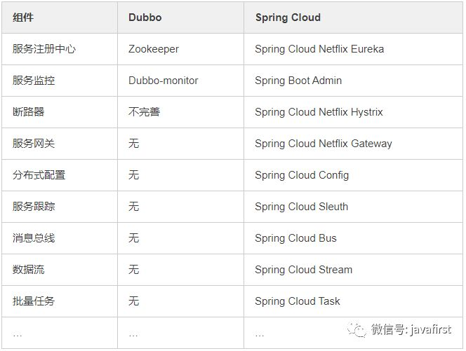

##

### 1 Spring MVC

**1.1 Spring MVC工作流程**

1、用户请求发到**前端控制器**（DispatcherServlet），前端控制器过滤请求（url），加载springmvc.xml配置文件。--（初始加载配置，是否能够访问）

2、前端控制器找到处理映射器（HandlerMapping），通过处理映射器完成url到Controller映射组件。--（url应该去哪）

3、处理映射器有了映射关系，并找到对应的处理器。将处理器（Handler）返回，返回前做拦截处理。

4、**前端控制器**拿到处理器后，去找处理适配器（HandlerAdapter），通过处理适配器访问并执行处理器。

5、执行处理器（**具体开发的方法**）。

6、处理器执行后会返回一个ModelAndView给处理适配器。

7、处理适配器将ModelAndView对象返回给**前端控制器**。

8、前端控制器请求视图解析器（ViewResolver）去进行视图解析，将其解析成真正的试图对象（如：jsp）

9、返回视图对象到到**前端控制器**。

10、视图渲染，将ModelAndView对象中的数据放到request域中，用来让页面加载数据的。

11、通过第8步，通过名称找到了对应的页面，通过第10步，request域中有了所需要的数据，那么就能够进行视图渲染了。最后将其返回即可。

**1.2 springMVC中的几个组件**：

	前端控制器（DispatcherServlet）：接收请求，响应结果，相当于电脑的CPU。
	
	处理器映射器（HandlerMapping）：根据URL去查找处理器
	
	处理器（Handler）：（需要程序员去写代码处理逻辑的）
	
	处理器适配器（HandlerAdapter）：会把处理器包装成适配器，这样就可以支持多种类型的处理器，类比笔记本的适配器（适配器模式的应用）
	
	视图解析器（ViewResovler）：进行视图解析，多返回的字符串，进行处理，可以解析成对应的页面

### 2 Servlet

作用：处理请求，发送响应。（Tomcat 是Web应用服务器,是一个Servlet/JSP容器）

**2.1 Servlet生命周期**
 
	1、加载和实例化：当Servlet容器启动或者客户端发送一个请求时，Servlet容器会去内存中查看是否存在。存在则取该实例响应请求。若不存在就创建一个Servlet实例。
	
	2、初始化：实例化Servlet对象后。Servlet容器将调用Servlet的init()方法进行初始。
	
	3、服务：初始化后的Servlet处于请求就绪状态。当收到请求时，调用service()处理用户请求，service()方法会根据请求去调对应的doPost()或者doGet()方法。
	
	4、销毁：Servlet容器关闭时，Servlet实例也随时销毁。其间，Servlet容器会调用Servlet 的destroy()方法去判断该Servlet是否应当被释放（或回收资源）。

### 3 线程

**3.1 线程生命周期**：新建、就绪、运行、死亡、堵塞

	1、新建状态
	创建一个线程实例（new Thread()）;
	
	2、就绪状态
	调用.start()方法，等待分配CPU分配，若分配到CPU就进入执行，否则在就绪队列中进行等待。
	
	3、运行
	获得CPU，执行run()方法。时除非此线程自动放弃CPU资源或者有优先级更高的线程进入，线程将一直运行到结束。
	
	4、死亡
	当线程执行完成或者线程被杀死，线程进入死亡状态。此时将不能再回到就绪状态。
	自然终止：正常运行run()方法后终止
	异常终止：调用stop()方法让一个线程终止运行

	5、堵塞（blocked）
	由于某种原因导致正在运行的线程让出CPU并暂停自己的执行，即进入堵塞状态。
	正在睡眠：用sleep(long t) 方法可使线程进入睡眠方式。一个睡眠着的线程在指定的时间过去可进入就绪状态。
	正在等待：调用wait()方法。（调用motify()方法回到就绪状态）
	被另一个线程所阻塞：调用suspend()方法。（调用resume()方法恢复）

**3.5 多线程的创建方式**

	1、继承Thread类
	2、实现Runnable接口，重写run()方法。
	3、Callable与FutureTask，和Runnable相似，只是重写的是call()方法。
	4、lambda方式。
	5、匿名内部类实现。
	6、定时器
	
	都需要将实现new Thread().start()

**3.3 sleep与wait区别**

	sleep()属于Thread类，wait()属于Object()；
	
	sleep()方法只是暂停执行时间，不会释放对象锁，当等待时间到后自动进入运行状态。
	wait()方法会放弃对象锁，进入等待锁定池，只有针对此对象调用notify()方法或者Allnotity()后本线程才进入对象锁定池准备获取对象锁进入运行状态。

**3.4 synchronized与volatile**

	1、共享内存 ——— 隐式通信 volatile 
	2、消息传递 ——— 显示通信 synchronized / lock

    synchronized：通过锁住共享内存空间的方式。线程A先锁住内存空间，修改完值后将值放入内存，释放锁。此时线程B才能获取值。可以用在变量、方法、类、同步代码块等，性能低。能保证可见性、原子性、有序性。

	volatile：也加了锁，JVM进行了优化。会将修改的结果强制刷新到主存中。只能修饰变量。不能保证原子性。

	volatile不会造成线程阻塞。synchronized可能会造成线程阻塞。
    

**3.5 多线程同步的实现方式**

参考：https://www.cnblogs.com/XHJT/p/3897440.html

	1、synchronized 同步方法
	2、synchronized同步代码块
	3、volatile（只可修饰变量）
	4、重入锁实现线程同步
        ReentrantLock() : 创建一个ReentrantLock实例 
        lock() : 获得锁 
        unlock() : 释放锁
    5、局部变量实现线程同步 
		ThreadLocal() : 创建一个线程本地变量 
	    get() : 返回此线程局部变量的当前线程副本中的值 
	    initialValue() : 返回此线程局部变量的当前线程的"初始值" 
	    set(T value) : 将此线程局部变量的当前线程副本中的值设置为value
    6、阻塞队列实现线程同步
		LinkedBlockingQueue 类常用方法 
	    LinkedBlockingQueue() : 创建一个容量为Integer.MAX_VALUE的LinkedBlockingQueue 
	    put(E e) : 在队尾添加一个元素，如果队列满则阻塞 
	    size() : 返回队列中的元素个数 
	    take() : 移除并返回队头元素，如果队列空则阻塞 
	7、原子变量实现线程同步
		AtomicInteger类常用方法：
		AtomicInteger(int initialValue) : 创建具有给定初始值的新的AtomicInteger
		addAddGet(int dalta) : 以原子方式将给定值与当前值相加
		get() : 获取当前值

### 4 线程池

**4.1、常见线程池**

	1、newSingleThreadExecutor
	单个线程的线程池，即线程池中每次只有一个线程工作，单线程串行执行任务

	2、newFixedThreadExecutor(n)
	固定数量的线程池，没提交一个任务就是一个线程，直到达到线程池的最大数量，然后后面进入等待队列直到前面的任务完成才继续执行

	3、newCacheThreadExecutor（推荐使用）
	可缓存线程池，当线程池大小超过了处理任务所需的线程，那么就会回收部分空闲（一般是60秒无执行）的线程，当有任务来时，又智能的添加新线程来执行。

	4、newScheduleThreadExecutor
	大小无限制的线程池，支持定时和周期性的执行线程 

	创建如：ExecutorService pool=Executors.newFixedThreadPool(2);

**4.2ThreadPoolExecutor详解**

	ThreadPoolExecutor的完整构造方法的签名是：ThreadPoolExecutor(int corePoolSize, int maximumPoolSize, long keepAliveTime, TimeUnit unit, BlockingQueue<Runnable> workQueue, ThreadFactory threadFactory, RejectedExecutionHandler handler) .
	
	corePoolSize - 池中所保存的线程数，包括空闲线程。
	
	maximumPoolSize-池中允许的最大线程数。
	
	keepAliveTime - 当线程数大于核心时，此为终止前多余的空闲线程等待新任务的最长时间。
	
	unit - keepAliveTime 参数的时间单位。
	
	workQueue - 执行前用于保持任务的队列。此队列仅保持由 execute方法提交的 Runnable任务。
	
	threadFactory - 执行程序创建新线程时使用的工厂。
	
	handler - 由于超出线程范围和队列容量而使执行被阻塞时所使用的处理程序。
	
	ThreadPoolExecutor是Executors类的底层实现。
  
	如： ThreadPoolExecutor executor = new ThreadPoolExecutor(5, 10, 200, TimeUnit.MILLISECONDS, new ArrayBlockingQueue<Runnable>(5));

**ThreadPoolExecutor创建流程**

	如果当前线程池中的线程数目小于corePoolSize，则每来一个任务，就会创建一个线程去执行这个任务；
	
	如果当前线程池中的线程数目>=corePoolSize，则每来一个任务，会尝试将其添加到任务缓存队列当中，若添加成功，则该任务会等待空闲线程将其取出去执行；若添加失败（一般来说是任务缓存队列已满），则会尝试创建新的线程去执行这个任务；
	
	如果当前线程池中的线程数目达到maximumPoolSize，则会采取任务拒绝策略进行处理；
	
	如果线程池中的线程数量大于 corePoolSize时，如果某线程空闲时间超过keepAliveTime，线程将被终止，直至线程池中的线程数目不大于corePoolSize；如果允许为核心池中的线程设置存活时间，那么核心池中的线程空闲时间超过keepAliveTime，线程也会被终止。

### 5 集合

参考：https://blog.csdn.net/zhangqunshuai/article/details/80660974#commentBox；https://blog.csdn.net/feiyanaffection/article/details/81394745#commentBox；
https://www.cnblogs.com/chengxiao/p/6059914.html

**5.1 概述**

	List , Set, Map都是接口，前两个继承至collection接口，Map为独立接口
	Set下有HashSet，LinkedHashSet，TreeSet
	List下有ArrayList，Vector，LinkedList
	Map下有Hashtable，LinkedHashMap，HashMap，TreeMap
	collection接口下还有个Queue接口，有PriorityQueue类

结构：

	Collection 接口的接口 对象的集合（单列集合） 
	├——-List 接口：元素按进入先后有序保存，可重复 
	│—————-├ LinkedList 接口实现类， 链表， 插入删除， 没有同步， 线程不安全 
	│—————-├ ArrayList 接口实现类， 数组， 随机访问， 没有同步， 线程不安全 
	│—————-└ Vector 接口实现类 数组， 同步， 线程安全 
	│ ———————-└ Stack 是Vector类的实现类 
	└——-Set 接口： 仅接收一次，不可重复，并做内部排序 
	├—————-└HashSet 使用hash表（数组）存储元素 
	│————————└ LinkedHashSet 链表维护元素的插入次序 
	└ —————-TreeSet 底层实现为二叉树，元素排好序
	
	Map 接口 键值对的集合 （双列集合） 
	├———Hashtable 接口实现类， 同步， 线程安全 
	├———HashMap 接口实现类 ，没有同步， 线程不安全- 
	│—————–├ LinkedHashMap 双向链表和哈希表实现 
	│—————–└ WeakHashMap 
	├ ——–TreeMap 红黑树对所有的key进行排序 
	└———IdentifyHashMap

**5.2 connection接口**(注意首字母小写):

	— List 有序,可重复
	
	ArrayList
	优点: 底层数据结构是数组，查询快，增删慢。
	缺点: 线程不安全，效率高
	Vector
	优点: 底层数据结构是数组，查询快，增删慢。
	缺点: 线程安全，效率低
	LinkedList
	优点: 底层数据结构是链表，查询慢，增删快。
	缺点: 线程不安全，效率高

	—Set 无序,唯一
	
	HashSet
	底层数据结构是哈希表。(无序,唯一)
	如何来保证元素唯一性?
	1.依赖两个方法：hashCode()和equals()
	
	LinkedHashSet
	底层数据结构是链表和哈希表。(FIFO插入有序,唯一)
	1.由链表保证元素有序
	2.由哈希表保证元素唯一
	
	TreeSet
	底层数据结构是红黑树。(唯一，有序)
	1. 如何保证元素排序的呢?
	自然排序
	比较器排序
	2.如何保证元素唯一性的呢?
	根据比较的返回值是否是0来决定

**5.3 Map接口**

有三个比较重要的实现类，分别是HashMap、TreeMap和HashTable。

	TreeMap是有序的，HashMap和HashTable是无序的。
	Hashtable的方法是同步的，HashMap的方法不是同步的。这是两者最主要的区别。

	这就意味着:
	Hashtable是线程安全的，HashMap不是线程安全的。
	HashMap效率较高，Hashtable效率较低。
	如果对同步性或与遗留代码的兼容性没有任何要求，建议使用HashMap。 查看Hashtable的源代码就可以发现，除构造函数外，Hashtable的所有 public 方法声明中都有 synchronized关键字，而HashMap的源码中则没有。
	Hashtable不允许null值，HashMap允许null值（key和value都允许）

	父类不同：Hashtable的父类是Dictionary，HashMap的父类是AbstractMap

### 6 hibernate三状态与二级缓存

hibernate对象的三种状态：（session即一级缓存,一级缓存请求内存，没有的话在请求数据库；）  

	1、 瞬时（临时）状态：对象被创建时的状态，数据库里面没有与之对应的记录！    
	
	2、持久状态： 处于session的管理中，并且数据库里面存在与之对应的记录！
	
	3、游离状态： 对象不处于session的管理中，但是数据库里面存在与之对应的记录，但是此时发生修改与数据库无关。

hibernate二级缓存

	二级缓存请求内存，没有在请求二级缓存区，没有在请求数据库；(很少修改的数据放二级缓存，类似于Redis缓存)

### 7 Redis

类型：String、List、Hash、Set、sort Set。

开发中长用于数据缓存。缓存时注解上的key+value构成键。

### 8 JVM与垃圾回收

（参考https://blog.csdn.net/aijiudu/article/details/72991993）

JVM被分为三个主要的子系统

	（1）类加载器子系统（2）运行时数据区（3）执行引擎

**8.1 运行时数据区**

	Java的动态类加载功能是由类加载器子系统处理。当它在运行时（不是编译时）
	首次引用一个类时，它加载、链接并初始化该类文件

	加载包含：启动类加载器 (BootStrap class Loader)、扩展类加载器(Extension class Loader)和应用程序类加载器(Application class Loader)

**8.2 运行时数据区**

	方法区（静态成员方法区）：存放类级别共享资源。如静态变量。每个JVM只有一个方法区。
	
	堆区:所有对象、实例变量、数组。多线程共享，不安全。
   
    栈区：存放局部变量，对象引用等。
   
    PC寄存器：存放当前执行指令地址。

    本地方法栈（native）：保存本地方法信息。

**8.3 执行引擎**

	分配给运行时数据区的字节码将由执行引擎执行。执行引擎读取字节码并逐段执行。

    包含：解释器、编译器、垃圾回收器、Java本地接口 (JNI)、本地方法库。

**垃圾回收：**

	收集并删除未引用的对象。可以通过调用"System.gc()"来触发垃圾回收，但并不保证会确实进行
	垃圾回收。JVM的垃圾回收只收集哪些由new关键字创建的对象。所以，如果不是用new创建的对
	象，你可以使用finalize函数来执行清理

### 9 java异常

**9.1 Java异常机制**

关键字：try、catch、finally、throw、throws。

	• try        -- 用于监听。将要被监听的代码(可能抛出异常的代码)放在try语句块之内，当try语句块内发生异常时，异常就被抛出。
	• catch   -- 用于捕获异常。catch用来捕获try语句块中发生的异常。
	• finally  -- finally语句块总是会被执行。它主要用于回收在try块里打开的物力资源(如数据库连接、网络连接和磁盘文件)。只有finally块，执行完成之后，才会回来执行try或者catch块中的return或者throw语句，如果finally中使用了return或者throw等终止方法的语句，则就不会跳回执行，直接停止。
	• throw   -- 用于抛出异常。
	• throws -- 用在方法签名中，用于声明该方法可能抛出的异常。

**9.2 异常分类**

	1. Throwable
	　　Throwable是 Java 语言中所有错误或异常的超类。
	　　Throwable包含两个子类: Error 和 Exception。它们通常用于指示发生了异常情况。
	　　Throwable包含了其线程创建时线程执行堆栈的快照，它提供了printStackTrace()等接口用于获取堆栈跟踪数据等信息。
	
	2. Exception
	　　Exception及其子类是 Throwable 的一种形式，它指出了合理的应用程序想要捕获的条件。
	
	3. RuntimeException 
	　　RuntimeException是那些可能在 Java 虚拟机正常运行期间抛出的异常的超类。
	　　编译器不会检查RuntimeException异常。例如，除数为零时，抛出ArithmeticException异常。RuntimeException是ArithmeticException的超类。当代码发生除数为零的情况时，倘若既"没有通过throws声明抛出ArithmeticException异常"，也"没有通过try...catch...处理该异常"，也能通过编译。这就是我们所说的"编译器不会检查RuntimeException异常"！
	　　如果代码会产生RuntimeException异常，则需要通过修改代码进行避免。例如，若会发生除数为零的情况，则需要通过代码避免该情况的发生！
	
	4. Error
	　　和Exception一样，Error也是Throwable的子类。它用于指示合理的应用程序不应该试图捕获的严重问题，大多数这样的错误都是异常条件。
	　　和RuntimeException一样，编译器也不会检查Error。
	
	
	Java将可抛出(Throwable)的结构分为三种类型：被检查的异常(Checked Exception)，运行时异常(RuntimeException)和错误(Error)。
	
	(01) 运行时异常
	定义: RuntimeException及其子类都被称为运行时异常。
	特点: Java编译器不会检查它。也就是说，当程序中可能出现这类异常时，倘若既"没有通过throws声明抛出它"，也"没有用try-catch语句捕获它"，还是会编译通过。例如，除数为零时产生的ArithmeticException异常，数组越界时产生的IndexOutOfBoundsException异常，fail-fail机制产生的ConcurrentModificationException异常等，都属于运行时异常。
	　　虽然Java编译器不会检查运行时异常，但是我们也可以通过throws进行声明抛出，也可以通过try-catch对它进行捕获处理。
	　　如果产生运行时异常，则需要通过修改代码来进行避免。例如，若会发生除数为零的情况，则需要通过代码避免该情况的发生！
	
	(02) 被检查的异常
	定义: Exception类本身，以及Exception的子类中除了"运行时异常"之外的其它子类都属于被检查异常。
	特点: Java编译器会检查它。此类异常，要么通过throws进行声明抛出，要么通过try-catch进行捕获处理，否则不能通过编译。例如，CloneNotSupportedException就属于被检查异常。当通过clone()接口去克隆一个对象，而该对象对应的类没有实现Cloneable接口，就会抛出CloneNotSupportedException异常。
	　　被检查异常通常都是可以恢复的。
	
	(03) 错误
	定义: Error类及其子类。
	特点: 和运行时异常一样，编译器也不会对错误进行检查。
	　　当资源不足、约束失败、或是其它程序无法继续运行的条件发生时，就产生错误。程序本身无法修复这些错误的。例如，VirtualMachineError就属于错误。
	　　按照Java惯例，我们是不应该是实现任何新的Error子类的！

**9.3 常见运行时异常**

	ArithmeticException：数学计算异常。
	NullPointerException：空指针异常。
	NegativeArraySizeException：负数组长度异常。
	ArrayOutOfBoundsException：数组索引越界异常。
	ClassNotFoundException：类文件未找到异常。
	ClassCastException：类型强制转换异常。
	SecurityException：违背安全原则异常。

**9.4 非RuntimeException类型**

	NoSuchMethodException：方法未找到异常。
	IOException：输入输出异常。
	EOFException：文件已结束异常。
	FileNotFoundException：文件未找到异常。
	NumberFormatException：字符串转换为数字异常。
	SQLException：操作数据库异常

### 10 封装、继承、多态

	
	封装：可以隐藏实现细节，使得代码模块化；将数据抽象后进行封装，包含数据与方法封装。

	继承：可以扩展已存在的代码模块（类）；它们的目的都是为了——代码重用。继承是指这样一种能力，它可以使用现有类的所有功能，并在无需重新编写原来的类的情况下对这些功能进行扩展。其继承的过程，就是从一般到特殊的过程。

	多态：则是为了实现另一个目的————接口重用！
	a. 继承的存在(继承是多态的基础,没有继承就没有多态). 
	b. 子类重写父类的方法(多态下调用子类重写的方法). 
	c. 父类引用变量指向子类对象(子类到父类的类型转换).

### 11 重写和重载

	重载：（Overload）是让类以统一的方式处理不同类型数据的一种手段，实质表现就是多个具有不同
	的参数个数或者类型的同名函数（返回值类型可随意，不能以返回类型作为重载函数的区分标准）
	同时存在于同一个类中，是一个类中多态性的一种表现（调用方法时通过传递不同参数个数和参数
	类型来决定具体使用哪个方法的多态性）。

	重写：（Override）是父类与子类之间的多态性，实质是对父类的函数进行重新定义，如果在子类中定义
	某方法与其父类有相同的名称和参数则该方法被重写，不过子类函数的访问修饰权限不能小于父类的；
	若子类中的方法与父类中的某一方法具有相同的方法名、返回类型和参数表，则新方法将覆盖原有的方
	法，如需父类中原有的方法则可使用 super 关键字。 

### 12 接口、抽象类（继承与抽象，子类.....）

	1.语法层面上的区别
	　　1）抽象类可以提供成员方法的实现细节，而接口中只能存在public abstract 方法（JDK1.8之前）；
	　　2）抽象类中的成员变量可以是各种类型的，而接口中的成员变量只能是public static final类型的；
	　　3）接口中不能含有静态代码块以及静态方法，而抽象类可以有静态代码块和静态方法；
	　　4）一个类只能继承一个抽象类，而一个类却可以实现多个接口。

    2.设计层面上的区别
		1）抽象类是对一种事物的抽象，即对类抽象，而接口是对行为的抽象。
		2）设计层面不同，抽象类作为很多子类的父类，它是一种模板式设计。而接口是一种行为规范，它是一种辐射式设计。

### 13 Object 方法

clone(),equals(),finalize(),getClass(),hashCode(),notify(),notifyAll(),toString()
,wait()

	protected Object   clone()创建并返回此对象的一个副本。   
	boolean   equals(Object obj)指示其他某个对象是否与此对象“相等”。   
	protected void   finalize()当垃圾回收器确定不存在对该对象的更多引用时，由对象的垃圾回收器调用此方法。   
	Class<?>   getClass()返回此 Object 的运行时类。   
	int   hashCode()返回该对象的哈希码值。   
	void   notify()唤醒在此对象监视器上等待的单个线程。   
	void   notifyAll()唤醒在此对象监视器上等待的所有线程。   
	String   toString()返回该对象的字符串表示。   
	void   wait()在其他线程调用此对象的 notify() 方法或 notifyAll() 方法前，导致当前线程等待。   
	void   wait(long timeout)在其他线程调用此对象的 notify() 方法或 notifyAll() 方法，或者超过指定的时间量前，导致当前线程等待。   
	void   wait(long timeout, int nanos)在其他线程调用此对象的 notify() 方法或 notifyAll() 方法，或者其他某个线程中断当前线程，或者已超过某个实际时间量前，导致当前线程等待。

### 14 IOC控制反转（容器）与AOP面向切面

（AOP、IOC参考:https://blog.csdn.net/bestone0213/article/details/47424255；https://blog.csdn.net/gloomy_114/article/details/68946881）

	依赖注入(DI)是控制反转(IOC)的一种方式，但现在大家默认控制反转等同于依赖注入.控制反转是一种设计思想。
	控制反转：控制反转是指spring容器通过依赖注入的方式使得创建依赖对象的控制权由对象转移到spring容器。（即对象不是由我们自己主动创建（new），而是由IOC容器控制。作用是解耦）
	
	面向切面编程，往往被定义为促使软件系统实现关注点的分离的技术。系统是由许多不同的组件所组成的，每一个组件各负责一块特定功能。除了实现自身核心功能之外，这些组件还经常承担着额外的职责。
	例如日志、事务管理和安全这样的核心服务经常融入到自身具有核心业务逻辑的组件中去。这些系统服务经常被称为横切关注点，因为它们会跨越系统的多个组件。

###  15 mybatis #与$

sql注入：name=anything' OR 'x'='x   ；'x'='x  恒为真。推荐#。

	$：是不安全的，是可以注入的，性能比较低，是经常用来拼接sql语句的，不建议用来做传值的传递参数。
	
	'#'：#{}会被替换为?号,有占位符的效果。是安全的，可以防止注入的，且编译采用Prestatement的机制，性能比较高，是传递字符串的 

### 16 sql优化

### 17 jdbc

**17.1 jdbc工具类**

	public class JdbcUtil {
		
		private static final String driver = getValue("jdbc.driver");
		private static final String url = getValue("jdbc.url");;
		private static final String user = getValue("jdbc.username");;
		private static final String password = getValue("jdbc.password");;
	
		static{
			// 加载驱动
					try {

                        //oracle.jdbc.driver.OracleDriver; com.mysql.jdbc.Driver
						Class.forName(driver);
					} catch (ClassNotFoundException e) {
					System.out.println("加载驱动失败！"+e.getMessage());
					}
		}
		
		/**
		 * 连接数据库对象
		 * @return Connection 连接对象
		 */
		public static Connection getConnection(){
			Connection conn = null;
			try {
				//jdbc:oracle:thin:@localhost:1521:ORCL; jdbc:mysql://@localhost:3306/dbName
				conn = DriverManager.getConnection(url, user, password);
			} catch (SQLException e) {
				System.out.println("数据库连接失败！"+e.getMessage());
			}
			return conn;		
		}
		
		/**获取文件中的数据库连接配置信息
		 * @param key 键
		 * @return 值
		 */
		private static String getValue(String key){
			//方式一：
			//ResourceBundle bundle = ResourceBundle.getBundle("jdbc");
			//return bundle.getString(key);	
			InputStream in = JdbcUtil.class.getResourceAsStream("/jdbc.properties");
			Properties properties = new Properties();
			try {
				properties.load(in);
			} catch (IOException e) {
				// TODO Auto-generated catch block
				e.printStackTrace();
			}
			return properties.getProperty(key);
		}
		
		/**
		 * 关闭连接
		 * @param conn 连接对象
		 * @param stmt 创建sql语句对象
		 * @param rs 执行sql语句对象
		 */
		public static void close(Connection conn ,Statement stmt,ResultSet rs){
			try {
				if(rs!=null){
				rs.close();
				}
				if(stmt!=null){
				stmt.close();
				}
				if(conn!=null){
				conn.close();
				}
			} catch (SQLException e) {
				System.out.println("关闭资源失败！"+e.getMessage());
			}
		}
		
		public static void main(String[] args) {
			System.out.println(getConnection());
		}
			
	}

17.2 非预编译查询

	public Employee findByPK(Integer empno1){
			Connection conn = JdbcUtil.getConnection();
			Statement stmt = null;
			ResultSet rs ;
			Employee emp = null;
			String sql = "select * from myemp where empno="+empno1;
			System.out.println(sql);
			try {
				 stmt = conn.createStatement();
				 rs = stmt.executeQuery(sql);
				 while(rs.next()){
						Integer empno = rs.getInt("empno");
						String ename = rs.getString("ename");
						String job = rs.getString("job");
						Integer mgr = rs.getInt("mgr");
						Date hiredate = rs.getDate("hiredate");
						Double sal = rs.getDouble("sal");
						Double comm = rs.getDouble("comm");
						Integer deptno = rs.getInt("deptno");
	
						emp = new Employee(empno, ename, job, mgr, hiredate,
								sal, comm, deptno);
				 }
				 
			} catch (SQLException e) {
				System.out.println("没有此员工！");
				return null;	
			}
			return emp;	
		}

17.3 预编译

	public void update(Employee emp) throws DataAccessExcption{
		Connection conn = JdbcUtil.getConnection();
		StringBuffer sql = new StringBuffer("update myemp set ename=? hiredate=?  where empno=?");
		PreparedStatement ps = null;
		try {
			 ps = conn.prepareStatement(sql.toString());
			 int i = 1;
			 //setObject(i++, 值);
			 ps.setObject(i++, emp.getEname());
			 //加sql
			 ps.setObject(i++, new java.sql.Date(emp.getHiredate().getTime()));
			 ps.setObject(i++, emp.getEmpno());
			 System.out.println(sql.toString());
			 //不要sql
			 int row = ps.executeUpdate();
			 System.out.println("更新成功！");	 
		} catch (SQLException e) {
			throw new DataAccessExcption();
		}finally{
			try {
				ps.close();
			} catch (SQLException e) {
				// TODO Auto-generated catch block
				e.printStackTrace();
			}
			JdbcUtil.close(conn,null, null);
		}		
	}

### 18 分页sql

mysql分页

	select * from users limit 0,10 -- (0为第一条，取第一条开始，一共取10条)

oracle分页

	select * from (select r.*,rownum rn  from (select * from users) r where rownum<=10) a where a.rn>0  --（查询起始1，结束10。共10条）

### 19 算法

### 20 java8新特性

**一 Lambda表达式**

Lambda表达式可以说是Java 8最大的卖点，她将函数式编程引入了Java。Lambda允许把函数作为一个方法的参数，或者把代码看成数据。
	
	Arrays.asList( "p", "k", "u","f", "o", "r","k").forEach( e -> System.out.println( e ) );

**二 接口的默认方法与静态方法**

我们可以在接口中定义默认方法，使用default关键字，并提供默认的实现。所有实现这个接口的类都会接受默认方法的实现，除非子类提供的自己的实现。例如：

	public interface DefaultFunctionInterface {
	     default String defaultFunction() {
	         return "default function";
	     }
	}

我们还可以在接口中定义静态方法，使用static关键字，也可以提供实现。例如：
	
	public interface StaticFunctionInterface {
	     static String staticFunction() {
	         return "static function";
	     }
	}

**三 方法引用**

通常与Lambda表达式联合使用，可以直接引用已有Java类或对象的方法。一般有四种不同的方法引用：
	
	构造器引用。语法是Class::new，或者更一般的Class< T >::new，要求构造器方法是没有参数；
	
	静态方法引用。语法是Class::static_method，要求接受一个Class类型的参数；
	
	特定类的任意对象方法引用。它的语法是Class::method。要求方法是没有参数的；
	
	特定对象的方法引用，它的语法是instance::method。要求方法接受一个参数，与3不同的地方在于，3是在列表元素上分别调用方法，而4是在某个对象上调用方法，将列表元素作为参数传入；

**四、重复注解**

在Java 5中使用注解有一个限制，即相同的注解在同一位置只能声明一次。Java 8引入重复注解，这样相同的注解在同一地方也可以声明多次。重复注解机制本身需要用@Repeatable注解。Java 8在编译器层做了优化，相同注解会以集合的方式保存，因此底层的原理并没有变化。

**五、扩展注解的支持**

Java 8扩展了注解的上下文，几乎可以为任何东西添加注解，包括局部变量、泛型类、父类与接口的实现，连方法的异常也能添加注解。

**六、Optional**

Java 8引入Optional类来防止空指针异常，Optional类最先是由Google的Guava项目引入的。Optional类实际上是个容器：它可以保存类型T的值，或者保存null。使用Optional类我们就不用显式进行空指针检查了。

**七、Stream**

Stream API是把真正的函数式编程风格引入到Java中。其实简单来说可以把Stream理解为MapReduce，当然Google的MapReduce的灵感也是来自函数式编程。她其实是一连串支持连续、并行聚集操作的元素。从语法上看，也很像linux的管道、或者链式编程，代码写起来简洁明了，非常酷帅！

**八、Date/Time API** (JSR 310)

Java 8新的Date-Time API (JSR 310)受Joda-Time的影响，提供了新的java.time包，可以用来替代 java.util.Date和java.util.Calendar。一般会用到Clock、LocaleDate、LocalTime、LocaleDateTime、ZonedDateTime、Duration这些类，对于时间日期的改进还是非常不错的。

**九、JavaScript引擎Nashorn**

Nashorn允许在JVM上开发运行JavaScript应用，允许Java与JavaScript相互调用。

**十、Base64**

在Java 8中，Base64编码成为了Java类库的标准。Base64类同时还提供了对URL、MIME友好的编码器与解码器。

除了这十大新特性之外，还有另外的一些新特性：

	更好的类型推测机制：Java 8在类型推测方面有了很大的提高，这就使代码更整洁，不需要太多的强制类型转换了。
	
	编译器优化：Java 8将方法的参数名加入了字节码中，这样在运行时通过反射就能获取到参数名，只需要在编译时使用-parameters参数。
	
	并行（parallel）数组：支持对数组进行并行处理，主要是parallelSort()方法，它可以在多核机器上极大提高数组排序的速度。
	
	并发（Concurrency）：在新增Stream机制与Lambda的基础之上，加入了一些新方法来支持聚集操作。
	
	Nashorn引擎jjs：基于Nashorn引擎的命令行工具。它接受一些JavaScript源代码为参数，并且执行这些源代码。
	
	类依赖分析器jdeps：可以显示Java类的包级别或类级别的依赖。
	
	JVM的PermGen空间被移除：取代它的是Metaspace（JEP 122）。

### 21 negix

（https://blog.csdn.net/wchengsheng/article/details/79930858）

### 22 spring cloud

https://blog.csdn.net/qq_42629110/article/details/84963815

	维度(SpringCloud)
		服务开发
			SpringBoot
			Spring
			SpringMVC
		服务配置与管理
			Netfilx公司的Archaiusm,阿里的Diamond
		服务注册与发现
			Eureka,ZooKeeper
		服务调用
			Rest,RPC,gRPC
		服务熔断器
			Hystrix
		服务负载均衡
			Ribbon,Nginx
		服务接口调用
			Feign
		消息队列
			Kafka,RabbitMq,ActiveMq
		服务配置中心管理
			SpringCloudConfing
		服务路由(API网关)
			Zuul
		事件消息总线
			SpringCloud Bus

**分布式事务**（https://blog.csdn.net/zyndev/article/details/79604395#commentBox）
	
	基于XA协议的两阶段提交
	消息事务+最终一致性（目前处理分布式主流方案tcc及消息的最终一致性）
	TCC编程模式
	LCN（推荐）：强一致性方案，github上较为流行的tx-lcn分布式处理框架，它是基于redis的一种补偿型处理方案。（https://blog.csdn.net/zhangxing52077/article/details/81587988）

**分布式锁**

（https://www.jianshu.com/p/68a1c094b639）

基于数据库、基于redis、基于ZooKeeper。

### 23 Dubbo

(https://blog.csdn.net/Y0Q2T57s/article/details/83005376#commentBox)

**23.1 Dubbo是什么？**
	
	Dubbo是阿里巴巴开源的基于 Java 的高性能 **RPC 分布式服务框架**，现已成为 Apache 基金会孵化项目。

**23.2 为什么要用Dubbo？**
	
	因为是阿里开源项目，国内很多互联网公司都在用，已经经过很多线上考验。内部使用了 Netty、Zookeeper，保证了高性能高可用性。
	
	使用 Dubbo 可以将核心业务抽取出来，作为独立的服务，逐渐形成稳定的服务中心，可用于提高业务复用灵活扩展，使前端应用能更快速的响应多变的市场需求。

**23.3 Dubbo 和 Spring Cloud 有什么区别？**

	两个没关联，如果硬要说区别，有以下几点。
	
	1）通信方式不同
	Dubbo 使用的是 RPC 通信，而 Spring Cloud 使用的是 HTTP RESTFul 方式。
	2）组成部分不同

......

### 24 IO

### 25 solr

(https://blog.csdn.net/lihang_1994/article/details/72599449)

Solr 是Apache下的一个顶级开源项目，采用Java开发，它是基于Lucene的全文搜索服务器。Solr提供了比Lucene更为丰富的查询语言，同时实现了可配置、可扩展，并对索引、搜索性能进行了优化。

### 26 ES

### 27 hadoop

### 28 项目描述

======================================
##非重要部分

### 1 EJB

将类打包到服务器，让客户端调。