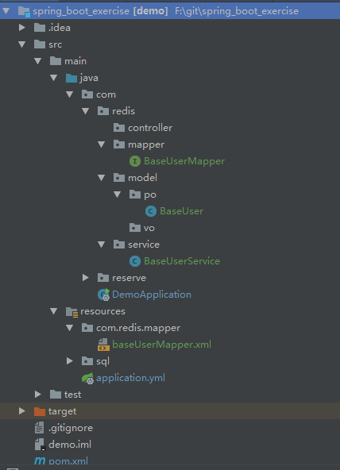

## Spring Boot 2.0整合mybatis

### 1 数据库准备

mysql数据库，测试表结构如下。并插入数据。

	CREATE TABLE `base_user` (
	  `id` int(11) NOT NULL AUTO_INCREMENT COMMENT 'id',
	  `account` varchar(100) NOT NULL COMMENT '登录账户',
	  `password` varchar(30) NOT NULL COMMENT '密码',
	  `user_name` varchar(100) NOT NULL COMMENT '姓名',
	  `sex` int(1) NOT NULL DEFAULT '1' COMMENT '性别；1男，2女。',
	  `remark` varchar(255) DEFAULT NULL COMMENT '备注',
	  `create_user` int(10) NOT NULL,
	  `create_time` datetime NOT NULL,
	  `update_user` int(10) NOT NULL,
	  `update_time` datetime NOT NULL,
	  PRIMARY KEY (`id`)
	) ENGINE=InnoDB AUTO_INCREMENT=2 DEFAULT CHARSET=utf8;

### 2 项目搭建

项目结构如下：

 
注：启动类默认放com包下，即最外层。否则需要添加注解去扫包。

**2.1** pom.xml

添加mysql驱动包，阿里数据库连接池ruid，mybatis-spring-boot-starter

	<?xml version="1.0" encoding="UTF-8"?>
	<project xmlns="http://maven.apache.org/POM/4.0.0" xmlns:xsi="http://www.w3.org/2001/XMLSchema-instance"
		xsi:schemaLocation="http://maven.apache.org/POM/4.0.0 http://maven.apache.org/xsd/maven-4.0.0.xsd">
		<modelVersion>4.0.0</modelVersion>
	
		<groupId>com</groupId>
		<artifactId>demo</artifactId>
		<version>0.0.1-SNAPSHOT</version>
		<packaging>jar</packaging>
	
		<name>demo</name>
		<description>Demo project for Spring Boot Exercise</description>
	
		<parent>
			<groupId>org.springframework.boot</groupId>
			<artifactId>spring-boot-starter-parent</artifactId>
			<version>1.5.10.RELEASE</version>
			<relativePath/> <!-- lookup parent from repository -->
		</parent>
	
		<properties>
			<project.build.sourceEncoding>UTF-8</project.build.sourceEncoding>
			<project.reporting.outputEncoding>UTF-8</project.reporting.outputEncoding>
			<spring-boot-starter-redis-version>1.3.2.RELEASE</spring-boot-starter-redis-version>
			<java.version>1.8</java.version>
		</properties>
	
		<dependencies>
		<!--	<dependency>
				<groupId>org.springframework.boot</groupId>
				<artifactId>spring-boot-starter-data-jpa</artifactId>
			</dependency>-->
			<dependency>
				<groupId>org.springframework.boot</groupId>
				<artifactId>spring-boot-starter-web</artifactId>
			</dependency>
	
			<dependency>
				<groupId>org.springframework.boot</groupId>
				<artifactId>spring-boot-starter-test</artifactId>
				<scope>test</scope>
			</dependency>
	
			<!-- Spring Boot Reids 依赖 -->
			<dependency>
				<groupId>org.springframework.boot</groupId>
				<artifactId>spring-boot-starter-redis</artifactId>
				<version>${spring-boot-starter-redis-version}</version>
			</dependency>
	
			<dependency>
				<groupId>mysql</groupId>
				<artifactId>mysql-connector-java</artifactId>
			</dependency>
	
			<!--mybatis-->
			<dependency>
				<groupId>org.mybatis.spring.boot</groupId>
				<artifactId>mybatis-spring-boot-starter</artifactId>
				<version>1.3.0</version>
			</dependency>
	
	
			<!--beetlsql-->
			<!--<dependency>
				<groupId>com.ibeetl</groupId>
				<artifactId>beetl-framework-starter</artifactId>
				<version>1.1.35.RELEASE</version>
			</dependency>
			<dependency>
				<groupId>com.ibeetl</groupId>
				<artifactId>beetlsql</artifactId>
				<version>2.10.10</version>
			</dependency>-->
	
			<!-- alibaba的druid数据库连接池 -->
			<dependency>
				<groupId>com.alibaba</groupId>
				<artifactId>druid-spring-boot-starter</artifactId>
				<version>1.1.10</version>
			</dependency>
	
			<!--junit测试-->
			<dependency>
				<groupId>junit</groupId>
				<artifactId>junit</artifactId>
				<version> 4.12</version>
			</dependency>
	
			<dependency>
				<groupId>log4j</groupId>
				<artifactId>log4j</artifactId>
				<version>1.2.17</version>
			</dependency>
	
			<!--热部署-->
			<dependency>
				<groupId>org.springframework.boot</groupId>
				<artifactId>spring-boot-devtools</artifactId>
				<optional>true</optional>
			</dependency>
	
			<dependency>
				<groupId>org.projectlombok</groupId>
				<artifactId>lombok</artifactId>
				<version>1.16.6</version>
			</dependency>
	
		</dependencies>
	
		<build>
			<plugins>
				<plugin>
					<groupId>org.springframework.boot</groupId>
					<artifactId>spring-boot-maven-plugin</artifactId>
				</plugin>
			</plugins>
		</build>
	
	
	</project>

**2.2** application.yml

	################程序端口,路由################
	server:
	  port: 8089
	  servlet:
          context-path: /spring_boot
	
	################数据源配置################
	spring:
	    datasource:
	        name: blog
	        url: jdbc:mysql://127.0.0.1:3306/blog?useUnicode:true&characterEncoding:utf8&useSSL:false
	        username: root
	        password: 123456
	        # password: cY+qV/UGnuFJ/qBQDppj++1hxX1buy+NlXWww::
	        # 使用druid数据源
	        type: com.alibaba.druid.pool.DruidDataSource
	        driver-class-name: com.mysql.jdbc.Driver
	        #filters: stat,config
	        filters: stat
	        maxActive: 20
	        initialSize: 1
	        maxWait: 60000
	        minIdle: 1
	        timeBetweenEvictionRunsMillis: 60000
	        minEvictableIdleTimeMillis: 300000
	        validationQuery: select 'x'
	        testWhileIdle: true
	        testOnBorrow: false
	        testOnReturn: false
	        poolPreparedStatements: true
	        maxOpenPreparedStatements: 20

	################mybatis配置以下两项################
	mapper-locations:
	     classpath:com.*.mapper/*.xml //数据库操作层，xml
	type-aliases-package: com.*.model.po    //数据库实体层
	
	################日志################
	logging:
	  level:
	     com:
	        redis:
	          mapper: debug

**2.3 启动类**

	@SpringBootApplication
	public class DemoApplication {
	
		public static void main(String[] args) {
			SpringApplication.run(DemoApplication.class, args);
		}
	}

### 3 类与方法测试

**3.1** 实体bean

po包下建实体BaseUser，和数据库字段对应。

	public class BaseUser {
	    /**编号id*/
	    private Integer id;
	    /**账号*/
	    private String  account;
	    /**密码*/
	    private String password;
	    /**用户姓名*/
	     private String userName;
	    /**性别，1男，2女*/
	    private Integer sex;
	    /**描述*/
	    private String remark;
	    /**创建人*/
	    private Integer createUser;
	    /**创建时间 */
	    private String createTime;
	    /**修改人*/
	    private Integer updateUser;
	    /**修改时间*/
	    private String updateTime;
	
	    public BaseUser() {
	        super();
	    }
	
	    public Integer getId() {
	        return id;
	    }
	
	    public void setId(Integer id) {
	        this.id = id;
	    }
	
	    public String getAccount() {
	        return account;
	    }
	
	    public void setAccount(String account) {
	        this.account = account;
	    }
	
	    public String getPassword() {
	        return password;
	    }
	
	    public void setPassword(String password) {
	        this.password = password;
	    }
	
	    public String getUserName() {
	        return userName;
	    }
	
	    public void setUserName(String userName) {
	        this.userName = userName;
	    }
	
	    public Integer getSex() {
	        return sex;
	    }
	
	    public void setSex(Integer sex) {
	        this.sex = sex;
	    }
	
	    public String getRemark() {
	        return remark;
	    }
	
	    public void setRemark(String remark) {
	        this.remark = remark;
	    }
	
	    public Integer getCreateUser() {
	        return createUser;
	    }
	
	    public void setCreateUser(Integer createUser) {
	        this.createUser = createUser;
	    }
	
	    public String getCreateTime() {
	        return createTime;
	    }
	
	    public void setCreateTime(String createTime) {
	        this.createTime = createTime;
	    }
	
	    public Integer getUpdateUser() {
	        return updateUser;
	    }
	
	    public void setUpdateUser(Integer updateUser) {
	        this.updateUser = updateUser;
	    }
	
	    public String getUpdateTime() {
	        return updateTime;
	    }
	
	    public void setUpdateTime(String updateTime) {
	        this.updateTime = updateTime;
	    }
	
	    @Override
	    public String toString() {
	        return "BaseUser{" +
	                "id=" + id +
	                ", account='" + account + '\'' +
	                ", password='" + password + '\'' +
	                ", userName='" + userName + '\'' +
	                ", sex=" + sex +
	                ", remark='" + remark + '\'' +
	                ", createUser=" + createUser +
	                ", createTime='" + createTime + '\'' +
	                ", updateUser=" + updateUser +
	                ", updateTime='" + updateTime + '\'' +
	                '}';
	    }
	}

**3.2** 数据库dao层

1）mapper包下建BaseUserMapper类，使用@Mapper ，或者在启动类上加@MapperScan(basePackages ={"com.*.mapper"})；

	@Mapper
	public interface BaseUserMapper {
	    /**
	     * 查询用户信息列表
	     * @CachePut(value = "user", key = "#root.targetClass + #result.username", unless = "#person eq null")
	     * @param baseUser 查询条件
	     * @return 用户信息列表
	     */
	     List<BaseUser> queryUserList(BaseUser baseUser);
	
	    /**
	     * 新增用户
	     * @param baseUser 用户信息
	     */
	     void insertUser(BaseUser baseUser);
	
	    /**
	     * 修改用户
	     * @param baseUser 用户信息
	     */
	    void updateUser(BaseUser baseUser);
	
	
	    /**
	     * oreInvocation属性
	     清除操作默认是在对应方法成功执行之后触发的，即方法如果因为抛出异常而未能成功返回时也不会触发清除操作。使用beforeInvocation可以改变触发清除操作的时间，当我们指定该属性值为true时，Spring会在调用该方法之前清除缓存中的指定元素。
	     * @param id
	     */
	    void deleteUser(Integer id);
	}

2）resource下建文件夹（一般与上面mapper的包对应），建一个与上面mapper类同名的xml

(如下BaseUserMapper.xml)
	
	<?xml version="1.0" encoding="UTF-8" ?>
	<!DOCTYPE mapper PUBLIC "-//mybatis.org//DTD Mapper 3.0//EN" "http://mybatis.org/dtd/mybatis-3-mapper.dtd" >
	<mapper namespace="com.redis.mapper.BaseUserMapper">
	    <parameterMap type="com.redis.model.po.BaseUser"    id="baseUserParameter"></parameterMap>
	    <resultMap type="com.redis.model.po.BaseUser"   id="baseUserResult"></resultMap>
	
	    <!--查询用户信息列表  -->
	    <select  id="queryUserList"  parameterMap="baseUserParameter" resultMap="baseUserResult" >
	       SELECT bu.id id,
	                bu.account account,
	                bu.`password` password,
	                bu.user_name userName,
	                bu.sex sex,
	                bu.remark remark,
	                bu.create_user createUser,
	                bu.create_time createTime
	        FROM base_user bu
	        WHERE 1=1
	        <if test="account!=null and account!=''">AND account like CONCAT(CONCAT('%',#{account}),'%') </if>
	    </select>
	
	    <!-- 新增用户信息-->
	    <insert id="insertUser" parameterMap="baseUserParameter">
	        insert into base_user <include refid="insert_column"/> <include refid="insert_values"/>
	    </insert>
	
	    <sql id="insert_column">
	        <trim prefix="(" suffixOverrides="," suffix=")">
	            <if test="account != null and account != '' ">account,</if>
	            <if test="password != null and password != '' ">password,</if>
	            <if test="userName != null and userName != '' ">user_name,</if>
	            <if test="sex != null and sex != '' ">sex,</if>
	            <if test="remark != null and remark != '' ">remark,</if>
	            <if test="createUser != null and createUser != '' ">create_user,</if>
	            create_time,
	            <if test="updateUser != null and updateUser != '' ">update_user,</if>
	            update_time
	        </trim>
	    </sql>
	
	    <sql id="insert_values">
	        <trim prefix="values(" suffixOverrides="," suffix=")">
	            <if test="account != null and account != '' ">#{account},</if>
	            <if test="password != null and password != '' ">#{password},</if>
	            <if test="userName != null and userName != '' ">#{userName},</if>
	            <if test="sex != null and sex != '' ">#{sex},</if>
	            <if test="remark != null and remark != '' ">#{remark},</if>
	            <if test="createUser != null and createUser != '' ">#{createUser},</if>
	            now(),
	            <if test="updateUser != null and updateUser != '' ">#{updateUser},</if>
	            now()
	        </trim>
	    </sql>
	
	    <!-- 修改用户信息 -->
	    <update id="updateUser" parameterMap="baseUserParameter">
	        update base_user
	        <trim prefix="set" suffixOverrides="," >
	            <if test="account != null and account != '' ">account=#{account},</if>
	            <if test="password != null and password != '' ">password=#{password},</if>
	            <if test="userName != null and userName != '' ">user_name=#{userName},</if>
	            <if test="sex != null and sex != '' ">sex=#{sex},</if>
	            remark=#{remark},
	            <if test="updateUser != null and updateUser != '' ">update_user=#{updateUser},</if>
	            update_time=now()
	        </trim>
	        <where>
	            id=#{id}
	        </where>
	    </update>
	
	    <delete id="deleteUser" parameterType="int">
	        DELETE FROM base_user  WHERE id=#{id}
	    </delete>
	
	</mapper>

**3.3** 业务层
	
	@Service
	public class BaseUserService {
	
	    private Logger logger = Logger.getLogger(getClass());
	
	    @Autowired
	    private BaseUserMapper baseUserMapper;
	    /**
	     * 查询用户信息列表
	     * @param baseUser 查询条件
	     * @return 用户信息列表
	     */
	    public  List<BaseUser> queryUserList(BaseUser baseUser){
	        return baseUserMapper.queryUserList(baseUser);
	    }
	}

**3.4** 测试类

	@RunWith(SpringRunner.class)
	@SpringBootTest
	public class BaseUserServiceTest {
	
	    @Autowired
	    private BaseUserService baseUserService;
	
	    @Test
	    public void queryUserListTest(){
	        List<BaseUser> userList = baseUserService.queryUserList(null);
	        Assert.notNull(userList,"null");
	    }
	}