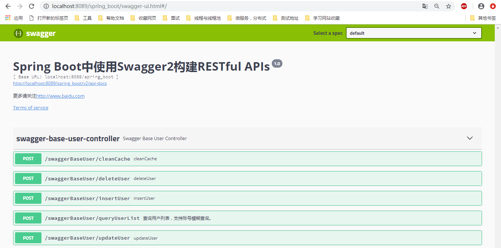
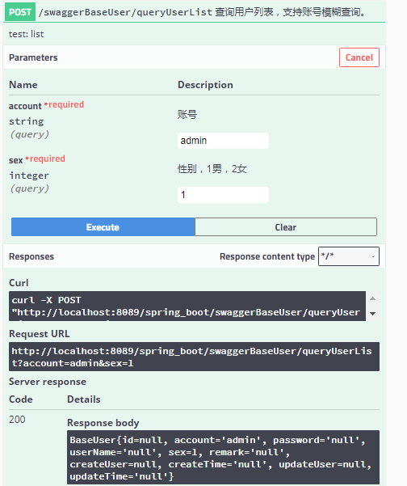

### 1：认识Swagger

Swagger 是一个规范和完整的框架，用于生成、描述、调用和可视化 RESTful 风格的 Web 服务。总体目标是使客户端和文件系统作为服务器以同样的速度来更新。文件的方法，参数和模型紧密集成到服务器端的代码，允许API来始终保持同步。

 作用：

    1. 接口的文档在线自动生成。

    2. 功能测试。

 **Swagger是一组开源项目，其中主要要项目如下**：

1.   Swagger-tools:提供各种与Swagger进行集成和交互的工具。例如模式检验、Swagger 1.2文档转换成Swagger 2.0文档等功能。

2.   Swagger-core: 用于Java/Scala的的Swagger实现。与JAX-RS(Jersey、Resteasy、CXF...)、Servlets和Play框架进行集成。

3.   Swagger-js: 用于JavaScript的Swagger实现。

4.   Swagger-node-express: Swagger模块，用于node.js的Express web应用框架。

5.   Swagger-ui：一个无依赖的HTML、JS和CSS集合，可以为Swagger兼容API动态生成优雅文档。

6.   Swagger-codegen：一个模板驱动引擎，通过分析用户Swagger资源声明以各种语言生成客户端代码。

 

### 2：Maven

		<!-- swagger2 -->
		<dependency>
			<groupId>io.springfox</groupId>
			<artifactId>springfox-swagger2</artifactId>
			<version>2.8.0</version>
			<exclusions>
				<exclusion>
					<groupId>io.swagger</groupId>
					<artifactId>swagger-models</artifactId>
				</exclusion>
			</exclusions>
		</dependency>

		<dependency>
			<groupId>io.swagger</groupId>
			<artifactId>swagger-models</artifactId>
			<version>1.5.20</version>
		</dependency>

		<dependency>
			<groupId>io.springfox</groupId>
			<artifactId>springfox-swagger-ui</artifactId>
			<version>2.8.0</version>
		</dependency>

### 3：创建Swagger2配置类

在创建Swagger2的配置类Swagger2，在springboot启动类加@Import(value={Swagger.class})

	/**
	* Swagger2配置类
	* 在与spring boot集成时，放在与Application.java同级的目录下。
	* 通过@Configuration注解，让Spring来加载该类配置。
	* 再通过@EnableSwagger2注解来启用Swagger2。
	*/
	@Configuration
	@EnableSwagger2
	public class Swagger {
		 
		/**
		* 创建API应用
		* apiInfo() 增加API相关信息
		* 通过select()函数返回一个ApiSelectorBuilder实例,用来控制哪些接口暴露给Swagger来展现，
		* 本例采用指定扫描的包路径来定义指定要建立API的目录。
		* @return
		*/
		@Bean
		public Docket createRestApi() {
			return new Docket(DocumentationType.SWAGGER_2)
			.apiInfo(apiInfo())
			.select()
			 //.apis(basePackage("com.XX.api.controller.broad"+splitor+"com.XX.api.controller.village"))
			.apis(RequestHandlerSelectors.basePackage("com.swagger.controller"))
			.paths(PathSelectors.any())
			.build();
		 
		}
		 
		/**
		* 创建该API的基本信息（这些基本信息会展现在文档页面中）
		* 访问地址：http://项目实际地址/swagger-ui.html
		* @return
		*/
		private ApiInfo apiInfo() {
			 return new ApiInfoBuilder()
			.title("Spring Boot中使用Swagger2构建RESTful APIs")
			.description("更多请关注http://www.baidu.com")
			.termsOfServiceUrl("http://www.baidu.com")
			.contact("sunf")
			.version("1.0")
			.build();
		 
		}
	 
	}

如上代码所示，通过createRestApi函数创建Docket的Bean之后，apiInfo()用来创建该Api的基本信息（这些基本信息会展现在文档页面中）。

### 4：添加文档内容

在完成了上述配置后，其实已经可以生产文档内容，但是这样的文档主要针对请求本身，描述的主要来源是函数的命名，对用户并不友好，我们通常需要自己增加一些说明来丰富文档内容。

Swagger使用的注解及其说明：

@Api：用在类上，说明该类的作用。

@ApiOperation：注解来给API增加方法说明。

@ApiImplicitParams : 用在方法上包含一组参数说明。

@ApiImplicitParam：用来注解来给方法入参增加说明。

@ApiResponses：用于表示一组响应

@ApiResponse：用在@ApiResponses中，一般用于表达一个错误的响应信息

    l   code：数字，例如400

    l   message：信息，例如"请求参数没填好"

    l   response：抛出异常的类   

@ApiModel：描述一个Model的信息（一般用在请求参数无法使用@ApiImplicitParam注解进行描述的时候）

    l   @ApiModelProperty：描述一个model的属性

 

注意：**@ApiImplicitParam的参数说明**：

	paramType：指定参数放在哪个地方
	
	header：请求参数放置于Request Header，使用@RequestHeader获取
	
	query：请求参数放置于请求地址，使用@RequestParam获取
	
	path：（用于restful接口）-->请求参数的获取：@PathVariable
	
	body：（不常用）
	
	form（不常用）
	
	name：参数名
	
	dataType：参数类型（string/int）
	
	required：参数是否必须传true | false
	
	value：说明参数的意思
	
	defaultValue：参数的默认值

**返回状态说明：**

	 @ApiResponses({
            @ApiResponse(code = 400, message = "请求参数没填好"),
            @ApiResponse(code = 404, message = "请求路径没有或页面跳转路径不对")
    })

**返回结果说明（返回ResultData）：**

	@ApiModel(value = "返回说明")
	public class ResultData<T>{
	
	    @ApiModelProperty(value = "成功标识；true：成功；false:失败")
	    private boolean success=true;
	
	    @ApiModelProperty(value = "返回状态码；200:成功")
	    private String code="200";
	
	    @ApiModelProperty(value = "描述信息")
	    private String message;
	
	    private T data;
	}5/8/2019 3:47:25 PM 

**例子**：

	/**desc:用户业务层
	 * @author  zhoulk
	 * date: 2019/4/25 0025
	@Api(value = "BaseUserController|一个用来测试swagger注解的控制器")
	@RestController
	@RequestMapping("/swaggerBaseUser")
	public class SwaggerBaseUserController {
	
	    private Logger logger = Logger.getLogger(getClass());
	
	    @Autowired
	    private BaseUserService baseUserService;
	
	    /**
	     * 查询用户信息列表
	     * @param baseUser 查询条件
	     * @return 用户信息列表
	     */
	  /*  @RequestMapping(value ="/queryUserList", method= RequestMethod.POST)
	    @ApiOperation(value="查询用户列表，支持账号模糊查询。", notes="test: list")
	    @ApiImplicitParams({
	            @ApiImplicitParam(paramType="query", name = "account", value = "账号",  dataType = "String")
	    })
	    public  List<BaseUser> queryUserList(BaseUser baseUser)
	    {
	        List<BaseUser> list = baseUserService.queryUserList(baseUser);
	        return list;
	    }*/
	
	    /**
	     * 查询用户信息列表
	     * @return 用户信息列表
	     */
	    @RequestMapping(value ="/queryUserList", method= RequestMethod.POST)
	    @ApiOperation(value="查询用户列表，支持账号模糊查询。", notes="test: list")
	    @ApiImplicitParams({
	            @ApiImplicitParam(paramType="query", name = "account", value = "账号",  dataType = "String", required=true,defaultValue = "admin"),
	            @ApiImplicitParam(paramType="query", name = "sex", value = "性别，1男，2女",dataType = "int",defaultValue = "1", required=true)
	    })
	    public  String queryUserList(@RequestParam(value="account") String account, @RequestParam(value="sex") Integer sex)
	    {
	        BaseUser baseUser = new BaseUser();
	        baseUser.setAccount(account);
	        baseUser.setSex(sex);
	        return baseUser.toString();
	    }
	
	}

**两个注意点**：

	1.  paramType会直接影响程序的运行期，如果paramType与方法参数获取使用的注解不一致，会直接影响到参数的接收。
	
	例如：
	使用Sawgger UI进行测试，接收不到！
	
	2.  还有一个需要注意的地方：
	Conntroller中定义的方法必须在@RequestMapper中显示的指定RequestMethod类型，否则SawggerUi会默认为全类型皆可访问， API列表中会生成多条项目。

**访问swagger页面**：http://localhost:8089/spring_boot/swagger-ui.html#/ （项目地址+/swagger-ui.html#/）

点击http://localhost:8089/spring_boot/v2/api-docs可以生成对应的接口文档（json）

**访问接口**：/swaggerBaseUser/queryUserList

