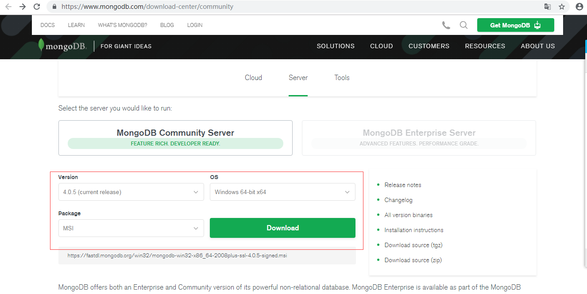
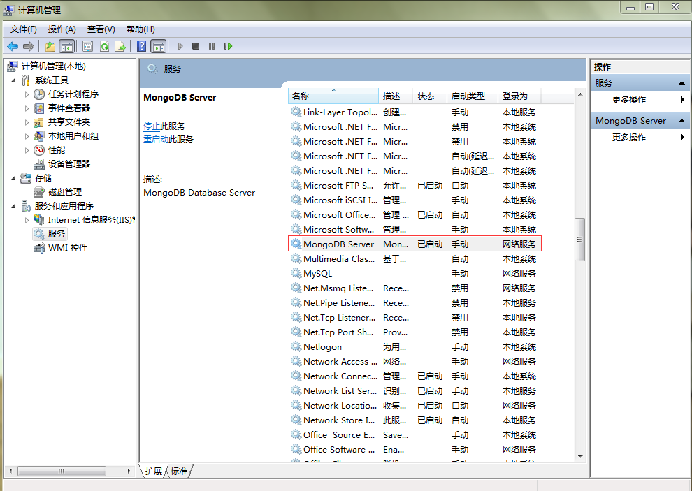
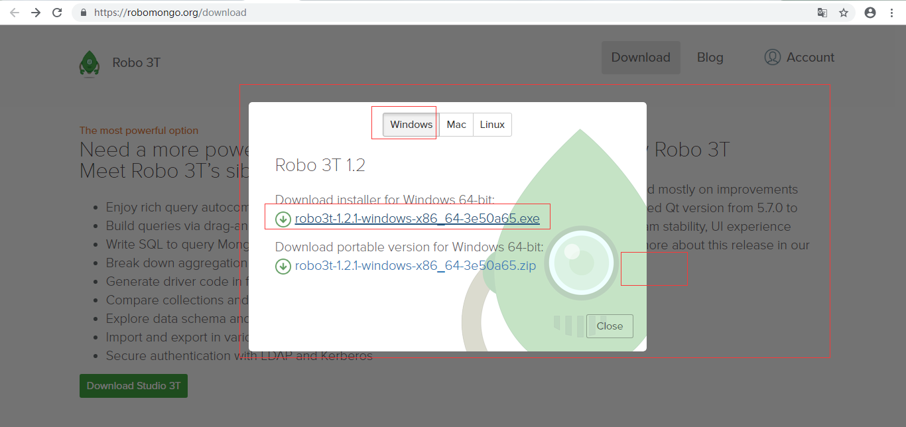

## windows7下MongoDB的安装

### 1 下载下MongoDB安装包

下载地址：https://www.mongodb.com/download-center/community

### 2 安装MongoDB

2.1 先建一个mongodb文件夹，文件夹下包含data文件夹。否则MongoDB启动会失败。
我建的文件为D:\Program Files\mongodb\data。

2.2 进行安装

点击mongodb-win32-x86_64-2008plus-ssl-4.0.5-signed.msi进行安装，中间主要是选择“Custom”自定义 安装路径修改下：D:\Program Files\mongodb
然后不断“下一步”，最后一步安装至结束。

注： 安装到最后一步的时候将Installing MongoDB Compass...（this may take a few minutes）勾去掉。否则安装会需要很久。

### 3 启动mongodb

3.1 直接在本地服务里面启动

3.2 命令行启动

	1.打开cmd
	
	2.进入D:\software\MongoDB\bin目录（注意：先输入d:进入d盘，然后输入cd D:\Program Files\mongodb\bin）
	
	3.输入如下的命令启动mongodb服务：
	mongod --dbpath D:\Program Files\mongodb\data\db

3.3在浏览器输入http://localhost:27017 （27017是mongodb的端口号）查看，若显示：

### 4 配置本地windows mongodb 服务

4.1 建log文件夹

D:\Program Files\mongodb\log文件夹下mongod.log用于存放日志。

4.2 在Mongodb新建配置文件mongo.config

	D:\Program Files\mongodb文件夹下建mongo.config，
	并在mongo.config文件加入配置
	dbpath=D:\Program Files\mongodb\data\db
	logpath=D:\Program Files\mongodb\data\log\mongo.log

4.3 创建服务

	1. cmd 加入D:\Program Files\mongodb\bin
	2. 输入：mongod --config "D:\Program Files\mongodb\mongo.config" --install --serviceName "MongoDB"
	3. 本地服务出现MongoDB,说明安装成功。

### 5 mongodb可视话工具Robomongo 

下载地址：https://robomongo.org/download

