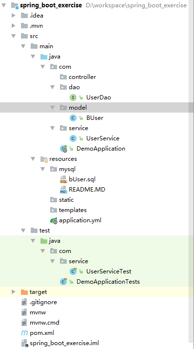

## springBoot整合BeetlSQL

#### 文章摘要：本文主要介绍springBoot整合BeetlSQL，以及BeetlSQL自定义sql使用。

注：本例中，数据库将使用mysql，数据源使用阿里数据源，数据库持久化采用BeetlSQL，由于个人原因暂时未加事务处理。
      
源码地址：https://github.com/zlk19921105/spring_boot_exercise

整合步骤如下：

1.1 pom.xml文件中添加MySQL依赖，完整pom附于文章最后

	<dependency>
	       <groupId>mysql</groupId>
	       <artifactId>mysql-connector-java</artifactId>
	</dependency>

	<!--beetlsql-->由于本次采用BeetlSQL操作数据库，故配置一下两项
	<dependency>
	  <groupId>com.ibeetl</groupId>
	  <artifactId>beetl-framework-starter</artifactId>
	  <version>1.1.35.RELEASE</version>
	</dependency>
	<dependency>
	  <groupId>com.ibeetl</groupId>
	  <artifactId>beetlsql</artifactId>
	  <version>2.10.10</version>
	</dependency>

	<!-- alibaba的druid数据库连接池 -->
	<dependency>
		<groupId>com.alibaba</groupId>
		<artifactId>druid-spring-boot-starter</artifactId>
		<version>1.1.0</version>
	</dependency>

1.2 application.yml配置

	#程序端口
	server:
      context-path: /springBoot
	  port: 8089
	
    #数据源配置
	spring:
	    datasource:
	        name: blog
	        url: jdbc:mysql://127.0.0.1:3306/blog?useUnicode=true&characterEncoding=utf8&useSSL=false
	        username: root
	        password: 123456
	        # password: cY+qV/UGnuFJ/qBQDppj++1hxX1buy+NlXWww==
	        # 使用druid数据源
	        type: com.alibaba.druid.pool.DruidDataSource
	        driver-class-name: com.mysql.jdbc.Driver
	        #filters: stat,config
	        filters: stat
	        maxActive: 20
	        initialSize: 1
	        maxWait: 60000
	        minIdle: 1
	        timeBetweenEvictionRunsMillis: 60000
	        minEvictableIdleTimeMillis: 300000
	        validationQuery: select 'x'
	        testWhileIdle: true
	        testOnBorrow: false
	        testOnReturn: false
	        poolPreparedStatements: true
	        maxOpenPreparedStatements: 20

    #hibernate配置这项
	#spring：
		#jpa：
			#properties：
				#hibernate：
					#hbm2ddl：
					#auto：update//更新数据表
					#auto=create//启动项目删除原有表新建表

	#mybatis配置以下两项
	#  mapper-locations:
		 #classpath:com.zlk.dao/*.xml //数据库操作层，xml

	#  type-aliases-package: com.zlk.model     //数据库实体层

1.3 数据库

    数据库名称：blog,
    创建表：CREATE TABLE `b_user` (
			  `USER_ID` int(11) NOT NULL AUTO_INCREMENT,
			  `USER_NAME` varchar(225) NOT NULL,
			  `PASSWORD` varchar(100) NOT NULL,
			  `LEVEL` varchar(100) DEFAULT NULL,
			  `PHONE` varchar(20) DEFAULT NULL,
			  `EMAIL` varchar(50) DEFAULT NULL,
			  `PROFESSIONAL` varchar(150) DEFAULT NULL,
			  `MAJOR` varchar(225) DEFAULT NULL,
			  `SCHOOL` varchar(225) DEFAULT NULL,
			  `CREATE_TIME` varchar(19) DEFAULT NULL,
			  PRIMARY KEY (`USER_ID`),
			  UNIQUE KEY `USER_NAME` (`USER_NAME`)
			) ENGINE=InnoDB AUTO_INCREMENT=1003 DEFAULT CHARSET=utf8;

1.4 java部分

项目结构图

	

1)model层

	/**用户实体类,类名称与字段名称要与数据库表名一致。也可以自定义xml取别名使用
	 * @author zhoulk
	 *         Date:  2018/4/4.
	 */
	@Getter @Setter @ToString
	public class BUser implements Serializable {
	    /**用户编号*/
	    private Long userId;
	    /**用户名*/
	    private String userName;
	    /**密码*/
	    private String password;
	    /**联系电话*/
	    private String phone;
	}

2）dao层

	/**
	 * desc:用户dao接口，继承BaseMapper接口
	 *
	 * @author zhoulk
	 *         Date:  2018/7/18.
	 */
	public interface UserDao extends BaseMapper<BUser> {
		//自定义方法，需要配置sql，见5)自定义sql
	    public List<BUser> allUser();
	}

3）service层

	/**
	 * desc:
	 *
	 * @author zhoulk
	 *         Date:  2018/7/18.
	 */
	@Service("userService")
	public class UserService {
	
	    @Autowired
	    private UserDao userDao;
	
	    public List<BUser> userList() {
	        return userDao.all();
	    }
	
	    public List<BUser> allUser() {
	        return userDao.allUser();
	    }
	
	}

4）测试类

	/**
	 * desc:用户业务类测试
	 *
	 * @author zhoulk
	 *         Date:  2018/7/18.
	 */
	@RunWith(SpringRunner.class)
	@SpringBootTest
	public class UserServiceTest {
	
	    @Autowired
	    private UserService userService;
	
	    @Test
	    public void userListTest(){
	        List<BUser> userList = userService.userList();
	        Assert.notNull(userList,"null");
	    }
	
	    @Test
	    public void allUserTest(){
	        List<BUser> userList = userService.allUser();
	        Assert.notNull(userList,"null");
	    }
	
	}

5）自定义sql，bUser.sql文件

 复杂SQL写在此处,sql文件命名规则与sql语法参考http://ibeetl.com/guide/beetlsql.html

	allUser
	===
	select  `user_name` from `b_user` /*where  `config_flag`=#configFlag#*/

注：自定义sql文件时，需要加在sql文件，如下@ImportResource(locations = "classpath*:/*.sql")

	@SpringBootApplication
	@ImportResource(locations = "classpath*:/*.sql")
	public class DemoApplication {
	
		public static void main(String[] args) {
			SpringApplication.run(DemoApplication.class, args);
		}
	}

 1.5 总结
 
BeetSql是一个全功能DAO工具， 同时具有Hibernate 优点 & Mybatis优点功能，适用于承认以SQL为中心，同时又需求工具能自动能生成大量常用的SQL的应用。

附：完整pom

	<?xml version="1.0" encoding="UTF-8"?>
	<project xmlns="http://maven.apache.org/POM/4.0.0" xmlns:xsi="http://www.w3.org/2001/XMLSchema-instance"
		xsi:schemaLocation="http://maven.apache.org/POM/4.0.0 http://maven.apache.org/xsd/maven-4.0.0.xsd">
		<modelVersion>4.0.0</modelVersion>
	
		<groupId>com</groupId>
		<artifactId>demo</artifactId>
		<version>0.0.1-SNAPSHOT</version>
		<packaging>jar</packaging>
	
		<name>demo</name>
		<description>Demo project for Spring Boot Exercise</description>
	
		<parent>
			<groupId>org.springframework.boot</groupId>
			<artifactId>spring-boot-starter-parent</artifactId>
			<version>1.5.10.RELEASE</version>
			<relativePath/> <!-- lookup parent from repository -->
		</parent>
	
		<properties>
			<project.build.sourceEncoding>UTF-8</project.build.sourceEncoding>
			<project.reporting.outputEncoding>UTF-8</project.reporting.outputEncoding>
			<java.version>1.8</java.version>
		</properties>
	
		<dependencies>
			<dependency>
				<groupId>org.springframework.boot</groupId>
				<artifactId>spring-boot-starter-data-jpa</artifactId>
			</dependency>
			<dependency>
				<groupId>org.springframework.boot</groupId>
				<artifactId>spring-boot-starter-web</artifactId>
			</dependency>
	
			<dependency>
				<groupId>org.springframework.boot</groupId>
				<artifactId>spring-boot-starter-test</artifactId>
				<scope>test</scope>
			</dependency>
	
			<dependency>
				<groupId>mysql</groupId>
				<artifactId>mysql-connector-java</artifactId>
			</dependency>
	
	
			<!--beetlsql-->
			<dependency>
				<groupId>com.ibeetl</groupId>
				<artifactId>beetl-framework-starter</artifactId>
				<version>1.1.35.RELEASE</version>
			</dependency>
			<dependency>
				<groupId>com.ibeetl</groupId>
				<artifactId>beetlsql</artifactId>
				<version>2.10.10</version>
			</dependency>
	
			<!-- alibaba的druid数据库连接池 -->
			<dependency>
				<groupId>com.alibaba</groupId>
				<artifactId>druid-spring-boot-starter</artifactId>
				<version>1.1.0</version>
			</dependency>
	
			<!--junit测试-->
			<dependency>
				<groupId>org.springframework</groupId>
				<artifactId>spring-test</artifactId>
			</dependency>
			<dependency>
				<groupId>junit</groupId>
				<artifactId>junit</artifactId>
				<version> 4.12</version>
			</dependency>
	
			<!--热部署-->
			<dependency>
				<groupId>org.springframework.boot</groupId>
				<artifactId>spring-boot-devtools</artifactId>
				<optional>true</optional>
			</dependency>
	
			<dependency>
				<groupId>org.projectlombok</groupId>
				<artifactId>lombok</artifactId>
				<version>1.16.6</version>
			</dependency>
	
		</dependencies>
	
		<build>
			<plugins>
				<plugin>
					<groupId>org.springframework.boot</groupId>
					<artifactId>spring-boot-maven-plugin</artifactId>
				</plugin>
			</plugins>
		</build>

	</project>
