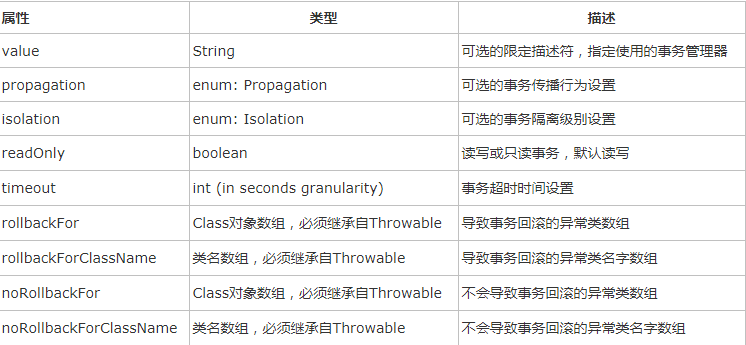
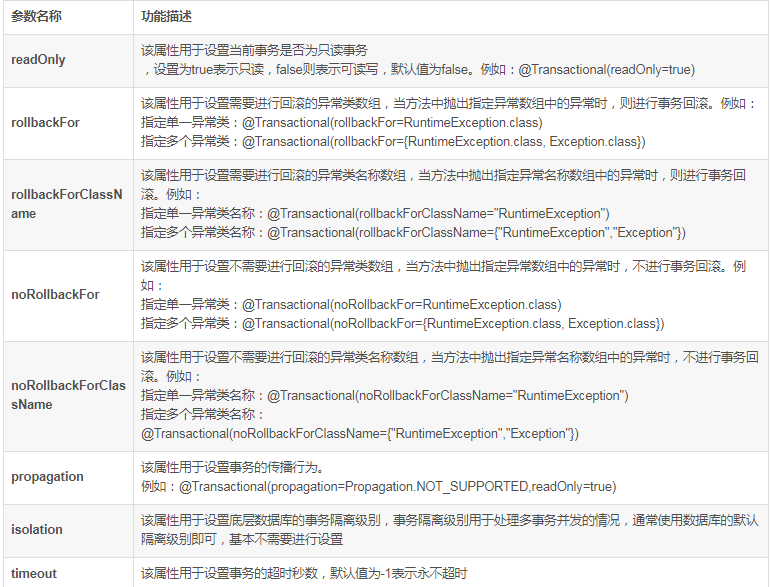

## Spring 注解整理

### 1核心容器（Core）

Spring Core 提供bean工厂 控制反转（IOC），利用IOC使配置与代码进行分离，降低耦合。
>基于xml配置元数据;
Spring 2.5引入了基于注释的配置元数据;
从Spring 3开始基于java配置，使用注解，

1.1@Configuration  [kənˌfɪgəˈreɪʃn] 
>作用：配置spring容器(应用上下文)，相当于把该类作为spring的xml配置文件中的
 </beans/>,用于替换XML中配置beans。

>用法：@Configuration标注在类上(此类为配置类)、接口。
>
>>注：用<context:component-scanbase-package=”XXX”/>扫描该类，最终我们可以在程序里用>@AutoWired或@Resource注解取得用@Bean注解的bean，和用xml先配置bean然后在程序里自动>注入一样。目的是减少xml里配置。
>

	例1.1：
	
		（1）
			
			/**
			 * desc:
			 *
			 * @author zhoulk
			 *         Date:  2018/6/25.
			 */
			public class Annotation {
			   public void Show(){
			       System.out.println("spring学习！");
			   }
			}
		
		（2）配置类，用于替换xml
			import org.springframework.context.annotation.Bean;
			import org.springframework.context.annotation.Configuration;
			import org.springframework.context.annotation.Scope;
			
			/**
			 * desc:
			 *
			 * @author zhoulk
			 *         Date:  2018/6/25.
			 *         配置类，替换xml
			 */
			@Configuration
			public class ConfigurationDemo {
			    // @Bean注解注册bean,同时可以指定初始化和销毁方法
			    // @Bean(name="annotation",initMethod="start",destroyMethod="cleanUp")
			    @Bean
			    @Scope("prototype")
			    public Annotation annotation() {
			        return new Annotation();
			    }
			}
		（3）
			
			import org.springframework.context.annotation.AnnotationConfigApplicationContext;
			import org.springframework.context.ApplicationContext;
			/**
			 * desc:
			 *
			 * @author zhoulk
			 *         Date:  2018/6/25.
			 *
			 *         注：报错
			 */
			
			public class TestConfiguration {
			
			    public static void main(String[] args) {
			
			        // @Configuration注解的spring容器加载方式，用AnnotationConfigApplicationContext替换ClassPathXmlApplicationContext
			        //和使用ApplicationContext.xml加载的效果相同
					// ClassPathXmlApplicationContext context = new ClassPathXmlApplicationContext("applicationContext.xml");
			        ApplicationContext context = new AnnotationConfigApplicationContext(ConfigurationDemo.class);
			        //获取实例c
			        Annotation annotation =(Annotation) context.getBean("annotation");
			        annotation.Show();
			    }
			}

1.2@Bean

>作用：@Bean注解一个方法，使其产生一个Bean，交于spring容器。等效于<bean id="id类名" class="类名"//>
>
>用法：@Bean注解方法（该方法返回类型为对象）、注解类型上。配合@Configuration使用
	
	例：配置类，用于替换xml
	
	    import org.springframework.context.annotation.Bean;
	    import org.springframework.context.annotation.Configuration;
	    import org.springframework.context.annotation.Scope;
	
	    /**
	     * desc:
	     *
	     * @author zhoulk
	     *         Date:  2018/6/25.
	     *         配置类，替换xml
	     */
	    @Configuration
	    public class ConfigurationDemo {
	        // @Bean注解注册bean,同时可以指定初始化和销毁方法
	        // @Bean(name="annotation",initMethod="start",destroyMethod="cleanUp")
	        @Bean
	        @Scope("prototype")//singleton：单例，默认值prototype：多例
	        public Annotation annotation() {
	            return new Annotation();
	        }
	    }

1.3@Import 
>作用：@Import是被用来整合所有在@Configuration注解中定义的bean配置
>
>用法：@Import注解类（配置类）、接口。

	
	例：import org.springframework.context.annotation.Configuration;
		import org.springframework.context.annotation.Import;
		
		@Configuration
		@Import({JavaConfigA.class,JavaConfigB.class})
		//JavaConfigA为配置类A，JavaConfigB配置类B。实现相同接口
		public class ParentConfig {
		    //Any other bean definitions
		}

1.4 @ConstructorProperties  [kənˈstrʌktə(r)]
>作用：（不明）
>
>用法：注解构造函数

	例：@ConstructorProperties({"x","y"})
	    public NewHello(String x, String y) {
	        this.x = x;
	        this.y = y;
	    }

1.5 @Component [kəmˈpəʊnənt], @Repository [rɪˈpɒzətri] , @Service, @Controller
>作用： @Component泛指组件，当组件不要好归类时，可以使用这个注解进行标注。 （把普通java对象实例化到spring容器中，相当于配置文件中的<bean id="" class=""/>）
>
>注：(@Service用于标注业务层组件
>
>@Repository用于标注数据访问组件，即DAO组件
>
>@Controller用于标注控制层组件，如Struts中的Action)
>
>用法：@Component注解用于类或接口，用法相似与@Service。

	例：@Component("userService") 
	    public class UserServiceImpl implements UserService{ 
	 
	        private UserDao userDao; 
	        @Override 
	        public List<User> getUser() { 
	           return userDao.getUser(); 
	        } 
	        //标注在set方法上。 
	        @Autowired 
	        public void setUserDao(@Qualifier("userDao") UserDao userDao) { 
			//@Qualifier用于接口有多个实现类时，@Qualifier的参数必须是我们标注需要实现的@Service注解的名称。
	           this.userDao = userDao; 
	        } 
	    } omponentScan

1.6@ComponentScan
>作用：@ComponentScan会自动扫描包路径下面的所有@Controller、@Service、@Repository、@Component 注解的类
>
>用法：@ComponentScan注解类（此类为配置类）、接口
>
>属性：value指定扫描的包，includeFilters包含那些过滤，excludeFilters不包含那些过滤，>useDefaultFilters>默认的过滤规则是开启的.如果我们要自定义的话是要关闭的。其中@Filters是一个过滤器的接口。

>@Filters 指过滤规则，FilterType指定过滤的规则（

>FilterType.ANNOTATION：按照注解

>FilterType.ASSIGNABLE_TYPE：按照给定的类型；

>FilterType.ASPECTJ：使用ASPECTJ表达式

>FilterType.REGEX：使用正则指定

>FilterType.CUSTOM：使用自定义规则）

>classes指定过滤的类

	例：package com.guang.config;  
	  
	import org.springframework.context.annotation.Bean;  
	import org.springframework.context.annotation.ComponentScan;  
	import org.springframework.context.annotation.ComponentScan.Filter;  
	import org.springframework.context.annotation.Configuration;  
	import org.springframework.context.annotation.FilterType;  
	import com.guang.entity.Person;  
	  
	@Configuration  
	// @ComponentScan("包路径") 会自动扫描包路径下面的所有@Controller、@Service、@Repository、@Component 的类  
	// includeFilters 指定包含扫描的内容  
	// excludeFilters 指定不包含的内容  
	// @Filter 指定过滤规则，type指定扫描的规则（注解，正则，自定义，ASPECTJ表达式），classes指定的扫描的规则类  
	@ComponentScan(basePackages = {"com.guang"},  
	        includeFilters = @Filter(type = FilterType.ANNOTATION, classes = {Controller.class}),  
	        excludeFilters = @Filter(type = FilterType.ANNOTATION, classes = {Repository.class}),  
	        includeFilters = @Filter(type = FilterType.CUSTOM, classes = {FilterCustom.class}),  
	        useDefaultFilters = false)  
	public class Myconfig {  
	  
	    @Bean("person")  
	    public Person person01() {  
	        return new Person("aiha", 25);  
	    }  
	  
	}  

1.7 @Required（为什么使用，什么场景？）
>作用：@Required注解的set方法必须在xml文件进行配置（赋值），否则会包错BeanInitializationException。
>
>用法：用于注解set方法。

	例：package com.zlk.required;
	
	import org.springframework.beans.factory.annotation.Required;
	import org.springframework.context.ApplicationContext;
	import org.springframework.context.support.ClassPathXmlApplicationContext;
	
	/**
	 * desc:
	 *
	 * @author zhoulk
	 *         Date:  2018/6/26.
	 *         测试@Required注解
	 */
	public class Student {
	    private String name;
	    private String age;
	
	    public String getName() {
	        return name;
	    }
	
	    public void setName(String name) {
	        this.name = name;
	    }
	
	    public String getAge() {
	        return age;
	    }
	
	    @Required
	    public void setAge(String age) {
	        this.age = age;
	    }
	
	    public static void main(String[] args) {
	        ApplicationContext context = new ClassPathXmlApplicationContext("/resources/Beans.xml");
	        Student student = (Student) context.getBean("student");
	        System.out.println("Name : " + student.getName() );
	        System.out.println("Age : " + student.getAge() );
	    }
	}
	
	配置文件Beans.xml：由于age用 @Required进行注解，配置文件中age必须有值。
    （否则报错：Caused by: org.springframework.beans.factory.BeanInitializationException: Property 'age' is required for bean 'student'）

	<?xml version="1.0" encoding="UTF-8"?>
	<beans xmlns="http://www.springframework.org/schema/beans"
	       xmlns:xsi="http://www.w3.org/2001/XMLSchema-instance"
	       xmlns:context="http://www.springframework.org/schema/context"
	       xsi:schemaLocation="http://www.springframework.org/schema/beans
	    http://www.springframework.org/schema/beans/spring-beans-3.0.xsd
	    http://www.springframework.org/schema/context
	    http://www.springframework.org/schema/context/spring-context-3.0.xsd">
	
	    <context:annotation-config/>
	
	    <!-- Definition for student bean -->
	    <bean id="student" class="com.zlk.required.Student">
	    <!--    <property name="name"  value="Zara" />-->
	        <!-- try without passing age and check the result -->
	         <property name="age"  value="11"/>
	    </bean>
	</beans>

1.8 @Autowired(Angular2中@Inject有类似效果,JAVA注解@Resource)
>作用：@Autowired 注释，它可以对类成员变量、方法及构造函数进行标注，完成自动装配的工作。 通过 @Autowired的使用来消除 set ，get方法。，当无匹配的Bean时会报错。
>
>>注：@Autowired可配合@Qualifier("office")指定注入Bean的名称。@Resource(name = "manImpl")可直接指明实现类。使用时必须对包进行扫描，否则注入结果将未null。
>>
>>@Resource默认按照名称方式进行bean匹配（装配对象名称），@Autowired默认按照类型方式进行bean匹配
>
>用法：注解对象（常见），构造方法，方法，参数，域，注解类型上。
>
>属性：required = false找不到匹配Bean时不报错。
>
>byType：按类型装配，可以根据属性的类型，在容器中寻找根该类型匹配的bean.如果发现多个，那么将会抛出异常。如>果》没有找到，即属性值为null。

>byName：按名称装配，可以根据属性的名称，在容器中寻找根该属性名相同的bean,如果没有找到，即属性值为null。

>Constructor与byType的方式类似，不同之处在于它应用于构造器参数。如果在容器中没有找到与构造器参数类型一致的>bean,那么将会抛出异常。

>Autodetect：通过bean类的自省机制来决定是使用constructor还是byType方式进行自动装配。如果发现默认的构造>器，那么将使用byType方式。

	例：
	@Service  
	public class SequenceServiceImpl implements SequenceService {  
	  
	    @Autowired
	    //@Qualifier("sequenceMapper")
	    private SequenceMapper sequenceMapper;  
	      
	    @Resource(name = "manImpl")//注意是manImpl不是ManImpl，因为使用@Service，容器为我们创建bean时默认类名首字母小写  
	    private Human human;  
	  
	}  

1.9@Order
>作用：@Order控制类的加载顺序。确定注入到array或者list中的顺序（待研究）
>
>用法：注解类和接口，方法，域（？）。@Order（n）,n越小，越先加载。
>
>测试结果：@Order(5)类加载顺序，只有在配合@Configuration与@Bean使用时产生效果（配置类）。
	
	例：
	1、package com.zlk.order;
	/**
	 * desc:
	 *
	 * @author zhoulk
	 *         Date:  2018/6/27.
	 */
	@Configuration
	@Order(5)
	public class Order1{
	    private final int ORDERED = 1;
	
	    @Bean
	    public Servers1 show1(){
	        System.out.println("Servers1");
	        return new Servers1();
	    }
	}

	2、@Configuration
	@Order(2)
	public class Order2 {
	    private final int ORDERED = 2;
	
	    @Bean
	    public Servers2 show2(){
	        System.out.println("Servers2");
	        return new Servers2();
	    }
	}

	3、public class Servers1{
	}
	
	4、public class Servers2 {
	}

	5.public class Test {
	    public static void main(String[] args) {
	        AnnotationConfigApplicationContext context =
	                new AnnotationConfigApplicationContext("com.zlk.order");
	
	     }
	}

1.10 @Priority [praɪˈɒrəti]（@Order效果相似，待研究）

1.11 @DependsOn
>作用：@DependsOn用于强制初始化其他Bean。
>
>用法：注解方法，类和接口。与@Bean一起使用。

	例：public class DependsA {
	}

	public class DependsB {
	}

	@Configuration
	@ComponentScan("com.zlk.dependsOn")
	public class Test {
	    @Bean
	    public DependsB dependsB () {
	        System.out.println("B");
	        return new DependsB();
	    }
	
	    @Bean
	    @DependsOn("dependsB")//强转先初始化dependsB
	    public DependsA dependsA () {
	        System.out.println("A");
	        return new DependsA();
	    }
	
	    public static void main(String[] args) {
	        new AnnotationConfigApplicationContext(Test.class);
	    }
	}

1.12@value
>作用：为了简化读取properties文件中的配置值，spring支持@value注解的方式来获取，这种方式大大简化了项目配置，提高业务中的灵活性。
>
>用法：注解方法，1、 @Value("#{对象.方法（）}") 
>2、@Value("${配置文件配置项名称}")

	例：import org.springframework.stereotype.Service; 
	  
	/** 
	 * 测试Bean 
	 */
	@Service("userService") 
	public class UserService { 
	  
	 public int count() { 
	  return 10; 
	 } 
	   
	 public int max(int size) { 
	  int count = count(); 
	  return count > size ? count : size; 
	 } 
	}
	
	import org.springframework.beans.factory.InitializingBean; 
	import org.springframework.beans.factory.annotation.Value; 
	import org.springframework.stereotype.Component; 
	  
	@Component
	public class AppRunner implements InitializingBean { 
	   
	 /** 
	  * 引用一个配置项 
	  */
	 @Value("${app.port}") 
	 private int port; 
	   
	 /** 
	  * 调用容器的一个bean的方法获取值 
	  */
	 @Value("#{userService.count()}") 
	 private int userCount; 
	   
	 /** 
	  * 调用容器的一个bean的方法，且传入一个配置项的值作为参数 
	  */
	 @Value("#{userService.max(${app.size})}") 
	 private int max; 
	   
	 /** 
	  * 简单的运算 
	  */
	 @Value("#{${app.size} <= '12345'.length() ? ${app.size} : '12345'.length()}") 
	 private int min; 
	   
	 //测试 
	 public void afterPropertiesSet() throws Exception { 
	  System.out.println("port : " + port); 
	  System.out.println("userCount : " + userCount); 
	  System.out.println("max : " + max); 
	  System.out.println("min : " + min); 
	 } 
	}

	app.properties文件：
	app.port=9090
	app.size=3

	import org.springframework.context.annotation.AnnotationConfigApplicationContext; 
	import org.springframework.context.annotation.ComponentScan; 
	import org.springframework.context.annotation.PropertySource; 
	  
	@ComponentScan
	@PropertySource("classpath:app.properties") 
	public class App { 
	   
	 public static void main( String[] args) { 
	  AnnotationConfigApplicationContext context = new AnnotationConfigApplicationContext(App.class); 
	  context.close(); 
	 } 
	}

1.13@Primary
>作用：当一个接口有多个实现类时，且实现类都有类似@Service注解实现。此时如果对接口进行注入实现，将不能确定注入那个实现类，结果将会报错（若只有一个实现类实现了类似@Service的注解，将注入该实现类）。处理办法在需要实现注入的实现类上加@Primary。（效果等同在实现注入用@Autowired与
@Qualifier("sequenceMapper")注解）
>
>用法：加到需要注入的实现类、接口、方法上。

	例：
	public interface S {
	    	String sing(String lyrics);
		}
	
	@Component // 加注解，让spring识别
	public class S1 implements  S {
	    	public String sing(String s1){
				return "s1";
			}
	}
	
	@Component // 加注解，让spring识别
	@Primary//指明注入该实现类
	public class S2 implements  S {
	    	public String sing(String s1){
				return "s2";
			}
	}
	
	@Component
	public class SingerService {
	    @Autowired
	    private S s;//此时注入@Primary注解的实现类。
	}

1.14@Qualifier
>作用：一般配合@Autowired使用，指明需要实现注入的类（接口有多实现时使用）
>
>用法：注解对象，类。@Qualifier（"实现类名称"）
>
>例子见1.8对应的实例。

1.15@Genre
>作用：与@Qualifier相似，但是可以用来注解形参（一个接口需要实现多个实现类注入时，作为辨别）
>
>用法：注解对象，注解形参。@Genre（“实现类名称”）
>

	例：public class MovieRecommender {
	    @Autowired
	    @Genre("Action")
	    private MovieCatalog actionCatalog;
	    private MovieCatalog comedyCatalog;
	
	    @Autowired
	    public void setComedyCatalog(@Genre("Comedy") MovieCatalog comedyCatalog) {
	        this.comedyCatalog = comedyCatalog;
	    }
	}

1.16 @Offline
作用：与@Qualifier相似

	例：
	public class MovieRecommender {
	
	    @Autowired
	    @Offline
	    private MovieCatalog offlineCatalog;
	
	    // ...
	}
	
	xml:
	<bean class="example.SimpleMovieCatalog">
	    <qualifier type="Offline"/>
	    <!-- inject any dependencies required by this bean -->
	</bean>

1.17@MovieQualifier(未明白)

1.18@PostConstruct、@PreDestroy(待整理，效果未明白)
 >被@PostConstruct修饰的方法会在服务器加载Servlet的时候运行，并且只会被服务器调用一次，类似于Serclet的>inti()方法。被@PostConstruct修饰的方法会在构造函数之后，init()方法之前运行。

 >被@PreDestroy修饰的方法会在服务器卸载Servlet的时候运行，并且只会被服务器调用一次，类似于Servlet的>destroy()方法。被@PreDestroy修饰的方法会在destroy()方法之后运行，在Servlet被彻底卸载之前。（详见下面的>程序实践）
 >
 >用法：注解方法

	例：1、public class Product {
	    private Integer price;
	    private String name;
	
	    @Resource(name = "typeB")
	    private Type type;
	
	    public Integer getPrice() {
	        return price;
	    }
	
	    public void setPrice(Integer price) {
	        this.price = price;
	    }
	
	    public Type getType() {
	        return type;
	    }
	
	    public String getName() {
	        return name;
	    }
	
	    public void setName(String name) {
	        this.name = name;
	    }
	
	    @PostConstruct
	    public void init() {
	        System.out.println("In init block of Product");
	    }
	
	    @PreDestroy
	    public void destroy() {
	        System.out.println("In destroy block of Product");
	    }
	}
	
	2、public class Type {
	    private String productType;
	
	    public String getProductType() {
	        return productType;
	    }
	
	    public void setProductType(String productType) {
	        this.productType = productType;
	    }
	}
	
	3、public class MainApp {
	    public static void main(String[] args) {
	        AbstractApplicationContext context = new ClassPathXmlApplicationContext(
	                "resources/BeansJSRAnnotation.xml");
	
	        Product product = (Product) context.getBean("product");
	
	        System.out.println("Product Name : " + product.getName());
	        System.out.println("Price : " + product.getPrice());
	
	        Type productType = product.getType();
	
	        System.out.println(product.getName() + " is of type:"
	                + productType.getProductType());
	        context.registerShutdownHook();
	    }
	}
	
	4、xml配置BeansJSRAnnotation.xml
	<?xml version="1.0" encoding="UTF-8"?>
	<beans xmlns="http://www.springframework.org/schema/beans"
	       xmlns:xsi="http://www.w3.org/2001/XMLSchema-instance"
	       xmlns:context="http://www.springframework.org/schema/context"
	       xsi:schemaLocation="http://www.springframework.org/schema/beans
	    http://www.springframework.org/schema/beans/spring-beans-3.2.xsd
	    http://www.springframework.org/schema/context
	    http://www.springframework.org/schema/context/spring-context-3.2.xsd">
	
	    <context:annotation-config />
	
	    <!-- Definition for Product bean -->
	    <bean id="product" class="com.zlk.postConstruct_preDestroy.Product" init-method="init" destroy-method="destroy">
	        <property name="name" value="ProductA" />
	        <property name="price" value="400" />
	    </bean>
	    <bean id="typeA" class="com.zlk.postConstruct_preDestroy.Type">
	        <property name="productType" value="Export" />
	    </bean>
	    <bean id="typeB" class="com.zlk.postConstruct_preDestroy.Type">
	        <property name="productType" value="Import" />
	    </bean>
	</beans>

1.19 @AliasFor
>作用：定义注解时，定义属性互为别名。
>注：该注解互为别名的属性成对出现，有默认值，使用互为别名的属性时只能用其中的一个属性名。
>用法：注解 注解属性的属性互为别名；

	例：@Documented
	@Inherited
	@Retention(RetentionPolicy.RUNTIME)
	@Target(ElementType.TYPE)
	public @interface ContextConfiguration {
	    @AliasFor("locations")
	    String[] value() default {};
	
	    @AliasFor("value")
	    String[] locations() default {};
	    //...
	}

1.20 @Named

>作用：用于辨别接口多实现时。
>
>用法：作用于形参、类、接口。
	
	例：1、import javax.inject.Inject;
	import javax.inject.Named;
	
	public class SimpleMovieLister {
	
	    private MovieFinder movieFinder;
	
	    @Inject//注入Bean
	    public void setMovieFinder(@Named("main") MovieFinder movieFinder) {
	        this.movieFinder = movieFinder;
	    }
	}

	2、import javax.inject.Inject;
	import javax.inject.Named;	
	@Named("movieListener")  // @ManagedBean("movieListener") could be used as well
	public class SimpleMovieLister {
	
	    private MovieFinder movieFinder;
	
	    @Inject
	    public void setMovieFinder(MovieFinder movieFinder) {
	        this.movieFinder = movieFinder;
	    }
	
	    // ...
	}

1.21 @Nullable
>作用：定义参数可以为空。
>用法：注解形参。

	例：public class SimpleMovieLister {
	
	    @Inject
	    public void setMovieFinder(@Nullable MovieFinder movieFinder) {
	        ...
	    }
	}

1.22@Scope
>作用：作用范围。
>
>用法：注解形参。@scope默认是单例模式（singleton），如@scope（"singleton"）
	如果需要设置的话@scope("prototype")

	1.singleton单例模式,
	　　全局有且仅有一个实例

	2.prototype原型模式，
	　　每次获取Bean的时候会有一个新的实例

	3.request
	　　request表示该针对每一次HTTP请求都会产生一个新的bean，同时该bean仅在当前HTTP request内有效，配置实例：
	request、session、global session使用的时候首先要在初始化web的web.xml中做如下配置：
	如果你使用的是Servlet 2.4及以上的web容器，那么你仅需要在web应用的XML声明文件web.xml中增加下述ContextListener即可： 
	<web-app>
	   ...
	  <listener>
	<listener-class>org.springframework.web.context.request.RequestContextListener</listener-class>
	  </listener>
	   ...
	</web-app>

	4.session
	　　session作用域表示该针对每一次HTTP请求都会产生一个新的bean，同时该bean仅在当前HTTP session内有效

	5.global session
	global session作用域类似于标准的HTTP Session作用域，不过它仅仅在基于portlet的web应用中才有意义。Portlet规范定义了全局Session的概念，它被所有构成某个 portlet web应用的各种不同的portlet所共享。在global session作用域中定义的bean被限定于全局portlet Session的生命周期范围内。如果你在web中使用global session作用域来标识bean，那么web会自动当成session类型来使用。

1.23 @Lazy（未测试）
>作用：lazy是是否懒加载，如果一个类不是启动就需要的就可以设置为懒加载，用的时候再初始化。
>@Lazy用于指定该Bean是否取消预初始化。主要用于修饰Spring Bean类，用于指定该Bean的预初始化行为，
>使用该Annotation时可以指定一个boolean型的value属性，该属性决定是否要预初始化该Bean
>
>lazy代表延时加载，lazy=false，代表不延时，如果对象A中还有对象B的引用，会在A的xml映射文件中配置b的对象引>用，多对一或一对多，不延时代表查询出对象A的时候，会把B对象也查询出来放到A对象的引用中，A对象中的B对象是有>值的。
>
>lazy=true代表延时，查询A对象时，不会把B对象也查询出来，只会在用到A对象中B对象时才会去查询，默认好像是>false，你可以看看后台的sql语句的变化就明白了，一般需要优化效率的时候会用到
>
>用法：注解类；
	
	例：@Lazy(true)
	@Component
	public class Chinese implements Person{
	   //codes here
	}

1.24@Profile（未测试）
>作用：实际开发中用于替换开发、测试、正式环境。
>
>用法：
	
	例：package com.websystique.spring.configuration;
	 
	import javax.sql.DataSource;
	 
	import org.springframework.context.annotation.Bean;
	import org.springframework.context.annotation.Configuration;
	import org.springframework.context.annotation.Profile;
	import org.springframework.jdbc.datasource.DriverManagerDataSource;
	 
	@Profile("Development")
	@Configuration
	public class DevDatabaseConfig implements DatabaseConfig {
	 
	    @Override
	    @Bean
	    public DataSource createDataSource() {
	        System.out.println("Creating DEV database");
	        DriverManagerDataSource dataSource = new DriverManagerDataSource();
	        /*
	         * Set MySQL specific properties for Development Environment
	         */
	        return dataSource;
	    }
	}
	
	
	<?xml version="1.0" encoding="UTF-8"?>
	<beans xmlns="http://www.springframework.org/schema/beans"
	        xmlns:xsi="http://www.w3.org/2001/XMLSchema-instance"
	        xmlns:context="http://www.springframework.org/schema/context"
	        xsi:schemaLocation="http://www.springframework.org/schema/beans http://www.springframework.org/schema/beans/spring-beans-4.0.xsd
	                            http://www.springframework.org/schema/context http://www.springframework.org/schema/context/spring-context-4.0.xsd">
	 
	    <context:component-scan base-package="com.websystique.spring"/>
	     
	    <beans profile="Development">
	        <import resource="dev-config-context.xml"/> 
	    </beans>
	 
	    <beans profile="Production">
	        <import resource="prod-config-context.xml"/>
	    </beans>
	 
	</beans>

1.25@Conditional（条件注解）
>作用：满足特定条件时创建特定的Bean.
>
>用法：如下
>
      @Bean
      @Conditional(WindowsCondition.class)//WindowsCondition类为判断条件
	  public ListService windowsListService() {
		        return new WindowsListService();
	}

1.26@PropertySouce
>作用：用于读取properties配置文件
>
>用法：@PropertySource("classpath:config.properties") ，注解与类上。
	
	例：package com.zlk.value;
	import org.springframework.context.annotation.AnnotationConfigApplicationContext;
	import org.springframework.context.annotation.ComponentScan;
	import org.springframework.context.annotation.PropertySource;
	
	@ComponentScan//扫描注解
	@PropertySource("classpath:resources/app.properties")//加载xml
	public class App {
		
	    @Value("${demo.url}")  
	    private String mongodbUrl;  

	    public static void main( String[] args) {
	        AnnotationConfigApplicationContext context = new AnnotationConfigApplicationContext(App.class);
	        context.close();
	    }
	}

1.27@EnableLoadTimeWeaving

1.28@EventListener
>作用：用于做事件监听(具体作用不清晰)。
>
>用法：注解方法。

1.29@Async(未测试)
>作用@Async标注的异步方法会在独立的现场中运行，调用者不用等其执行完，即可执行其他操作。
>
>>用法：
>>1启动方式：
>
>>基于Java配置的启用方式：
>
>>@Configuration  
>>@EnableAsync  
>>public class SpringAsyncConfig { ... } 
>>
>>基于XML配置文件的启用方式，配置如下：
>
>><task:executor id="myexecutor" pool-size="5"  />  
>><task:annotation-driven executor="myexecutor"/>   
>>
>>2基于@Async无返回值调用
>
	 @Async  //标注使用  
	 public void asyncMethodWithVoidReturnType() {  
	     System.out.println("Execute method asynchronously. "  
	       + Thread.currentThread().getName());  
	 }  

1.30@NumberFormat、@DateTimeFormat
>作用：数字与日期格式注解
	
  	注:@Number：定义数字相关的解析/格式化元数据（通用样式、货币样式、百分数样式），参数如下：
	
	    style：用于指定样式类型，包括三种：Style.NUMBER（通用样式） Style.CURRENCY（货币样式） Style.PERCENT（百分数样式），默认Style.NUMBER；
	
	    pattern：自定义样式，如patter="#,###"；
	
	 
	
	@DateTimeFormat：定义日期相关的解析/格式化元数据，参数如下：
	
	    pattern：指定解析/格式化字段数据的模式，如”yyyy-MM-dd HH:mm:ss”
	
	iso：指定解析/格式化字段数据的ISO模式，包括四种：ISO.NONE（不使用）  ISO.DATE(yyyy-MM-dd) ISO.TIME(hh:mm:ss.SSSZ)  ISO.DATE_TIME(yyyy-MM-dd hh:mm:ss.SSSZ)，默认ISO.NONE；
	
	    style：指定用于格式化的样式模式，默认“SS”，具体使用请参考Joda-Time类库的org.joda.time.format.DateTimeFormat的forStyle的javadoc；
	
	优先级： pattern 大于 iso 大于 style。
>用法：如下

	例：public class FormatterModel {  
	    @NumberFormat(style=Style.NUMBER, pattern="#,###")  
	    private int totalCount;  
	    @NumberFormat(style=Style.PERCENT)  
	    private double discount;  
	    @NumberFormat(style=Style.CURRENCY)  
	    private double sumMoney;  
	      
	    @DateTimeFormat(iso=ISO.DATE)   
	    private Date registerDate;  
	      
	    @DateTimeFormat(pattern="yyyy-MM-dd HH:mm:ss")   
	    private Date orderDate;  
	  
	    //省略getter/setter  
	}   

1.31@Aspect（理解模糊）
>作用：做AOP(面向切面)管理。
>
>用法:注解类。

>配合使用的注解有@Pointcut， @After， @Befor，@AfterReturning、@AfterThrowing、@AfterThrowing、@Around

	例：xml配置
	<?xml version="1.0" encoding="UTF-8"?>
	
	<beans xmlns="http://www.springframework.org/schema/beans"
	       xmlns:xsi="http://www.w3.org/2001/XMLSchema-instance"
	       xmlns:aop="http://www.springframework.org/schema/aop"
	       xsi:schemaLocation="http://www.springframework.org/schema/beans http://www.springframework.org/schema/beans/spring-beans-2.0.xsd
	           http://www.springframework.org/schema/aop http://www.springframework.org/schema/aop/spring-aop-2.0.xsd
	           ">
	
	    <!-- 启用AspectJ对Annotation的支持 -->
	    <aop:aspectj-autoproxy/>
	
	    <bean id="userManager" class="com.zlk.aspect.UserManagerImpl"/>
	    <bean id="aspcejHandler" class="com.zlk.aspect.AspceJAdvice"/>
	
	</beans>
	
	1、public interface UserManager {
	    public String findUserById(int userId);
	}
	
	2.public class UserManagerImpl implements UserManager {
	
	    public String findUserById(int userId) {
	        System.out.println("---------UserManagerImpl.findUserById()--------");
	        if (userId <= 0) {
	            throw new IllegalArgumentException("该用户不存在!");
	        }
	        return "张三";
	    }
	3、@Aspect
	public class AspceJAdvice {
	
	    /**
	     * Pointcut
	     * 定义Pointcut，Pointcut的名称为aspectjMethod()，此方法没有返回值和参数
	     * 该方法就是一个标识，不进行调用
	     */
	    @Pointcut("execution(* find*(..))")
	    private void aspectjMethod(){};
	
	    /**
	     * Before
	     * 在核心业务执行前执行，不能阻止核心业务的调用。
	     * @param joinPoint
	     */
	    @Before("aspectjMethod()")
	    public void beforeAdvice(JoinPoint joinPoint) {
	        System.out.println("-----beforeAdvice().invoke-----");
	        System.out.println(" 此处意在执行核心业务逻辑前，做一些安全性的判断等等");
	        System.out.println(" 可通过joinPoint来获取所需要的内容");
	        System.out.println("-----End of beforeAdvice()------");
	    }
	
	    /**
	     * After
	     * 核心业务逻辑退出后（包括正常执行结束和异常退出），执行此Advice
	     * @param joinPoint
	     */
	    @After(value = "aspectjMethod()")
	    public void afterAdvice(JoinPoint joinPoint) {
	//        joinPoint.getArgs();
	        System.out.println("-----afterAdvice().invoke-----");
	        System.out.println(" 此处意在执行核心业务逻辑之后，做一些日志记录操作等等");
	        System.out.println(" 可通过joinPoint来获取所需要的内容");
	        System.out.println("-----End of afterAdvice()------");
	    }
	
	    /**
	     * Around
	     * 手动控制调用核心业务逻辑，以及调用前和调用后的处理,
	     *
	     * 注意：当核心业务抛异常后，立即退出，转向AfterAdvice
	     * 执行完AfterAdvice，再转到ThrowingAdvice
	     * @param pjp
	     * @return
	     * @throws Throwable
	     */
	    @Around(value = "aspectjMethod()")
	    public Object aroundAdvice(ProceedingJoinPoint pjp) throws Throwable {
	        System.out.println("-----aroundAdvice().invoke-----");
	        System.out.println(" 此处可以做类似于Before Advice的事情");
	
	        //调用核心逻辑
	        Object retVal = pjp.proceed();
	        System.out.println(" 此处可以做类似于After Advice的事情");
	        System.out.println("-----End of aroundAdvice()------");
	        return retVal;
	    }
	
	    /**
	     * AfterReturning
	     * 核心业务逻辑调用正常退出后，不管是否有返回值，正常退出后，均执行此Advice
	     * @param joinPoint
	     */
	    @AfterReturning(value = "aspectjMethod()", returning = "retVal")
	    public void afterReturningAdvice(JoinPoint joinPoint, String retVal) {
	        System.out.println("-----afterReturningAdvice().invoke-----");
	        System.out.println("Return Value: " + retVal);
	        System.out.println(" 此处可以对返回值做进一步处理");
	        System.out.println(" 可通过joinPoint来获取所需要的内容");
	        System.out.println("-----End of afterReturningAdvice()------");
	    }
	
	    /**
	     * 核心业务逻辑调用异常退出后，执行此Advice，处理错误信息
	     *
	     * 注意：执行顺序在Around Advice之后
	     * @param joinPoint
	     * @param ex
	     */
	    @AfterThrowing(value = "aspectjMethod()", throwing = "ex")
	    public void afterThrowingAdvice(JoinPoint joinPoint, Exception ex) {
	        System.out.println("-----afterThrowingAdvice().invoke-----");
	        System.out.println(" 错误信息："+ex.getMessage());
	        System.out.println(" 此处意在执行核心业务逻辑出错时，捕获异常，并可做一些日志记录操作等等");
	        System.out.println(" 可通过joinPoint来获取所需要的内容");
	        System.out.println("-----End of afterThrowingAdvice()------");
	    }
	}
	
	4、public class ClientTest {
	    public static void main(String[] args) {
	        BeanFactory factory = new ClassPathXmlApplicationContext("resources/applicationContext.xml");
	        UserManager userManager = (UserManager)factory.getBean("userManager");
	
	        //可以查找张三
	        userManager.findUserById(1);
	
	        System.out.println("=====我==是==分==割==线=====");
	
	        try {
	            // 查不到数据，会抛异常，异常会被AfterThrowingAdvice捕获
	            userManager.findUserById(0);
	        } catch (IllegalArgumentException e) {
	        }
	    }
	}

1.32@EnableAspectJAutoProxy（理解不清晰）
>作用：开启AspectJ 自动代理模式,如果不填proxyTargetClass=true，默认为false，
>
>用法：@EnableAspectJAutoProxy(proxyTargetClass=true)

	
	例：package com.dyh.ioc.base;
	
	import org.aspectj.lang.annotation.After;
	import org.aspectj.lang.annotation.Aspect;
	import org.aspectj.lang.annotation.Before;
	import org.aspectj.lang.annotation.Pointcut;
	import org.springframework.context.annotation.ComponentScan;
	import org.springframework.context.annotation.Configuration;
	import org.springframework.context.annotation.EnableAspectJAutoProxy;
	import org.springframework.stereotype.Component;
	
	//即使用jdk默认代理模式，AspectJ代理模式是CGLIB代理模式
	//如果目标对象实现了接口，默认情况下会采用JDK的动态代理实现AOP
	//如果目标对象实现了接口，可以强制使用CGLIB实现AOP (此例子我们就是强制使用cglib实现aop)
	//如果目标对象没有实现了接口，必须采用CGLIB库，spring会自动在JDK动态代理和CGLIB之间转换
	
	//用于定义配置类，可替换xml配置文件
	@Configuration
	//开启AspectJ 自动代理模式,如果不填proxyTargetClass=true，默认为false，
	@EnableAspectJAutoProxy(proxyTargetClass=true)
	//扫描注入类
	@ComponentScan(basePackages = "com.dyh.ioc.*")
	@Component
	@Aspect
	public class AopAspectConfiguration {
	    //声明切入点
	    //第一个*表示 方法  返回值（例如public int）
	    //第二个* 表示方法的全限定名（即包名+类名）
	    //perform表示目标方法参数括号两个.表示任意类型参数
	    //方法表达式以“*”号开始，表明了我们不关心方法返回值的类型。然后，我们指定了全限定类名和方法名。对于方法参数列表，
	    //我们使用两个点号（..）表明切点要选择任意的perform()方法，无论该方法的入参是什么
	    //execution表示执行的时候触发
	    @Pointcut("execution(* *(..))")
	    public void point(){
	        //该方法就是一个标识方法，为pointcut提供一个依附的地方
	    }
	
	    @Before("point()")
	    public void before(){
	        System.out.println("Before");
	    }
	    @After("point()")
	    public void after(){
	        System.out.println("After");
	    }
	}

1.34@Transactional
>作用：事务管理，保证数据一致性。
>
>属性：
>
>
>用法：只能放在Services实现类的public方法上（放在类上可能影响性能，放接口上可能无效），只有通过action直接调用Services方法时才会回滚。

1.35 @within、@annotation、@target、@args（效果未测试出来）
>@within：用于匹配所有持有指定注解类型内的方法；注解类型也必须是全限定类型名。
>
>@target：用于匹配当前目标对象类型的执行方法，其中目标对象持有指定的注解；注解类型也必须是全限定类型名。

>@args：用于匹配当前执行的方法传入的参数持有指定注解的执行；注解类型也必须是全限定类型名。
>
>@annotation：用于匹配当前执行方法持有指定注解的方法；

1.36@Configurable
>作用：用于Bean的自动装配（xml配置时，bean中可以省略id（此条测试，未通过））
>
>注：new 对象的时候就会自动帮你装配，而不需要用BeanFactory去获取（未测试）
>
>用法：注解类，@Configurable或者@Configurable("类名")，在xml中配置
    </bean id="account" class="com.zlk.configurable.Account" scope="prototype"/>
    </bean/>

	例：xml文件
	<?xml version="1.0" encoding="UTF-8"?>
	<beans xmlns="http://www.springframework.org/schema/beans" xmlns:xsi="http://www.w3.org/2001/XMLSchema-instance" xmlns:aop="http://www.springframework.org/schema/aop" xmlns:tx="http://www.springframework.org/schema/tx" xmlns:context="http://www.springframework.org/schema/context"
	       xsi:schemaLocation="
	          http://www.springframework.org/schema/beans http://www.springframework.org/schema/beans/spring-beans.xsd
	          http://www.springframework.org/schema/aop http://www.springframework.org/schema/aop/spring-aop.xsd
	          http://www.springframework.org/schema/tx http://www.springframework.org/schema/tx/spring-tx.xsd
	          http://www.springframework.org/schema/context http://www.springframework.org/schema/context/spring-context.xsd">
	    <!-- 启用AspectJ对Annotation的支持 -->
	 <!--   <context:spring-configured/>
	    <context:component-scan base-package="com.zlk.configurable"/>
	    <aop:aspectj-autoproxy/>-->
	    <!--<bean class="com.zlk.configurable.Account" scope="prototype">
	        <property name="fundsTransferService" ref="fundsTransferService"/>
	    </bean>-->
	
	    <bean id="account" class="com.zlk.configurable.Account" scope="prototype">
	    </bean>
	</beans>
	
	1、@Configurable
	//@Configurable("account")
	public class Account {
	
	    public Account() {
	        System.out.println("Account 对象为" + "Account");
	    }
	
	    public void show(){
	        System.out.println("---Account--");
	    }
	}
	
	2、public class Test {
	    public static void main(String[] args) {
	        //加载applicationContext.xml
	        ClassPathXmlApplicationContext context = new ClassPathXmlApplicationContext("resources/configurable.xml");
	        //获取实例
	        Account account =(Account) context.getBean("account");
	        account.show();
	    }
	}

1.37@NonNull、@NonNullApi、@NonNullFields、@Nullable(包未导成功，未测试)
>作用：
>>@NonNull注释在特定参数,返回值或字段不能 null(不需要参数和返回值 @NonNullApi和 @NonNullFields应用)。

>>@Nullable注释在特定参数,返回值或字段 null.

>>@NonNullApi注释在包级别声明非空参数和返回值的默认行为。

>>@NonNullFields注释在包级别声明非空字段的默认行为。
>
>用法：

### 2、测试

2.1@BootstrapWith（理解模糊）
>作用：@BootstrapWith是一个类级别注释,用于配置Spring和TestContext框架是如何引导的。具体地说, @BootstrapWith用于指定一个自定义 TestContextBootstrapper。
>用法：注解类、接口

2.2@ContextConfiguration
>作用：用于确认如何加载和配置一个ApplicationContext集成测试，
>
>@ContextConfiguration声明应用程序上下文资源 locations或注释 classes将用于加载上下文。
>用法：注解类。

	例：加载配置文件（如1）或者配置类（如2），若是多个配置文件用逗号隔开。
	1、@ContextConfiguration(Locations="../applicationContext.xml")  
	public class XmlApplicationContextTests {
	    // class body...
	}

	2、@ContextConfiguration(classes = SimpleConfiguration.class)
	public class XmlApplicationContextTests {
	    // class body...
	}

2.3@WebAppConfiguration(未完成测试，报错)
>作用：与@ContextConfiguration一起使用，使用的默认值 "file:src/main/webapp"对web应用程序的根的路径(即。资源基础的路径)。在幕后使用的资源基础路径创建一个 MockServletContext这是 ServletContext测试的 WebApplicationContext.
>
>用法：注解测试类，
>
>>属性：classpath:和 file
>>@WebAppConfiguration("src/test/webapp")
>>@WebAppConfiguration("classpath:test-web-resources")

	例：@RunWith(SpringJUnit4ClassRunner.class)//指定单元测试类
	// @WebAppConfiguration omitted on purpose
	@ContextConfiguration(classes = WebConfig.class)//配置文件或者配置类
	public class EmployeeTest {
	 
	    @Autowired
	    private WebApplicationContext webAppContext;
	    private MockMvc mockMvc;
	 
	    @Before
	    public void setup() {
	        MockitoAnnotations.initMocks(this);
	        mockMvc = MockMvcBuilders.webAppContextSetup(webAppContext).build();
	    }
	     
	    ...
	}

2.4@ContextHierarchy（未测试）

	例：@RunWith(SpringRunner.class)
	@ContextHierarchy({
	    @ContextConfiguration(name = "parent", locations = "/app-config.xml"),
	    @ContextConfiguration(name = "child", locations = "/user-config.xml")
	})
	public class BaseTests {}
	
	@ContextHierarchy(
	    @ContextConfiguration(
	        name = "child",
	        locations = "/test-user-config.xml",
	        inheritLocations = false
	))
	public class ExtendedTests extends BaseTests {}

2.5@RunWith
>作用：用于指明单元测试类。
>
>用法：注解单元测试类。例子见2.3。

2.6@TestExecutionListeners（未测试）
>作用：用于指定在测试类执行之前，可以做的一些动作，如这里的>DependencyInjectionTestExecutionListener.class，就可以对一测试类中的依赖进行注入，>TransactionalTestExecutionListener.class用于对事务进行管理；这两个都是Srping自带的； 我们也可以实现自>己的Listener类来完成我们自己的操作，只需要继续类
>org.springframework.test.context.support.AbstractTestExecutionListener
>
>用法：注解类。
>
	例：
	@RunWith(SpringJUnit4ClassRunner.class)
	@ContextConfiguration(locations = { "classpath*:/spring1.xml", "classpath*:/spring2.xml" })
	@TestExecutionListeners( { DependencyInjectionTestExecutionListener.class, TransactionalTestExecutionListener.class })
	@Transactional
	public class TestClass {
		@Inject
		//这个类会在执行时被注入，这里是按类型注入，如果想按名称注入，需要加上@Named注解，如@Named("class1")
		//实现类可以加上@Named("class1")注解，也可以是配置在配置文件中的
		Class1 class1;
		
		@Test 
		public void  t1(){}

2.7@Transactional
>作用：和@TestExecutionListeners中的
>TestExecutionListener.class配合使用，用于保证插入的>数据库中的测试数据，在测试完后，事务自动回滚，将插入的数据给删除掉，保证数据库的干净。（此处是针对测试类的用法，不是业务层）
>
>注：可以使用@Commit 、 @Rollback控制提交和回滚（@Rollback(false)不回滚，@Rollback(true)回滚）。 
>@BeforeTransaction注解事务执行前的方法，@AfterTransaction注解事务执行后的方法；另有@Sql、@SqlGroup、@SqlConfig
>
>用法：注解方法、接口、类（例见2.6）

2.8@IfProfileValue（理解模糊）
>作用：（不明）
>用法：注解类

	例：只附测试类（结果Test ignored，原因不明）
	@RunWith(SpringJUnit4ClassRunner.class)//表示整合JUnit4进行测试
	//@ComponentScan("com.zlk.within"),报错
	@IfProfileValue(name="java.vendor", value="com zlk within.")
	@ContextConfiguration(locations={"classpath:spring-config.xml"})//加载spring配置文件
	public class IfProfileValueTest {
	    @Resource
	    private Member member;
	    @Resource
	    private Leader leader;
	    // 实现
	    @Test
	    public void test1() {
	        System.out.println("---------------member---------------");
	        member.who();
	        System.out.println("---------------leader---------------");
	        leader.who();
	    }
	}

2.9@ProfileValueSourceConfiguration(不理解)
>作用：类级别注解用来指定当通过@IfProfileValue注解获取已配置的profile值时使用何种ProfileValueSource。 如果@ProfileValueSourceConfiguration没有在测试中声明，将默认使用 SystemProfileValueSource。

2.10@Timed
>作用:测试方法必须在执行时间内完成（毫秒），否则会报错，测试失败。
>用法：注解方法或注解上。配合@Test使用
>
	例：@Test
	    @Timed(millis = 1000)
	    public void test2() {
	        System.out.println("---------------member---------------");
	        member.who();
	        System.out.println("---------------leader---------------");
	        leader.who();
	    }

2.11@Repeat
>作用：控制测试方法执行次数。
>用法：@Repeat(执行次数)

	 例：@Repeat(5)
	    @Test
	    public void test3() {
	        System.out.println("执行一次");
	    }

2.12@SpringJUnitConfig、@SpringJUnitWebConfig（未测试）
>作用：组合注解，用于加载配置

2.13@EnabledIf（未测试）
>作用：@EnabledIf条件满足允许执行，@DisabledIf条件满足禁止执行。

	例：1、@Target({ElementType.TYPE, ElementType.METHOD})
	@Retention(RetentionPolicy.RUNTIME)
	@EnabledIf(
	    expression = "#{systemProperties['os.name'].toLowerCase().contains('mac')}",
	    reason = "Enabled on Mac OS"
	)
	public@interface EnabledOnMac {}
	
	2、@Target({ElementType.TYPE, ElementType.METHOD})
	@Retention(RetentionPolicy.RUNTIME)
	@DisabledIf(
	    expression = "#{systemProperties['os.name'].toLowerCase().contains('mac')}",
	    reason = "Disabled on Mac OS"
	)
	public@interface DisabledOnMac {}

2.13@ResponseBody [Response [rɪˈspɒns]响应]
>作用：@Responsebody 注解表示该方法的返回的结果直接写入 HTTP 响应正文（ResponseBody）中，一般在异步获取
>数据时使用，通常是在使用 @RequestMapping 后，返回值通常解析为跳转路径，加上 @Responsebody 后返回结果不
>会被解析为跳转路径，而是直接写入HTTP 响应正文中。

	例：
	@RequestMapping(value = "user/login/{id}/{name}/{status}")
	@ResponseBody
	public User login(@PathVariable int id, @PathVariable String name, @PathVariable boolean status) {
	//返回一个User对象响应ajax的请求
	    return new User(id, name, status);
	}

2.14@DirtiesContext

### 3、数据访问（Data Access）

3.1@Transactional
>作用：做事务管理
>
>用法：注解类、接口、方法（推荐）
>
>属性：

	例：@Transactional(readOnly = true)
	public class DefaultFooService implements FooService {
	
	    public Foo getFoo(String fooName) {
	        // do something
	    }
	
	    // these settings have precedence for this method
	    @Transactional(readOnly = false, propagation = Propagation.REQUIRES_NEW)
	    public void updateFoo(Foo foo) {
	        // do something
	    }
	}

3.2@EnableTransactionManagement（spring Boot注解）
>用于启动注解事务管理。

	例@EnableTransactionManagement // 启注解事务管理，等同于xml配置方式的 <tx:annotation-driven />
	@SpringBootApplication
	public class ProfiledemoApplication {
	
	    @Bean
	    public Object testBean(PlatformTransactionManager platformTransactionManager){
	        System.out.println(">>>>>>>>>>" + platformTransactionManager.getClass().getName());
	        return new Object();
	    }
	
	    public static void main(String[] args) {
	        SpringApplication.run(ProfiledemoApplication.class, args);
	    }
	}

3.3@EventListener

3.4@TransactionalEventListener
>作用：注解模型与发布事件
>
>用法：需要管理的bean的公共方法使用@EventListener 注解来消费事件。
>@TransactionalEventListener 提供事务绑定事件支持。

3.5@Repository
>作用：让spring创建相应实例。（用于dao层）
>
>用法：注解类。@Repository(value="userDao")或者@Repository

	例： @Repository 
	 public class UserDao { … } 

3.6@PersistenceContext、@PersistenceUnit（两个都是jpa注解）
>作用：@PersistenceContext注入的是实体管理器，执行持久化操作的，需要配置文件persistence.xml。
>@PersistenceUnit

3.7@EnableLoadTimeWeaving
>作用：做时间监控（不明白）
>用法：注解类，配合@Configuration使用。

	例：
	@Configuration
	 @EnableLoadTimeWeaving
	 public class AppConfig {
	     // application-specific @Bean definitions ...
	 }

### 4、Web Servlet

4.1@RequestMapping、@GetMapping、@PostMapping、@PutMapping、@DeleteMapping、@PatchMapping
>作用：@RequestMapping处理请求地址映射。后面注解等同于@RequestMapping加method属性时的效果。

>>@RequestMapping属性：（参考https://www.cnblogs.com/qq78292959/p/3760560.html）

>>value：指定请求的实际地址。

>>method： 指定请求的method类型， GET、POST、PUT、DELETE等。

>>consumes： 指定处理请求的提交内容类型（Content-Type），例如application/json, text/html。

>>produces: 指定返回的内容类型，仅当request请求头中的(Accept)类型中包含该指定类型才返回。
>
>>params： 指定request中必须包含某些参数值是，才让该方法处理。

>>headers： 指定request中必须包含某些指定的header值，才能让该方法处理请求。

>用法：@RequestMapping注解类（类上面的地址作为父路径）和方法。

	例：@RestController
    @RequestMapping("/hello")
	public class HelloController {
	
	    @RequestMapping(value="/hsay",method= RequestMethod.GET)
	    public String sayHello(@PathVariable("id") Integer id){
	        return "id:"+id;
	    }
	}

4.2@ExceptionHandler
>作用：统一处理某一类的异常，减少代码重复率。（参考https://blog.csdn.net/liujia120103/article/details/75126124）

>用法：注解方法。

4.3@ControllerAdvice
>作用：全局异常管理（spring能扫描到的类，就可以实现该异常处理）
>
>用法：注解异常管理类，配合@ExceptionHandler使用

4.4@ResponseStatu
>作用：用于自定义异常，可配合@ExceptionHandler使用（参考https://blog.csdn.net/lovesomnus/article/details/73188823）
>
>用法：注解类

4.5@ResponseBody
>作用：将方法的返回的结果直接写入 HTTP 响应正文（ResponseBody）中，一般在异步获取数据时使用，通常是在使用 @RequestMapping 后，返回值通常解析为跳转路径，加上 @Responsebody 后返回结果不会被解析为跳转路径，而是直接写入HTTP 响应正文中。（一般返回数据json或者xml时使用）。

	注：(前台提交时)
	A) GET、POST方式提时， 根据request header Content-Type的值来判断:
	
	    application/x-www-form-urlencoded， 可选（即非必须，因为这种情况的数据@RequestParam, @ModelAttribute也可以处理，当然@RequestBody也能处理）；
	    multipart/form-data, 不能处理（即使用@RequestBody不能处理这种格式的数据）；
	    其他格式， 必须（其他格式包括application/json, application/xml等。这些格式的数据，必须使用@RequestBody来处理）；
	B) PUT方式提交时， 根据request header Content-Type的值来判断:
	
	    application/x-www-form-urlencoded， 必须；
	    multipart/form-data, 不能处理；
	    其他格式， 必须；
说明：request的body部分的数据编码格式由header部分的Content-Type指定；
>用法：注解方法，一般配合@RequestMapping使用。

	例：@RequestMapping(value = "user/login")
	@ResponseBody
	// 将ajax（datas）发出的请求写入 User 对象中,返回json对象响应回去
	public User login(User user) {   
	    User user = new User();
	    user .setUserid(1);
	    return user ;
	}

4.6@Controller
>作用：使用该注解后，spring容器会对齐生成一个对应Bean(首字母小写)命名的action。配合@RequestMapping使用时将定位到页面。配合@ResponseBody使用时可返回json数据。
>用法：注解类。（Controller层）

	例：
	1、 @Controller
	//或@Controller(value="UserAction") 或@Controller("UserAction")
	 public class UserAction{
		@RequestMapping(value = "user/login")
		// 将ajax（datas）发出的请求写入 User 对象中,返回json对象响应回去
		public String login(User user) {   
		    return "/views/index";
		}
	 }

    2、@Controller
	 public class UserAction{
		@RequestMapping(value = "user/login")
		@ResponseBody
		// 将ajax（datas）发出的请求写入 User 对象中,返回json对象响应回去
		public User login(User user) {   
		    User user = new User();
		    user .setUserid(1);
		    return user ;
		}
	 }

4.7@RestController
>作用：@Controller与@ResponseBody组合而成，其返回时将不定位页面，而是直接返回数据。
>需要定位页面需要使用modelandview类。
>用法：注解controller类。

	例：1、@RestController
	 public class UserAction{
		@RequestMapping(value = "user/login")
		// 将ajax（datas）发出的请求写入 User 对象中,返回json对象响应回去
		public User login(User user) {   
		    User user = new User();
		    user .setUserid(1);
		    return user ;
		}
	 }

	2、@RestController
	 public class UserAction{
		@RequestMapping(value = "user/login")
		// 将ajax（datas）发出的请求写入 User 对象中,返回json对象响应回去
		public ModelAndView login(User user) {   
		    return new  ModelAndView("/views/index.html");
		}
	 }

4.8@PathVariable
>作用：用于获取参数。（需要占位，前后端参数位置要对应）
>用法：注解形参。

例：@RequestMapping("/edit/{id}/{name}")
    public String edit(Model model, @PathVariable long id,@PathVariable String name) {
        
        return page("edit");
    }
 
4.9@RequestParam
>作用：用于获取参数。

>>属性：

>>value：参数名字，即入参的请求参数名字，如username表示请求的参数区中的名字为username的参数的值将传入；

>>required：是否必须，默认是true，表示请求中一定要有相应的参数，否则将报404错误码；

>>defaultValue：默认值，表示如果请求中没有同名参数时的默认值

>用法：注解形参。void method(@RequestParam String name) 或void method(@RequestParam("name") String name);

例： @Controller
  @RequestMapping("/wx")
  public class WxController {
  
      @Autowired
      private WxService wxService;
     private static final Log log= LogFactory.getLog(WxController.class);
 
     @RequestMapping(value = "/service",method = RequestMethod.GET)
     public void acceptWxValid(@RequestParam String signature, @RequestParam String timestampthrows IOException {
   
    }

4.10@RequestHeader
>作用：可以把Request请求header部分的值绑定到方法的参数上。
>用法：注解形参。
	
	例：这是一个Request 的header部分：
	
	[plain] view plaincopy
	Host                    localhost:8080  
	Accept                  text/html,application/xhtml+xml,application/xml;q=0.9  
	Accept-Language         fr,en-gb;q=0.7,en;q=0.3  
	Accept-Encoding         gzip,deflate  
	Accept-Charset          ISO-8859-1,utf-8;q=0.7,*;q=0.7  
	Keep-Alive              300  
	
	[java] view plaincopy
	@RequestMapping(“/displayHeaderInfo.do”)  
	public void displayHeaderInfo(@RequestHeader(“Accept-Encoding”) String encoding,  
	                              @RequestHeader(“Keep-Alive”) long keepAlive)  {  
	  
	  //…  
	  
	}  
	上面的代码，把request header部分的 Accept-Encoding的值，绑定到参数encoding上了， Keep-Alive header的值绑定到参数keepAlive上。

4.11@MatrixVariable
>作用：获取URL上对应名称的值。
>用法：注解形参。

	例：1、// GET /pets/42;q=11;r=22
	
	@GetMapping("/pets/{petId}")
	public void findPet(@PathVariable String petId, @MatrixVariable int q) {
	
	    // petId == 42
	    // q == 11
	}

	2、// GET /owners/42;q=11/pets/21;q=22
	
	@GetMapping("/owners/{ownerId}/pets/{petId}")
	public void findPet(
	        @MatrixVariable(name="q", pathVar="ownerId") int q1,
	        @MatrixVariable(name="q", pathVar="petId") int q2) {
	
	    // q1 == 11
	    // q2 == 22
	}

4.12@CookieValue
>作用：获取cookie的值。

>>属性
>
>>(1) value 请求参数的参数名；

>>(2) required 该参数是否必填，默认为true(必填)，当设置成必填时，如果没有传入参数，报错；

>>(3) defaultValue 设置请求参数的默认值；

>用法：注解形参。

	例：
	@RequestMapping("/springmvc")
	@Controller
	public class HelloWorld {
	@RequestMapping("/testCookieValue")
	    public String testCookieValue(@CookieValue("JSESSIONID")String sessionId){
	        System.out.println("testCookieValue: "+sessionId);
	        return "success";
	    }

4.13@RequestPart
>作用：@RequestPart 绑定“multipart/data”数据，除了能绑定@RequestParam 能做到的请求参数外，还能绑定上传的文件等
>用法：与@RequestParam相似。注解形参。

4.14@ModelAttribute
>作用：注解方法时，controller中被@ModelAttribute注解的方法会先执行，后执行请求方法。
>注解形参时，如注解@ModelAttribute("user")，用于获取参，user类必须有无参构造。
>用法：绑定形参或者无返回值的方法。

	例：1、@ModelAttribute
	public String test1(UserModel user) 
	
	2、public String test1(@ModelAttribute("user") UserModel user)   

4.15@SessionAttribute
>作用：让参数在多个请求间共享
>用法：注解类。

	例：@Controller
	@RequestMapping("sc")
	@SessionAttributes("name")
	public class SessionController {
	    @RequestMapping("session")
	    public String sessions(Model model,HttpSession session){
	        model.addAttribute("name", "winclpt");
	        session.setAttribute("myName", "chke");
	        return "session";
	}
	
	上面的代码将Model中的name参数保存到了session中（如果Model中没有name参数，而session中存在一个name参数，那么SessionAttribute会讲这个参数塞进Model中）
	
	SessionAttribute有两个参数：
	
	　　String[] value：要保存到session中的参数名称
	
	　　Class[] typtes：要保存的参数的类型，和value中顺序要对应上
	
	所以可以这样写：@SessionAttributes(types = {User.class,Dept.class},value={“attr1”,”attr2”})
	
	原理理解：它的做法大概可以理解为将Model中的被注解的attrName属性保存在一个SessionAttributesHandler中，在每个RequestMapping的方法执行后，这个SessionAttributesHandler都会将它自己管理的“属性”从Model中写入到真正的HttpSession；同样，在每个RequestMapping的方法执行前，SessionAttributesHandler会将HttpSession中的被@SessionAttributes注解的属性写入到新的Model中。
	
	　　如果想删除session中共享的参数，可以通过SessionStatus.setComplete()，这句只会删除通过@SessionAttribute保存到session中的参数

4.16@SessionAttributes
>作用：@SessionAttributes注解就可以使得模型中的数据存储一份到session域中。
>>属性：　1、names：这是一个字符串数组。里面应写需要存储到session中数据的名称。

>>2、types：根据指定参数的类型，将模型中对应类型的参数存储到session中

>> 
>
>
>value：其实和names是一样的。
	
	例:@SessionAttributes(value={"names"},types={Integer.class})
	 @Controller
	 public class Test {
	  
	     @RequestMapping("/test")
	     public String test(Map<String,Object> map){
	          map.put("names", Arrays.asList("caoyc","zhh","cjx"));
	          map.put("age", 18);
	          return "hello";
	     }
	 }
	
	JSP
	request中names:${requestScope.names} 
	request中age:${requestScope.age} 
	

	session中names:${sessionScope.names } 
	session中age:${sessionScope.age } 

4.17@RequestAttribute
>作用：可以被用于访问由过滤器或拦截器创建的、预先存在的请求属性（不明白）
>
>用法：注解形参。

	例：1、 @RequestMapping("/reqAttr")
	    public String handle(@RequestAttribute("reqStr") String str, Model model)
	    {
	        System.out.println("--> reqStr : " + str);
	        model.addAttribute("sth", str);
	        return "/examples/targets/test1";
	    }
	
	2、@WebFilter(filterName = "myFilter", description = "测试过滤器", urlPatterns = { "/*" })
	public class MyFilter implements Filter
	{
	    
	    @Override
	    public void init(FilterConfig filterConfig) throws ServletException
	    {}
	    
	    @Override
	    public void doFilter(ServletRequest request, ServletResponse response, FilterChain chain) throws IOException, ServletException
	    {
	        System.out.println("--> MyFilter Do.");
	        request.setAttribute("reqStr", "万万没想到，啦啦啦啦啦！");
	        
	        chain.doFilter(request, response);
	        
	    }
	    
	    @Override
	    public void destroy()
	    {}
	    
	}

4.18 @JsonView
>作用：@JsonView注解用来过滤序列化对象的字段属性，转换json.
>
>用法：注解属性字段或者方法。

	例：public class View {
	   public interface Summary {}
	   public interface SummaryWithDetail extends Summary{}
	}
	
	public class User { 
	
	  @JsonView(View.Summary.class) 
	  private Long id; 
	  @JsonView(View.Summary.class) 
	  private String firstname; 
	  @JsonView(View.Summary.class) 
	  private String lastname; 
	
	  @JsonView(View.SummaryWithDetail .class) 
	  private String email; 
	  @JsonView(View.SummaryWithDetail .class) 
	  private String address; 
	
	  private String postalCode; 
	  private String city; 
	  private String country;
	
	  ...
	}
	
	@RestController
	public class UserRestController{
	  @Autowired 
	  private UserService userService;
	
	  @RequestMapping("/user")
	  @JsonView(View.Summary.class) 
	  public List<User> getUsers(){
	    return userService.listUsers();
	  }
	
	  @RequestMapping("/userWithDetail")
	  @JsonView(View.SummaryWithDetail.class) 
	  public List<User> getUsersWithDetail(){
	    return userService.listUsers();
	  }
	}

4.19@InitBinder
>作用：表单多对象精准绑定。
>
>用法：注解形参。

	例：
	<form action="/test/test" method="post">  
	   <input type="text" name="user.id" value="huo_user_id">  
	   <input type="text" name="user.name" value="huo_user_name">  
	   <input type="text" name="addr.id" value="huo_addr_id">  
	   <input type="text" name="addr.name" value="huo_addr_name">  
	   <input type="submit" value="提交">  
	</form>  
	
	
	@Controller  
	@RequestMapping("/test")  
	public class TestController {  
	// 绑定变量名字和属性，参数封装进类  
	    @InitBinder("user")  
	    public void initBinderUser(WebDataBinder binder) {  
	        binder.setFieldDefaultPrefix("user.");  
	    }  
	    // 绑定变量名字和属性，参数封装进类  
	    @InitBinder("addr")  
	    public void initBinderAddr(WebDataBinder binder) {  
	        binder.setFieldDefaultPrefix("addr.");  
	    }     
	      
	    @RequestMapping("/test")  
	    @ResponseBody  
	    public Map<String,Object> test(HttpServletRequest request,@ModelAttribute("user") User user,@ModelAttribute("addr") Addr addr){  
	        Map<String,Object> map=new HashMap<String,Object>();  
	        map.put("user", user);  
	        map.put("addr", addr);  
	        return map;  
	    }  

4.20@CrossOrigin
>作用：用于实现跨域访问。

>用法：注解类或者方法。

	例：
	@CrossOrigin()
	@RestController
	@RequestMapping("/test")
	public class TestController {
	 
	    @RequestMapping("/{id}")
	    public Account retrieve(@PathVariable Long id) {
	        // ...
	    }
	 
	    @RequestMapping(method = RequestMethod.DELETE, path = "/{id}")
	    public void remove(@PathVariable Long id) {
	        // ...
	    }

4.21@EnableWebMvc
>作用：用于启用MVC Java config。相当于xml中的<mvc:annotation-driven> 。

>用法：注解类，配合@Configuration使用。

	例：@Configuration
	@EnableWebMvc
	public class WebConfig {
	}

### 5、Web Reactive	

5.1@Validated、@Valid
>作用：用于校验bean中相关注解标注的属性值。
>
>>注：可使用@Validated校验的bean属性注解有：
>>@Null	限制只能为null
>
>>@NotNull	限制必须不为null
>
>>@AssertFalse	限制必须为false
>
>>@AssertTrue	限制必须为true
>
>>@DecimalMax(value)	限制必须为一个不大于指定值的数字
>
>>@DecimalMin(value)	限制必须为一个不小于指定值的数字
>
>>@Digits(integer,fraction)	限制必须为一个小数，且整数部分的位数不能超过integer，小数部分的位数不能超过fraction
>
>>@Future	限制必须是一个将来的日期
>
>>@Max(value)	限制必须为一个不大于指定值的数字
>
>>@Min(value)	限制必须为一个不小于指定值的数字
>
>>@Past	验证注解的元素值（日期类型）比当前时间早
>
>>@Pattern(value)	限制必须符合指定的正则表达式
>
>>@Size(max,min)	限制字符长度必须在min到max之间
>
>>@NotEmpty	验证注解的元素值不为null且不为空（字符串长度不为0、集合大小不为0）
>
>>@NotBlank	验证注解的元素值不为空（不为null、去除首位空格后长度为0），不同于@NotEmpty，@NotBlank只应用于字符串且在比较时会去除字符串的空格
>
>>@Email	验证注解的元素值是Email，也可以通过正则表达式和flag指定自定义的email格式

>用法：注解形参。

	例：
	public class User {  
	    private String id; 
	    @NotEmpty(message = "{edit.username.null}")
	    private String username;
	    @Size(min=6 ,max= 20 ,message = "{edit.password.size}")
	    private String password;
	   ......
	}
	
	@Controller  
	public class UserController {  
	  
	    @RequestMapping("/save")  
	    public String save(@Validated User user, BindingResult result) {  
	        if(result.hasErrors()) {  
	            return "error";  
	        }  
	        return "success";  
	    }  
	}

5.2@EnableWebFlux

### 6、Integration

6.1@WebService
>作用：实现远程调用。

>>属性：

>>1、serviceName： 对外发布的服务名，指定 Web Service 的服务名称：wsdl:service。缺省值为 Java 类的简单名称 + Service。（字符串）

>>2、endpointInterface： 服务接口全路径, 指定做SEI（Service EndPoint Interface）服务端点接口

>>3、name：此属性的值包含XML Web Service的名称。在默认情况下，该值是实现XML Web Service的类的名称，wsdl:portType 的名称。缺省值为 Java 类的简单名称 + Service。（字符串）

>>4、portName：  wsdl:portName。缺省值为 WebService.name+Port。

>>5、targetNamespace：指定你想要的名称空间，认是使用接口实现类的包名的反缀

>>6、wsdlLocation：指定用于定义 Web Service 的 WSDL 文档的 Web 地址。Web 地址可以是相对路径或绝对路径。（字符串）

>>注意：实现类上可以不添加Webservice注解  

>用法：注解类。

例：
	/**
	 * 将 Java 类标记为实现 Web Service，或者将 Java 接口标记为定义 Web Service 接口
	 * @author 
	 *
	 */
	//修改目标空间   ，修改服务名         在wsdl那里的xml文件显示对应的修改信息
	@WebService(targetNamespace="http://www.itcast.cn",serviceName="MyService")
	public class HelloService {
	    //修改方法名  返回值的名字
	    @WebMethod(operationName="hello")
	    @WebResult(name="ret")
	    public String sayHello(
	            //修改参数名字 
	            @WebParam(name="name")
	            String name,
	            @WebParam(name="age")
	            int age){
	        System.out.println("sayHello called...");
	        return "hello " + name;
	    }
	    //此方法 本系统测试 不对外发布
	    @WebMethod(exclude=true)
	    public String sayHello2(String name){
	        System.out.println("sayHello called...");
	        return "hello " + name;
	    }
	    
	    public static void main(String[] args) {
	        //参数1：绑定服务的地址   参数2：提供服务的实例
	        Endpoint.publish("http://192.168.1.101:5678/hello", new HelloService());
	        System.out.println("server ready...");
	    }
	}

6.2@WebMethod
>作用：注释表示作为一项 Web Service 操作的方法，将此注释应用于客户机或服务器服务端点接口（SEI）上的方法，或者应用于 JavaBeans 端点的服务器端点实现类。（用于向外公布，它修饰的方法是webservice方法）。

>>属性：要点： 仅支持在使用 @WebService 注释来注释的类上使用 @WebMethod 注释

>>1、operationName：指定与此方法相匹配的wsdl:operation 的名称。缺省值为 Java 方法的名称。（字符串）

>>2、action：定义此操作的行为。对于 SOAP 绑定，此值将确定 SOAPAction 头的值。缺省值为 Java 方法的名称。（字符串）

>>3、exclude：指定是否从 Web Service 中排除某一方法。缺省值为 false。（布尔值）

>用法：注解到@WebService注解类的方法上。

6.3@SOAPBinding

6.4@JmsListener
>作用：异步接收消息，@JmsListener公开的bean公开一个JMS侦听器端点。（参考：http://websystique.com/spring/spring-4-jms-activemq-example-with-jmslistener-enablejms/）

>用法：注解方法。

例：@Component publicc lassMyService {

    @JmsListener(destination = "myDestination")
    public void processOrder(String data) { ... }
}

6.5@EnableJms
>作用：创建消息侦听容器。

>用法：注解类，配合@Configuration使用。

例：@Configuration
@EnableJms
public class AppConfig {
	@Bean
	public DefaultJmsListenerContainerFactory jmsListenerContainerFactory() {
	        DefaultJmsListenerContainerFactory factory = new DefaultJmsListenerContainerFactory();
	        factory.setConnectionFactory(connectionFactory());
	        factory.setDestinationResolver(destinationResolver());
	        factory.setSessionTransacted(true);
	        factory.setConcurrency("3-10");
	        return factory;
	}
}

6.6@Header、@Headers
>作用：@Header带注释的方法参数中提取特定头值,包括标准JMS标头。
>@Headers-注解参数为了访问所有头信息，必须能指定为java.util.Map.

>用法：注解形参

	例：@ComponentpublicclassMyService {
	
	    @JmsListener(destination = "myDestination")
	    public void processOrder(Order order, @Header("order_type") String orderType) {
	        ...
	    }
	}

6.7@SendTo
>作用：会将接收到的消息发送到指定的路由目的地，所有订阅该消息的用户都能收到，属于广播。

>用法：注解方法。

	例：@JmsListener(destination = "myDestination")
		@SendTo("status")
		public Message<OrderStatus> processOrder(Order order) {
		    // order processingreturn MessageBuilder
		            .withPayload(status)
		            .setHeader("code", 1234)
		            .build();
		}

6.8@Payload

6.9@ManagedResource
>作用：将类的所有实例标识为JMX受控资源(参考：https://blog.csdn.net/yaerfeng/article/details/28232435)
>
>用法：注解类。

例：

6.10@ManagedAttribute
>作用：将方法标识为JMX操作
>
>用法：注解方法。（例见6.9）

6.11@ManagedOperation
>作用：将getter或者setter标识为部分JMX属性
>
>用法：注解get与set方法。（例见6.9）

6.12 @ManagedOperationParameters、@ManagedOperationParameter
>作用：定义操作说明。

>用法：注解方法。（例见6.9）

6.13@EnableMBeanExport
>作用：在javaconfig类中开启注解，相当与<context:mbean-export/>

>用法：注解类。

	例：@EnableMBeanExport(server="myMBeanServer", defaultDomain="myDomain")
    //相当于<context:mbean-exportserver="myMBeanServer"default-domain="myDomain"/>
	@Configuration
	ContextConfiguration {
	
	}

6.14@EnableAsync
>作用：@EnableAsync配合@Async异步执行。（参考：https://blog.csdn.net/u010502101/article/details/78759786）

>用法：注解类。

	例：@Component
	public class CountNumber {
	    @Async
	    public void PrintNumber(){
	        for(int i=1; i<10; i++){
	            System.out.println("i = " + i);
	        }
	    }
	}
	
	/*@SpringBootApplication注解与@ComponentScan、@EnableAsync注解达到相同的功效*/
	//@SpringBootApplication
	@ComponentScan
	@EnableAsync
	public class Springboot3Application {
	
	    public static void main(String[] args) throws Exception {
	
	        ConfigurableApplicationContext context = SpringApplication.run(Springboot3Application.class, args);
	
	        /*@Async和@EnableAsync配合使用*/
	    context.getBean(CountNumber.class).PrintNumber();
	        for(int i=1; i<10; i++){
	            TimeUnit.MICROSECONDS.sleep(1);
	            System.out.println("------------------");
	        }
	        context.close();
	    }
	}

6.15@Scheduled、@EnableScheduling
>作用：定时任务在配置类上添加@EnableScheduling开启对定时任务的支持，在相应的方法上添加@Scheduled声明需要执行的定时任务。 

	@Scheduled属性参数：
	1、cron
	2、zone
	3、fixedDelay和fixedDelayString
	4、fixedRate和fixedRateString
	5、initialDelay和initialDelayString
		注：1.cron是设置定时执行的表达式，如 0 0/5 * * * ?每隔五分钟执行一次
			2.zone表示执行时间的时区
			3.fixedDelay 和fixedDelayString 表示一个固定延迟时间执行，上个任务完成后，延迟多长时间执行
			4.fixedRate 和fixedRateString表示一个固定频率执行，上个任务开始后，多长时间后开始执行
			5.initialDelay 和initialDelayString表示一个初始延迟时间，第一次被调用前延迟的时间

>用法：@EnableScheduling注解配置类，@Scheduled注解方法。

	例：1、@Configuration
	@ComponentScan({"com.xingguo.logistics.service.aspect")
	@EnableScheduling
	public class AopConfig{
	}
	
	2、@Service
	public class TestService2 {
	
	    private static final SimpleDateFormat format = new SimpleDateFormat("HH:mm:ss");
	
	    //初始延迟1秒，每隔2秒
	    @Scheduled(fixedRateString = "2000",initialDelay = 1000)
	    public void testFixedRate(){
	        System.out.println("fixedRateString,当前时间：" +format.format(new Date()));
	    }
	
	    //每次执行完延迟2秒
	    @Scheduled(fixedDelayString= "2000")
	    public void testFixedDelay(){
	        System.out.println("fixedDelayString,当前时间：" +format.format(new Date()));
	    }
	
	    //每隔3秒执行一次
	    @Scheduled(cron="0/3 * * * * ?")
	    public void testCron(){
	        System.out.println("cron,当前时间：" +format.format(new Date()));
	    }
	}
	
	3、public class TestController {
	    public static void main(String[] args) {
	        AnnotationConfigApplicationContext context = new AnnotationConfigApplicationContext(AopConfig.class);
	    }
	}

6.16@Cacheable
>作用：（参考：https://www.cnblogs.com/fashflying/p/6908028.html）
@Cacheable可以标记在一个方法上，也可以标记在一个类上。当标记在一个方法上时表示该方法是支持缓存的，当标记在一个类上时则表示该类所有的方法都是支持缓存的。对于一个支持缓存的方法，Spring会在其被调用后将其返回值缓存起来，以保证下次利用同样的参数来执行该方法时可以直接从缓存中获取结果，而不需要再次执行该方法。Spring在缓存方法的返回值时是以键值对进行缓存的，值就是方法的返回结果，至于键的话，Spring又支持两种策略，默认策略和自定义策略，这个稍后会进行说明。需要注意的是当一个支持缓存的方法在对象内部被调用时是不会触发缓存功能的。@Cacheable可以指定三个属性，value、key和condition。

>>属性：
>
>> value属性是必须指定的，其表示当前方法的返回值是会被缓存在哪个Cache上的，对应Cache的名称.
>
>>key属性是用来指定Spring缓存方法的返回结果时对应的key的。该属性支持SpringEL表达式。当我们没有指定该属性时，Spring将使用默认策略生成key。Spring还为我们提供了一个root对象可以用来生成key。

>>有的时候我们可能并不希望缓存一个方法所有的返回结果。通过condition属性可以实现这一功能。condition属性默认为空，表示将缓存所有的调用情形。其值是通过SpringEL表达式来指定的，当为true时表示进行缓存处理；当为false时表示不进行缓存处理，即每次调用该方法时该方法都会执行一次。

>用法：注解类、方法。

	
	例：1、@Cacheable({"cache1", "cache2"})//Cache是发生在cache1和cache2上的
	
	   public User find(Integer id) {
	
	      returnnull;
	
	   }
	
	2、 @Cacheable(value="users", key="#id")
	
	   public User find(Integer id) {
	
	      returnnull;
	
	   }
	
	3、 @Cacheable(value={"users", "xxx"}, key="caches[1].name")
	
	   public User find(User user) {
	
	      returnnull;
	
	   }
	
	4、 @Cacheable(value={"users"}, key="#user.id", condition="#user.id%2==0")
	
	   public User find(User user) {
	
	      System.out.println("find user by user " + user);
	
	      return user;
	
	   }

6.17@CacheEvict
>作用：@CacheEvict是用来标注在需要清除缓存元素的方法或类上的。当标记在一个类上时表示其中所有的方法的执行都会触发缓存的清除操作。@CacheEvict可以指定的属性有value、key、condition、allEntries和beforeInvocation。其中value、key和condition的语义与@Cacheable对应的属性类似。即value表示清除操作是发生在哪些Cache上的（对应Cache的名称）；key表示需要清除的是哪个key，如未指定则会使用默认策略生成的key；condition表示清除操作发生的条件。下面我们来介绍一下新出现的两个属性allEntries和beforeInvocation。（见例：）

>用法：注解方法、类。

	例：
	1、allEntries属性
	       allEntries是boolean类型，表示是否需要清除缓存中的所有元素。默认为false，表示不需要。当指定了allEntries为true时，Spring Cache将忽略指定的key。有的时候我们需要Cache一下清除所有的元素，这比一个一个清除元素更有效率。
	
	   @CacheEvict(value="users", allEntries=true)
	
	   public void delete(Integer id) {
	
	      System.out.println("delete user by id: " + id);
	
	   }
	
	2、 beforeInvocation属性
	       清除操作默认是在对应方法成功执行之后触发的，即方法如果因为抛出异常而未能成功返回时也不会触发清除操作。使用beforeInvocation可以改变触发清除操作的时间，当我们指定该属性值为true时，Spring会在调用该方法之前清除缓存中的指定元素。
	
	   @CacheEvict(value="users", beforeInvocation=true)
	
	   public void delete(Integer id) {
	
	      System.out.println("delete user by id: " + id);
	
	   }

6.18@CachePut
>作用：与@Cacheable不同的是使用@CachePut标注的方法在执行前不会去检查缓存中是否存在之前执行过的结果，而是每次都会执行该方法，并将执行结果以键值对的形式存入指定的缓存中。属性和@Cacheable相同。

>用法：注解方法、类。
	
	例：// @CachePut也可以标注在类上和方法上。使用@CachePut时我们可以指定的属性跟@Cacheable是一样的。
	
	   @CachePut("users")//每次都会执行方法，并将结果存入指定的缓存中
	
	   public User find(Integer id) {
	
	      returnnull;
	
	   }

6.19@Caching
>作用：@Caching注解可以让我们在一个方法或者类上同时指定多个Spring Cache相关的注解。其拥有三个属性：cacheable、put和evict，分别用于指定@Cacheable、@CachePut和@CacheEvict。

>用法：注解方法、类。

	例：@Caching(cacheable = @Cacheable("users"), evict = { @CacheEvict("cache2"),
	
	         @CacheEvict(value = "cache3", allEntries = true) })
	
	   public User find(Integer id) {
	
	      returnnull;
	
	   }

6.20@CacheConfig 
>作用：有时候一个类中可能会有多个缓存操作，而这些缓存操作可能是重复的。这个时候可以使用@CacheConfig。

>用法：@CacheConfig是一个类级别的注解，允许共享缓存的名称、KeyGenerator、CacheManager 和CacheResolver。 
该操作会被覆盖。

	例：@CacheConfig("books")
	public class BookRepositoryImpl implements BookRepository {
	
	    @Cacheable
	    public Book findBook(ISBN isbn) {...}
	}
	
	#### 开启缓存注解
	java类配置：
	@Configuration
	@EnableCaching
	public class AppConfig {
	}
	
	XML 配置：
	<beans xmlns="http://www.springframework.org/schema/beans"
	    xmlns:xsi="http://www.w3.org/2001/XMLSchema-instance"
	    xmlns:cache="http://www.springframework.org/schema/cache"
	    xsi:schemaLocation="
	        http://www.springframework.org/schema/beans http://www.springframework.org/schema/beans/spring-beans.xsd
	        http://www.springframework.org/schema/cache http://www.springframework.org/schema/cache/spring-cache.xsd">
	
	        <cache:annotation-driven />
	
	</beans>

6.21 @CacheKey
>作用：该注解用来在请求命令的参数上标记，使其作为缓存的Key值，如果没有标注则会使用所有参数。如果同事还是使用了@CacheResult和@CacheRemove注解的cacheKeyMethod方法指定缓存Key的生成，那么该注解将不会起作用。属性value。

>用法：注解形参。
	
	例：
	@Service
	public class CacheKeyDemo2 {
	 
	    @Autowired
	    private RestTemplate restTemplate;
	 
	    @HystrixCommand(fallbackMethod = "hiConsumerFallBack")
	    public User hiConsumer(@CacheKey("id") User user) {
	        
	        //SERVICE_HI是服务端的spring.application.name，并且大写，hi为服务端提供的接口
	        return restTemplate.getForEntity("http://SERVICE_HI/hi", User.class, user.getId()).getBody();
	    }
	    
	    public String hiConsumerFallBack(String id, Throwable e) {
	        return "This is a error";
	    }
	 
	}
	 

###7、Languages
7.1@field

7.2@get

7.3@LocalServerPort
>作用：通过 @LocalServerPort注解,获取测试时动态的端口号。

>用法：

	例：@RunWith(SpringRunner.class)
	@SpringBootTest(classes = ServerApplication.class, webEnvironment = SpringBootTest.WebEnvironment.RANDOM_PORT)
	public class Test {
	
	    @LocalServerPort
	    private int port;
	
	    private URL base;
	    private Gson gson = new Gson();
	
	    @Autowired
	    private TestRestTemplate restTemplate;
	
	    @Before
	    public void setUp() throws Exception {
	        this.base = new URL("http://localhost:" + port + "/");
	    }
	
	    @Test
	    public void test() {
	        ResponseEntity<String> test = this.restTemplate.getForEntity(
	                this.base.toString() + "/task", String.class, "test");
	        System.out.println(test.getBody());
	    }
	}

7.4@Nested
	例：class SpecificationLikeTests {
	
	  @Nested
	  @DisplayName("a calculator")
	  inner class Calculator {
	     val calculator = SampleCalculator()
	
	     @Test
	     fun `should return the result of adding the first number to the second number`() {
	        val sum = calculator.sum(2, 4)
	        assertEquals(6, sum)
	     }
	
	     @Test
	     fun `should return the result of subtracting the second number from the first number`() {
	        val subtract = calculator.subtract(4, 2)
	        assertEquals(2, subtract)
	     }
	  }
	}

7.5@DisplayName
（例见7.4）

7.6@ConfigurationProperties
>作用：@ConfigurationProperties的大致作用就是通过它可以把properties或者yml配置直接转成对象。

>用法：注解类、方法。

	例：1、1yml配置：
	spring: 
	  redis: 
	    dbIndex: 0
	    hostName: 192.168.58.133
	    password: nmamtf
	    port: 6379
	    timeout: 0
	    poolConfig: 
	      - maxIdle: 8
	      - minIdle: 0
	      - maxActive: 8
	      - maxWait: -1
	
	1、2@Component
	@ConfigurationProperties(prefix="spring.redis")  
	public class RedisProps {
	 
		private int dbIndex;
		@NotNull
		private String hostname;
		private String password;
		@NotNull
		private int port;
		private long timeout;
		private List<Map<String,String>> poolConfig;
		
		public int getDbIndex() {
			return dbIndex;
		}
		public void setDbIndex(int dbIndex) {
			this.dbIndex = dbIndex;
		}
		public String getHostname() {
			return hostname;
		}
		public void setHostname(String hostname) {
			this.hostname = hostname;
		}
		public String getPassword() {
			return password;
		}
		public void setPassword(String password) {
			this.password = password;
		}
		public int getPort() {
			return port;
		}
		public void setPort(int port) {
			this.port = port;
		}
		public long getTimeout() {
			return timeout;
		}
		public void setTimeout(long timeout) {
			this.timeout = timeout;
		}
		public List<Map<String, String>> getPoolConfig() {
			return poolConfig;
		}
		public void setPoolConfig(List<Map<String, String>> poolConfig) {
			this.poolConfig = poolConfig;
		}
		
	}
	
	1、3@Configuration  
	@EnableAutoConfiguration
	public class RedisConfig {
		
	    @Bean  
	    @ConfigurationProperties(prefix="spring.redis.poolConfig")  
	    public JedisPoolConfig getRedisConfig(){  
	        JedisPoolConfig config = new JedisPoolConfig();
	        return config;  
	    }  
	      
	    @Bean  
	    @ConfigurationProperties(prefix="spring.redis")  
	    public JedisConnectionFactory getConnectionFactory(){  
	        JedisConnectionFactory factory = new JedisConnectionFactory();  
	        factory.setUsePool(true);
	        JedisPoolConfig config = getRedisConfig();  
	        factory.setPoolConfig(config);  
	        return factory;  
	    }  
	      
	    @Bean  
	    public RedisTemplate<?, ?> getRedisTemplate(){  
	        RedisTemplate<?,?> template = new StringRedisTemplate(getConnectionFactory());  
	        return template;  
	    }  
	}    