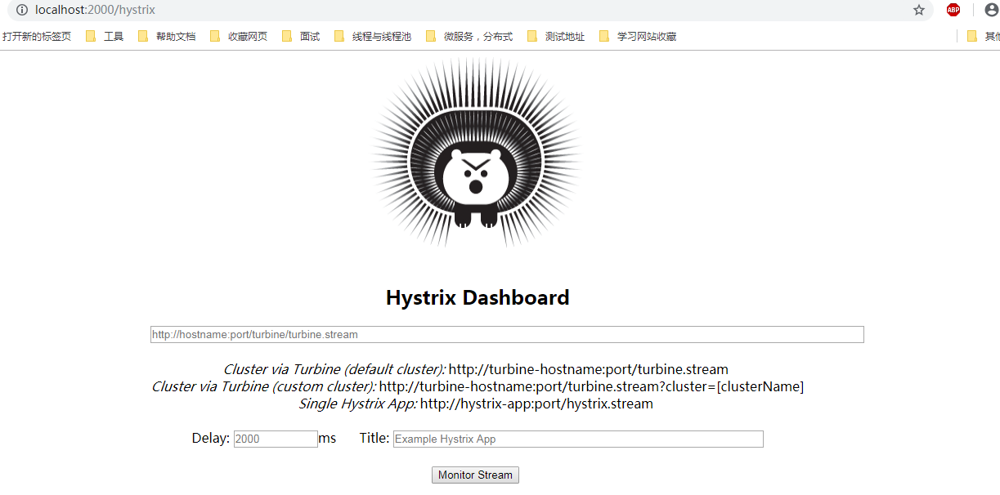

## Spring Cloud  Hystrix 使用详细

### 目录

1 请求命令的创建

2 请求缓存

3 请求合并

4 属性详解

5 Hystrix仪表盘

### 介绍

**注： pom.xml和application.properties键“服务容错保护：Spring Cloud  Hystrix”**

### 1 请求命令的创建

1.1 未使用@HystrixCommand注解形式

Hystrix创建通过继承HystrixCommand类来实现。getFallback()方法定义降级错误返回。

	public class UserCommand extends HystrixCommand<User> {
	    @Autowired
	    private RestTemplate restTemplate;
	
	    public UserCommand() {
	        super(HystrixCommandGroupKey.Factory.asKey("UserCommand"));
	    }
	
	    @Override
	    protected User run() throws Exception {
	        System.out.println("");
	        return  restTemplate.getForObject("http://hello-service/user/login",User.class);
	    }
	
	    @Override
	    protected User getFallback() {
	        System.out.println("==================================");
	        System.out.println(getFailedExecutionException().getMessage());
	        return new User("def","def");
	    }
	}

测试：

	1 同步执行:User u = new UserCommand().execute()
	2 异步执行:Future<User> fWorld = new UserCommand().queue();
	3 通过:Observable实现响应   
	Observable<User> observe = new UserCommand().observe();
	Observable<User> userObservable = new UserCommand().toObservable();

1.2 使用@HystrixCommand注解

	@Service("userService")
	public class UserService {
	    /**获取logger实例*/
	    private final Logger logger = Logger.getLogger(getClass().toString());
	
	    @Autowired
	    private RestTemplate restTemplate;
	
	    /**
	     *同步调用
	     * @return
	     */
	    @HystrixCommand(fallbackMethod = "notFindFallback1")
	    public String login()
	    {
	        logger.info("调用：http://hello-service/user/login");
	       // ResponseEntity<String> forEntity = restTemplate.getForEntity("http://hello-service/user/login", String.class);
	        String forObject = restTemplate.getForObject("http://hello-service/user/login", String.class);
	        return "我是一个消费者去调用==》"+forObject;
	    }
	
	   
	    /**
	     *异步调用
	     * @return
	     */
	    @HystrixCommand(fallbackMethod = "notFindFallback")
	    public Future<String> loginAsync()
	    {
	        return new AsyncResult<String>() {
	            @Override
	            public String invoke() {
	                String forObject = restTemplate.getForObject("http://hello-service/user/login", String.class);
	                return "我是一个消费者去调用==》"+forObject;
	            }
	        };
	    }
	
	    /**
	     * 异常触发方法
	     * @return
	     */
	    public String notFindFallback()
	    {
	        return "error";
	    }
	
	    /**
	     * 异常捕获方法，可捕获异常
	     * @return
	     */
	    public String notFindFallback1(Throwable e)
	    {
	        return e.getMessage();
	    }
	}

@HystrixCommand注解属性

	1 fallbackMethod指定异常降级方法
	2 observableExecutionMode = ObservableExecutionMode.EAGER表示.observe()执行方式observableExecutionMode = ObservableExecutionMode.LAYZ表示.toObservable();
	3 ignoreExceptions 指定某类异常触发时，不走fallbackMethod降级方法
    4 commandKey 指定命名名,groupKey指定组名,threadPoolKey指定线程。用于划分Hystrix分组，默认同组名化一个线程池组。所以需要指定线程划分。（setter设置）

**注：一些情况不需要做降级处理。如写操作，批处理或者离线计算。（操作的返回一般为void**）

### 2 请求缓存

Hystrix提供请求缓存，减轻高并发情况下服务的压力。

2.1 通过重写getCache()方法

	继承HystrixCommand类，重写getCacheKey()方法。getCache()方法返回缓存key值。
	清理缓存使用HystrixRequestCache.clear()。(getCacheKey()默认返回null,缓存未开启)

2.2 使用缓存注解（必须配合@HystrixCommand使用）

	@CacheResult标记结果加入缓存
    @CacheRemove请求缓存失效
    @CacheKey标记缓存的key

2.2.1 使用@CacheResult实现缓存功能

    @CacheResult(cacheKeyMethod = "getCacheKey")
    @HystrixCommand(commandKey = "findUserById", groupKey = "UserService", threadPoolKey = "userServiceThreadPool")
    public UserVO findById(Long id) {
        ResponseEntity<UserVO> user = restTemplate.getForEntity("http://users-service/user?id={id}", UserVO.class, id);
        return user.getBody();
    }

    public String getCacheKey(Long id) {
        return String.valueOf(id);
    }

2.2.2 使用@CacheResult和@CacheKey实现缓存功能

	@CacheResult
    @HystrixCommand(commandKey = "findUserById", groupKey = "UserService", threadPoolKey = "userServiceThreadPool")
    public UserVO findById2(@CacheKey("id") Long id) {
        ResponseEntity<UserVO> user = restTemplate.getForEntity("http://users-service/user?id={id}", UserVO.class, id);
        return user.getBody();
    }

2.2.3 使用@CacheRemove清空缓存

	@CacheRemove(commandKey = "findUserById")
    @HystrixCommand(commandKey = "updateUser",groupKey = "UserService",threadPoolKey = "userServiceThreadPool")
    public void updateUser(@CacheKey("id")UserVO user){
        restTemplate.postForObject("http://users-service/user",user,UserVO.class);
    }

### 3 请求合并
请求合并可以减少请求数量以缓解依赖服务线程池资源，但是会产生额外开销时间。如一个请求不合并消耗10ms,请求合并延时窗为10ms(默认)，那么最坏情况需要15ms才能完成请求。

以下情况可以考虑使用请求合并：

	请求命令本身是高延迟的；
	延迟时间窗口的并发量高时。如果并发不高，使用请求合并会造成系统瓶颈。（将单个请求合并后请求）

3.1 继承HystrixCollapser实现请求合并

继承HystrixCollapser实现请求合并，主要是在HystrixCommand之前放置了一个合并处理器。（例：略）

3.2 使用注解的形式实现请求合并

3.2.1 服务提供者

	 @RequestMapping("/findAll")
	    public  List<User> findAll(String ids){
	        logger.info("服务host:"+port+",service_id:"+hostname+"ss:"+ss);
	        System.out.println("port:"+port);
	        User user;
	        ArrayList<User> list = new ArrayList();
	        for(int i=0;i<=2;i++){
	            user  = new User();
	            user.setName("name"+i);
	            user.setPassword("pw"+i);
	            list.add(user);
	        }
	        return list;
	    }

3.2.2 服务消费者
	public class UserService {
	    @Autowired
	    private RestTemplate restTemplate;
	
		//窗口时间100ms
	    @HystrixCollapser(batchMethod = "findAll", collapserProperties = {
	            @HystrixProperty(name="timerDelayInMilliseconds", value = "100")
	    })
	    public Future<User> find(Long id) {
	        return null;
	    }
	
	    @HystrixCommand
	    public List<User> findAll(List<Long> ids) {
	        List forObject = restTemplate.getForObject("http://hello-service/user/findAll?ids={ids}", List.class, StringUtils.join(ids,","));
	        return forObject;
	    }
	}
	
	//测试方法 测试将id=1001,id=1002的单个请求方法find（），合并后请求findAll（）方法
 	@RequestMapping("/users")
    public String users() throws ExecutionException, InterruptedException {
        //开启上下文TheardLocal
        HystrixRequestContext context = HystrixRequestContext.initializeContext();
        Future<User> demo1 = userService.find(1001L);
        Future<User> demo2 = userService.find(1002L);
        System.out.println(demo1.get());
        System.out.println(demo2.get()); 
        context.close();
        return "";
    }

### 4 属性详解

4.1 Command

4.2 collaspser

4.3 threadPool

### 5 Hystrix仪表盘

Hystrix Dashboard主要用来实时监控Hystrix的各项指标消息，帮助我们快速发现系统问题，及时采取应对措施。参考地址：https://segmentfault.com/a/1190000011478978

**单体应用构建步骤如下**

**5.1** pom.xml

	<?xml version="1.0" encoding="UTF-8"?>
	<project xmlns="http://maven.apache.org/POM/4.0.0" xmlns:xsi="http://www.w3.org/2001/XMLSchema-instance"
			 xsi:schemaLocation="http://maven.apache.org/POM/4.0.0 http://maven.apache.org/xsd/maven-4.0.0.xsd">
		<modelVersion>4.0.0</modelVersion>
	
		<groupId>com.example</groupId>
		<artifactId>eureka-hystrix-dashboard</artifactId>
		<version>0.0.1-SNAPSHOT</version>
		<packaging>jar</packaging>
	
		<name>eureka-hystrix-dashboard</name>
		<description>Demo project for Spring Boot</description>
	
		<parent>
			<groupId>org.springframework.boot</groupId>
			<artifactId>spring-boot-starter-parent</artifactId>
			<version>2.0.1.RELEASE</version>
			<relativePath/> <!-- lookup parent from repository -->
		</parent>
	
		<properties>
			<java.version>1.8</java.version>
			<spring-cloud.version>Finchley.RELEASE</spring-cloud.version>
		</properties>
	
		<dependencies>
			<!--注册中心-->
			<!--<dependency>
				<groupId>org.springframework.cloud</groupId>
				<artifactId>spring-cloud-starter-netflix-eureka-server</artifactId>
			</dependency>-->
			<!--服务容错-->
			<dependency>
				<groupId>org.springframework.cloud</groupId>
				<artifactId>spring-cloud-starter-netflix-hystrix</artifactId>
			</dependency>
			<!--仪表盘-->
			<dependency>
				<groupId>org.springframework.cloud</groupId>
				<artifactId>spring-cloud-starter-netflix-hystrix-dashboard</artifactId>
			</dependency>
			<dependency>
				<groupId>org.springframework.boot</groupId>
				<artifactId>spring-boot-starter-actuator</artifactId>
			</dependency>
	
			<dependency>
				<groupId>org.springframework.boot</groupId>
				<artifactId>spring-boot-starter-test</artifactId>
				<scope>test</scope>
			</dependency>
		</dependencies>
	
		<dependencyManagement>
			<dependencies>
				<dependency>
					<groupId>org.springframework.cloud</groupId>
					<artifactId>spring-cloud-dependencies</artifactId>
					<version>${spring-cloud.version}</version>
					<type>pom</type>
					<scope>import</scope>
				</dependency>
			</dependencies>
		</dependencyManagement>
	
		<build>
			<plugins>
				<plugin>
					<groupId>org.springframework.boot</groupId>
					<artifactId>spring-boot-maven-plugin</artifactId>
				</plugin>
			</plugins>
		</build>
	</project>

**5.2** application.properties

	spring.application.name=hystrix_dashboard
	server.port=2000
	
	eureka.client.serviceUrl.defaultZone=http://localhost:1111/eureka/
	
	#设置Hystrix隔离策略为线程池
	zuul.ribbon-isolation-strategy=thread
	#每个路由使用独立的线程池
	zuul.thread-pool.use-separate-thread-pools=true

**5.3** 启动类

加@EnableHystrixDashboard注解
	
	@SpringBootApplication
	//@EnableDiscoveryClient
	@EnableHystrixDashboard
	public class DemoApplication {
	
		public static void main(String[] args) {
			SpringApplication.run(DemoApplication.class, args);
		}
	
	}

**启动服务，打开浏览器输入：http://localhost:2000/hystrix**，监控首页如下图

**服务消费者配置如下：**

	1pom.xml加入
	<dependency>
			<groupId>org.springframework.boot</groupId>
			<artifactId>spring-boot-starter-actuator</artifactId>
	</dependency>
	
	2启动类
	@EnableCircuitBreaker
	@EnableDiscoveryClient
	@SpringBootApplication
	public class CustomerApplication {
	
		@Bean
		@LoadBalanced
		RestTemplate restTemplate(){
			return new RestTemplate();
		}
	
		@Bean
		public ServletRegistrationBean hystrixMetricsStreamServlet() {
			ServletRegistrationBean registration = new ServletRegistrationBean(new HystrixMetricsStreamServlet());
			registration.addUrlMappings("/hystrix.stream");
			return registration;
		}
	
		public static void main(String[] args) {
			SpringApplication.run(CustomerApplication.class, args);
		}
	}

通过 Hystrix Dashboard 主页面的文字介绍，我们可以知道，Hystrix Dashboard 共支持三种不同的监控方式：

	默认的集群监控：通过 URL：http://turbine-hostname:port/turbine.stream 开启，实现对默认集群的监控。
	指定的集群监控：通过 URL：http://turbine-hostname:port/turbine.stream?cluster=[clusterName] 开启，实现对 clusterName 集群的监控。
	单体应用的监控： 通过 URL：http://hystrix-app:port/hystrix.stream 开启 ，实现对具体某个服务实例的监控。（现在这里的 URL 应该为 http://hystrix-app:port/actuator/hystrix.stream，Actuator 2.x 以后 endpoints 全部在/actuator下，可以通过management.endpoints.web.base-path修改）

### 6 Turbine集群监控

**集群应用构建步骤如下**

**6.1** pom.xml

 <!-- 我们要添加的依赖 -->
    <dependency>
        <groupId>org.springframework.boot</groupId>
        <artifactId>spring-boot-starter-actuator</artifactId>
    </dependency>
    <dependency>
        <groupId>org.springframework.cloud</groupId>
        <artifactId>spring-cloud-starter-turbine</artifactId>
    </dependency>

**6.2** 在入口类上添加@EnableTurbine注解表示开启Turbine，如下：

	@SpringBootApplication
	@EnableDiscoveryClient
	@EnableTurbine
	public class TurbineApplication {
	
	    public static void main(String[] args) {
	        SpringApplication.run(TurbineApplication.class, args);
	    }
	}

**6.3** application.properties配置文件中加

	spring.application.name=turbine
	server.port=2002
	management.port=2003
	eureka.client.service-url.defaultZone=http://localhost:1111/eureka/
	turbine.app-config=ribbon-consumer
	turbine.cluster-name-expression="default"
	turbine.combine-host-port=true

### 参考：

	1 《Spring Cloud  微服务实战》 翟永超 电子工业出版社 2017.5

    参考网站：http://blog.didispace.com/Spring-Cloud基础教程/
			https://springcloud.cc