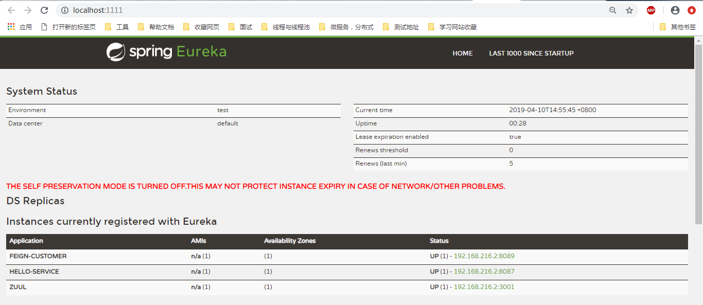
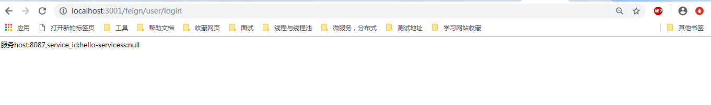

## 5 API网关服务：Spring Cloud Zuul（过滤器重新加）

### 目录

1 入门配置

参考

### 介绍

对外提供服务，管理**路由（具体url去哪个服务）与规则维护**，对所有微服务的校验进行前置（如用户校session校验，**过滤器**与拦截器等）

### 1 入门配置

**1.1** pom.xml

添加spring-cloud-starter-netflix-zuul。添加spring-cloud-starter-netflix-eureka-server整合eureka。

	<?xml version="1.0" encoding="UTF-8"?>
	<project xmlns="http://maven.apache.org/POM/4.0.0" xmlns:xsi="http://www.w3.org/2001/XMLSchema-instance"
		xsi:schemaLocation="http://maven.apache.org/POM/4.0.0 http://maven.apache.org/xsd/maven-4.0.0.xsd">
		<modelVersion>4.0.0</modelVersion>
		<parent>
			<groupId>org.springframework.boot</groupId>
			<artifactId>spring-boot-starter-parent</artifactId>
			<version>2.0.1.RELEASE</version>
			<relativePath/> <!-- lookup parent from repository -->
		</parent>
		<groupId>com.example</groupId>
		<artifactId>demo</artifactId>
		<version>0.0.1-SNAPSHOT</version>
		<name>demo</name>
		<description>Demo project for Spring Boot</description>
	
		<properties>
			<java.version>1.8</java.version>
		</properties>
	
		<dependencies>
			<dependency>
				<groupId>org.springframework.boot</groupId>
				<artifactId>spring-boot-starter</artifactId>
			</dependency>
			<!--注册中心-->
			<dependency>
				<groupId>org.springframework.cloud</groupId>
				<artifactId>spring-cloud-starter-netflix-eureka-server</artifactId>
			</dependency>
	
			<dependency>
				<groupId>org.springframework.cloud</groupId>
				<artifactId>spring-cloud-starter-netflix-zuul</artifactId>
			</dependency>
	
			<dependency>
				<groupId>org.springframework.boot</groupId>
				<artifactId>spring-boot-starter-test</artifactId>
				<scope>test</scope>
			</dependency>
		</dependencies>
	
		<dependencyManagement>
			<dependencies>
				<dependency>
					<groupId>org.springframework.cloud</groupId>
					<artifactId>spring-cloud-dependencies</artifactId>
					<version>Finchley.RELEASE</version><!--spring boot 2.0 与1.0 配置时需要选择对应版本-->
					<type>pom</type>
					<scope>import</scope>
				</dependency>
				<dependency>
					<groupId>com.google.guava</groupId>
					<artifactId>guava</artifactId>
					<scope>compile</scope>
					<version>19.0</version>
				</dependency>
			</dependencies>
		</dependencyManagement>
	
		<build>
			<plugins>
				<plugin>
					<groupId>org.springframework.boot</groupId>
					<artifactId>spring-boot-maven-plugin</artifactId>
				</plugin>
			</plugins>
		</build>
	
	</project>

**1.2**application.properties

**多实例配置**：zuul.routes.<route>.path与zuul.routes.<route>.serviceId
其中如果请求服务配置了上下文（如server.servlet.context-path=/feign），则route必须和上下文一致。且path中路由规则也得也route一致。

注：如果服务配置了上下文，需要配置zuul.routes.feign.stripPrefix=false，否则路径中会缺少上下文路由，导致路径404.

	spring.application.name=zuul
	server.port=3001
	
	eureka.instance.instanceId=${spring.cloud.client.ip-address}:${server.port}
	eureka.instance.preferIpAddress=true
	
	#传统式
	#zuul.routes.feign.path=/feign/**
	#zuul.routes.feign.url=/feign//loclhost:8087
	
	#面向服务
	#stripPrefix=true(默认true。如果请求服务有上下文路由时，选择false不去前缀,且有前缀时route与path对应为服务的路由)会去除前缀,
	zuul.routes.feign.stripPrefix=false
	zuul.routes.feign.path=/feign/**
	zuul.routes.feign.serviceId=feign-customer
	
	eureka.client.serviceUrl.defaultZone=http://localhost:1111/eureka/

**1.3** 启动类Application
   
加@EnableZuulProxy注解。

	@EnableZuulProxy
	@SpringBootApplication
	public class DemoApplication {
	
		public static void main(String[] args) {
			SpringApplication.run(DemoApplication.class, args);
		}
	
	}

**1.4** 测试

测试前启动注册中心、服务与Zuul。如下图

输入一个存在的url：localhost:3001/feign/user/login

### 参考

	1 《Spring Cloud  微服务实战》 翟永超 电子工业出版社 2017.5

    参考网站：http://blog.didispace.com/Spring-Cloud基础教程/